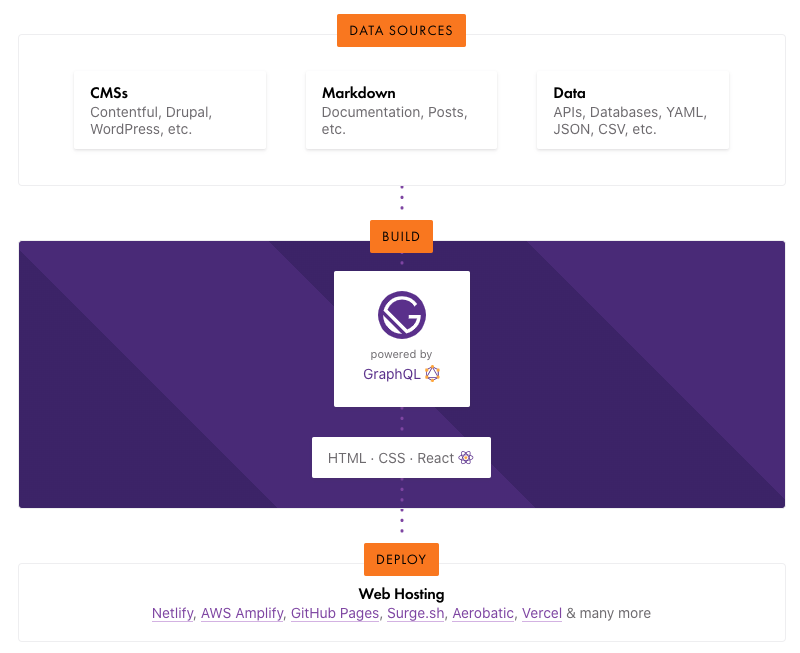
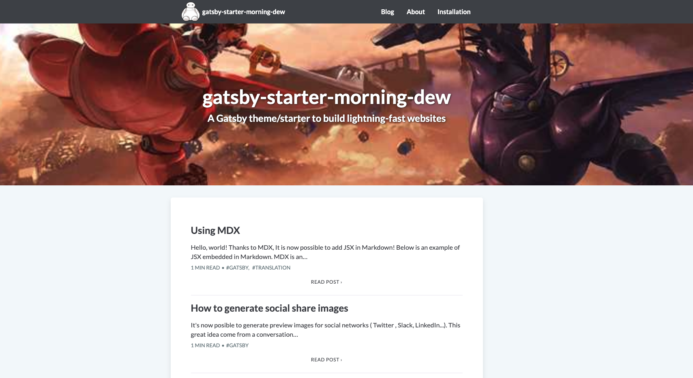

예전에 Jekyll 기반으로 블로그를 만들어 뒀지만, 달랑 글 몇 개 쓰고 방치해버려 폐가(?) 느낌이 나길래 과감히 버리고 새롭게 시작하기로 했습니다.

이왕 다시 만들기로 한김에 최근 관심을 가지게 된 **React + GraphQL** 조합의 **Gatsby**를 선택했고, 이번 기회에 **`'블로그 만들기'`**와 **`'React & GraphQL 공부'`** 두 마리 토끼를 잡아 보고자 합니다!

위에서 언급한 대로 Gatsby는 React 기반의오픈소스 프레임워크 입니다. 블로그 뿐만 아니라 간단한 웹사이트를 만들 수 있을 정도로 다양한 플러그인이 개발되어 있다는 점이 큰 장점인 것 같습니다.

Gatsby 메인 페이지에서 소개하는 Gatsby 플로우는 아래와 같으니 참고하시기 바랍니다.



저는 개인적으로 탑-다운 방식의 학습을 선호하기 때문에 맘에 드는 테마로 일단 만든 다음, 하나 하나 뜯어 보고 수정하면서 진행하기로 했습니다.

무엇보다 제가 새로 배우는 기술에 재미를 붙이는 방식이기도 합니다.😁

## Requirements

우선 Gatsby가 React 기반이기 때문에 **Node.js**가 설치되어 있어야 합니다.

환경에 맞게 **[Node.js](https://nodejs.org/ko/download/)** 를 설치해 주세요.

본 글 작성 기준 제가 사용한 Node.js 버전은 다음과 같습니다. 패키지 매니저는 npm 을 사용했습니다. (yarn 을 사용하셔도 됩니다.)

```bash{1,4}
node -v
v12.16.1

npm -v
6.13.4
```

## Installation with gatsby-cli

[Gatsby Starter Library](https://www.gatsbyjs.org/starters/?v=2)에서 다양한 스타일의 스타터를 확인할 수 있습니다.

저는 이 블로그의 스타터인 [gatsby-starter-morning-dew](https://github.com/maxpou/gatsby-starter-morning-dew)를 선택하였습니다.

스타터 코드를 기준으로 하나씩 수정해가면서 구조를 파악할 예정입니다.

gatsby-cli를 설치하고 스타터 레포지터리를 기준으로 Gatsby 프로젝트를 생성해 봅시다.

```bash
npm install --global gatsby-cli
gatsby new gatsby-blog https://github.com/maxpou/gatsby-starter-morning-dew
```

개발모드로 프로젝트를 실행하여 로컬 브라우저(http://localhost:8080)에서 초기 상태의 스타터 페이지를 확인할 수 있습니다.

```bash
cd gatsby-blog
gatsby develop
```



## Project Structure

본 프로젝트의 전체 디렉터리 구조는 다음과 같습니다.

각 페이지의 뼈대는 `src/templates` 에 작성되어 있고, 컴포넌트(`src/components`)를 통해 내용 및 스타일이 적용되어 렌더링 됩니다.

```bash
content
  |__ images # 배경, 아이콘 등
  |__ pages # 기타 페이지 (우측 상단 링크 페이지)
  |__ posts # 블로그 포스트
data
  |__ siteConfig.js # 사이트 설정 파일 (커스텀)
scripts
  |__ generatePostPreviewImages.js # 블로그 포스트 미리보기 작성 스크립트
src
  |__ components # React Component
  |__ hooks      # React Hooks
  |__ pages
  |__ templates
  |__ tokens
  theme.js
static
  |__ favicon.ico
  |__ robots.txt
.eslintrc.js
.prettierrc
.travis.yml
components.js
index.js
gatsby-config.js
gatsby-node.js
package.json
```

## Customization

**`data/siteConfig.js`** 파일을 수정하여 블로그 구조 및 정보를 쉽게 변경할 수 있습니다.

속성 하나씩 수정해가며 적용되는 부분을 확인해 봅시다. 저의 경우 아래와 같이 설정 파일은 아래와 같이 수정 했습니다.

```js
module.exports = {
  siteTitle: "Devnori's Tech Blog", // 메인 페이지 제목
  siteDescription: '',
  authorName: 'Sungchul Park',
  twitterUsername: '',
  authorAvatar: 'icon.png', // 글 하단에 사용되는 작성자 프로필 아이콘 (이미지 경로 : content/images)
  defaultLang: 'en',
  authorDescription: `
  작성자 소개 글
  `,
  siteUrl: 'https://Sungchul-P.github.io/',
  disqusSiteUrl: '',
  pathPrefix: '', // GitHub-Pages Repository 경로 (Repo 이름이 "username.github.io" 같은 형식이면 생략)
  siteCover: 'georgia.png', // 메인 페이지 배경 (이미지 경로 : content/images)
  googleAnalyticsId: '',
  background_color: '#ffffff',
  theme_color: '#222222',
  display: 'standalone',
  icon: 'content/images/icon.png',
  postsPerPage: 6,
  disqusShortname: '',
  headerTitle: "Devnori's Tech Blog", // 페이지 헤더 제목
  headerLinksIcon: '', //  (leave empty to disable: '')
  headerLinks: [
    // 우측 상단 메뉴
    {
      label: 'Blog',
      url: '/',
    },
    {
      label: 'About',
      url: '/about-me',
    },
  ],
  // 페이지 하단 (Footer) 정보 (ex: Github ...)
  websiteHost: {
    name: 'GitHub',
    url: 'https://github.com',
  },
  footerLinks: [
    {
      sectionName: 'Explore',
      links: [
        {
          label: 'Blog',
          url: '/',
        },
        {
          label: 'About',
          url: '/about-me',
        },
      ],
    },
    {
      sectionName: 'Follow the author',
      links: [
        {
          label: 'GitHub',
          url: 'https://github.com/Sungchul-P/Sungchul-P.github.io',
        },
        {
          label: 'Website',
          url: 'https://Sungchul-P.github.io/',
        },
      ],
    },
  ],
}
```

추가로, **`content/pages/about`**(About 페이지 내용) 과 **`content/posts`**(블로그 포스트) 의 마크다운을 참고하여 지금 이 글을 작성하였습니다.

> 상세한 구조 변경 및 마크다운 작성 내용은 [Github Repository](https://github.com/Sungchul-P/Sungchul-P.github.io)를 참고해 주세요.

## Deploying to a GitHub Pages

Gatsby 프로젝트를 배포하는 방법은 Netlify, Heroku, GitHub Pages 등 다양하게 지원하고 있습니다. ([https://www.gatsbyjs.org/docs/deploying-and-hosting](https://www.gatsbyjs.org/docs/deploying-and-hosting))

사용해 본 경험이 있는 GitHub Pages를 이용하기로 했습니다. GitHub에서 제공하는 무료 정적 페이지 호스팅 서비스이므로 GitHub 레포지터리가 필요합니다.

기본으로 제공하는 도메인은 "Username.github.io" 이고, 레포지터리를 도메인과 같은 이름으로 만들어서 진행했습니다. (필수는 아니므로 레포지터리 이름을 다르게 생성한 경우 Reference를 참고하여 진행하세요.)

도메인과 레포지터리 이름을 같은 이름으로 생성하면, master 브랜치에 빌드 및 배포된 페이지를 기준으로 사이트가 렌더링 됩니다.

개발 코드와 Gatsby 빌드 파일을 같은 브랜치에서 진행하면 프로젝트 구조가 복잡해지므로 별도의 브랜치를 생성해서 진행하는 것이 좋습니다.

### GitHub Repository와 연동

```bash{2}
git init
git remote add origin https://github.com/Sungchul-P/Sungchul-P.github.io

# branch 생성
git branch -m develop
```

### gh-pages 패키지 설치

GitHub Pages 배포를 위해서는 gh-pages 패키지를 설치해야 합니다. (**`필수`**)

```bash{1}
npm install gh-pages --save-dev
```

### Deploy Script 추가 및 실행

**`package.json`** 파일에 배포 스크립트를 추가하여 사용할 수 있습니다.

```json{3}
{
  "scripts": {
    "deploy": "gatsby build && gh-pages -d public -b master"
  }
}
```

npm 스크립트로 배포를 실행 합니다.

```bash{1}
npm run deploy

# 배포 정상 완료된 경우, 아래 메시지를 확인할 수 있습니다.
... (생략) ...
info Done building in 11.916020379 sec
Published
```

### 배포 및 렌더링된 페이지 확인

[https://sungchul-p.github.io/](https://sungchul-p.github.io/)


## Reference

- [https://www.gatsbyjs.org/docs/how-gatsby-works-with-github-pages/](https://www.gatsbyjs.org/docs/how-gatsby-works-with-github-pages/)
- [http://blog.naver.com/PostView.nhn?blogId=lyshyn&logNo=221527017383](http://blog.naver.com/PostView.nhn?blogId=lyshyn&logNo=221527017383)
