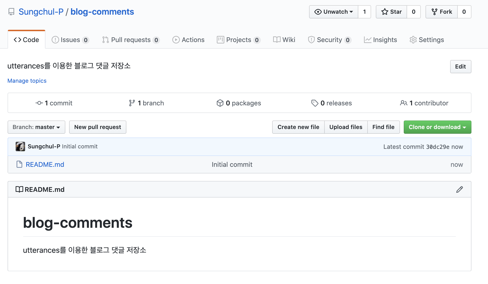
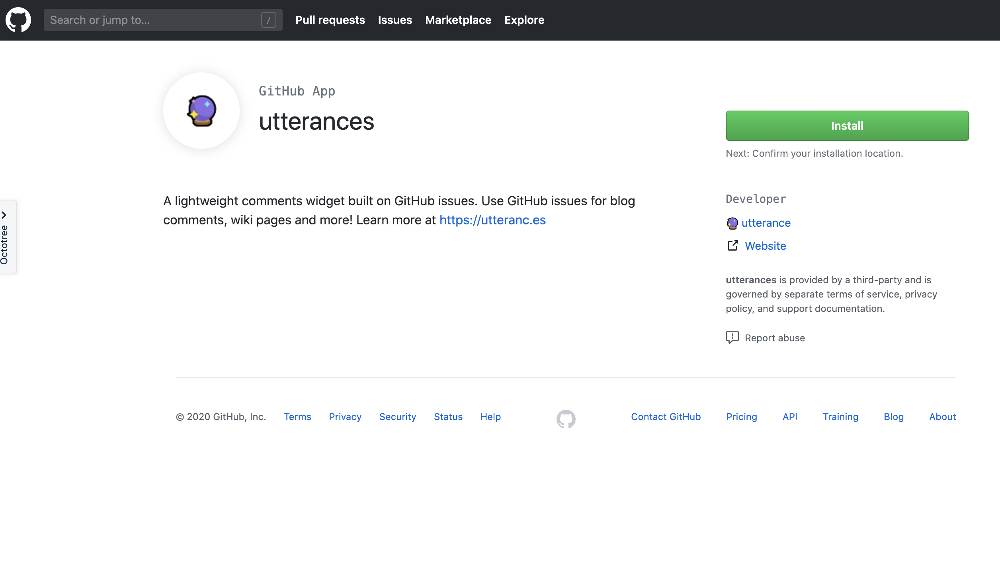
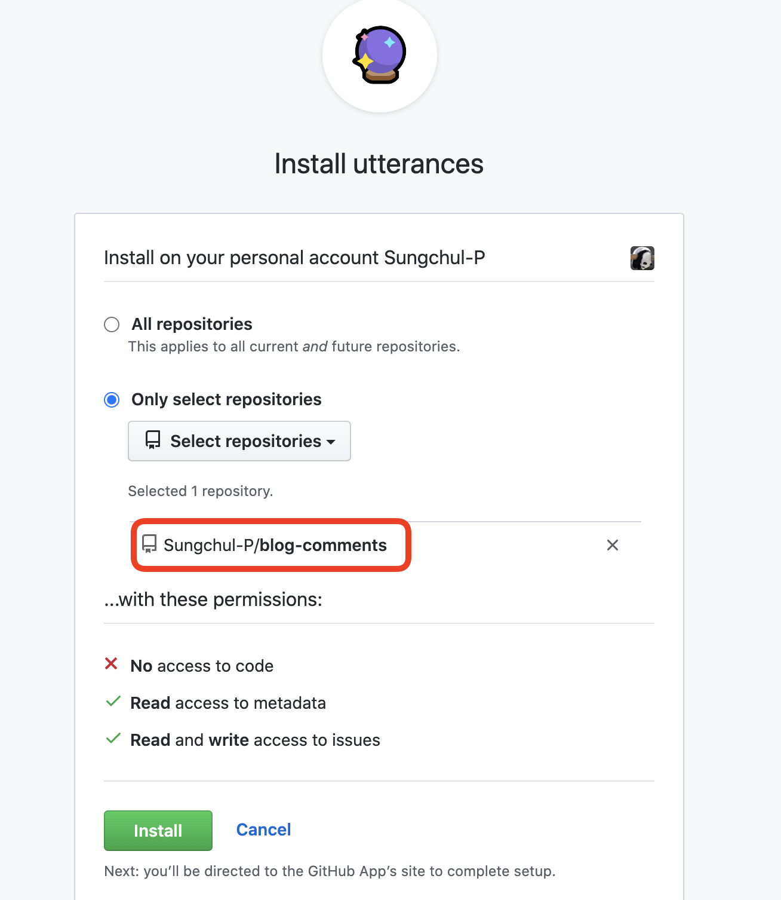
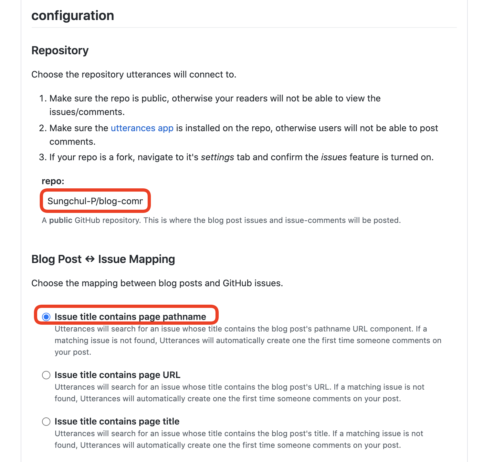
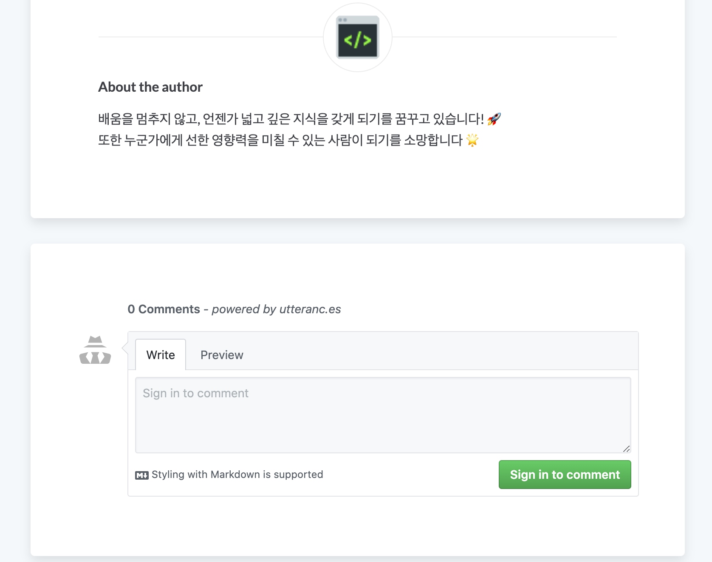

제가 선택한 Gatsby 블로그 스타터는 댓글 플러그인으로 Disqus를 사용하고 있습니다.

하지만, 저는 Disqus보다 utterances를 선호하기 때문에 컴포넌트를 교체하는 작업을 진행하려고 합니다.
Utterances는 Github 계정을 연동하는 서비스 이고, 댓글을 남기면 지정한 레포지터리에 이슈를 생성하는 방식으로 동작합니다.

## Create Repository & Install Utterances

댓글 저장용 따로 레포지터리를 생성하고, Utterances를 연결하겠습니다.



[Install Utterances](https://github.com/apps/utterances) 이 링크에서 앱을 설치하고 레포지터리를 연결 합니다.





[Utterances](https://utteranc.es/) 에서 레포지터리(Sungchul-P/blog-comments) 및 블로그 포스트 & 이슈 매핑 방법을 입력하면 설치 스크립트를 확인할 수 있습니다.

매핑 방법의 경우 6가지 방식을 제공하고 있으며, 상황에 따라 적절히 선택하시면 됩니다. 저의 경우 pathname을 선택했습니다.



React 환경이 아닌 경우, 아래의 스크립트를 삽입하면 연결이 끝나지만 React는 별도의 컴포넌트를 생성해야 합니다.

```js{2,3}
<script
  src="https://utteranc.es/client.js"
  repo="sungchul-p/blog-comments"
  issue-term="pathname"
  theme="github-light"
  crossorigin="anonymous"
  async
></script>
```

## React 컴포넌트 작성

**`src/components/Utterances.js`** 컴포넌트를 다음과 같이 작성합니다.

```js{17}
import React from 'react'

class Utterances extends React.Component {
  constructor(props) {
    super(props)

    this.commentsEl = React.createRef()
    this.state = { status: 'pending' }
  }

  componentDidMount() {
    const scriptEl = document.createElement('script')
    scriptEl.onload = () => this.setState({ status: 'success' })
    scriptEl.onerror = () => this.setState({ status: 'failed' })
    scriptEl.async = true
    scriptEl.src = 'https://utteranc.es/client.js'
    scriptEl.setAttribute('repo', 'sungchul-p/blog-comments')
    scriptEl.setAttribute('issue-term', 'title')
    scriptEl.setAttribute('theme', 'github-light')
    scriptEl.setAttribute('crossorigin', 'anonymous')
    this.commentsEl.current.appendChild(scriptEl)
  }

  render() {
    const { status } = this.state

    return (
      <div className="comments-wrapper">
        {status === 'failed' && <div>Error. Please try again.</div>}
        {status === 'pending' && <div>Loading script...</div>}
        <div ref={this.commentsEl} />
      </div>
    )
  }
}

export default Utterances
```

이제 블로그 페이지를 생성 기준이 되는 템플릿을 수정하여 적용해야 합니다.

**`src/templates/blog-post.js`** 에서 Disqus 컴포넌트 부분을 Utterances로 교체 합니다.

```
...(생략)...
import Utterances from '../components/Utterances'

...(생략)...
<Utterances />
```

드디어 포스트 가장 아래에 댓글창이 추가된 것을 확인할 수 있습니다 !



## Reference

- [https://velog.io/@iamchanii/build-a-blog-with-gatsby-and-typescript-part-4](https://velog.io/@iamchanii/build-a-blog-with-gatsby-and-typescript-part-4)

- [https://dev.to/loizoskounios/blog-comments-powered-by-github-3dp2](https://dev.to/loizoskounios/blog-comments-powered-by-github-3dp2)

- [https://github.com/utterance/utterances/issues/161](https://github.com/utterance/utterances/issues/161)
