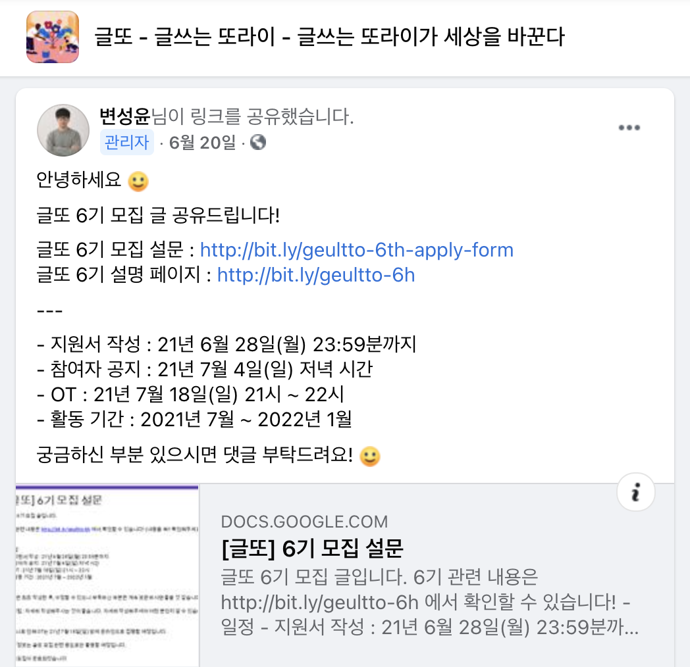

## 글또(글쓰는 또라이가 세상을 바꾼다)

글또는 개발자 글쓰기 모임으로, **"개발자들의 글쓰기 역량을 강화하고 글을 꾸준히 쓸 수 있도록 돕는 커뮤니티"** 입니다.

사실 예전에 3,4기 때도 페이스북에서 모집 글을 봤으나 부담감에 참여하지 않았는데, 강제성 없이는 글을 적지 않는 제 모습을 보고 이제는 안 되겠다 싶어서 이번 6기에 참여하게 됐습니다.

> 이번에는 모집 페이지를 보고 바로 지원했습니다. 모집 페이지를 보는 것만으로도 글 써야겠다는 생각이 들더라고요.

- [글또 6기 모집 페이지](http://bit.ly/geultto-6h)

## 글또 참여에 대한 마음가짐

- 글쓰기 습관 만드는 것을 최우선으로 한다.
- 나에게 이로운 행동이라는 것을 자신에게 인지시킨다.
- 나의 소소한 글쓰기가 누군가에게는 선한 영향(시간 절약, 삽질 최소화로 스트레스 감소 등)이 될 수 있음을 믿자.
- 피드백을 적극적으로 수용하여 개선해 나가고, 나 역시 좋은 피드백을 줄 수 있도록 좋은 글을 많이 읽자 !
- 다양한 분들의 글을 읽으면서 시야를 넓히자.

## 나만의 글쓰기 규칙

- 초안 적을 때부터 글 구조와 질에 얽매이지 않는다. (코드 리팩토링하듯이 다음에 보강한다고 생각할 것)
- 글 적는 데 부수적인 것에 너무 집착하지 않는다. (그림, 들여쓰기 등)
- 글쓰기에 투자하는 시간을 대략적으로라도 정해놓자. (글감에 따라 글 쓰는데 걸리는 시간을 예상할 수 있으면 최고)
- 글 배포 전에 글자 수 세기 및 맞춤법 검사기를 이용하여 최종 점검한다. (교정에 시간이 너무 오래 걸리면 생략 가능)

## 글또 기간에 쓰고자 하는 것

글또 6기는 6개월(2021년 7월 ~ 2022년 1월) 동안 진행됩니다.
초반 3개월은 새롭게 익힌 기술들 위주로 적고, 후반 3개월은 실무에서 사용 중인 것과 종합하여 시리즈로 적어보려 합니다.
최대한 계획한 주제들로 적고자 하지만, 새롭게 꽂히는 기술이 생기거나 변덕이 생기는 경우 얼마든지 주제를 변경할 수 있도록 마음을 열어둘 생각입니다.

### 글 작성 집중 기간(3개월)

- 고 언어(GoLang) : 관심 있는 오픈소스 분석을 위해 고 언어를 공부하며 **"고 개발자 로드맵 시리즈"** 작성
- 오픈소스 데이터 플랫폼 : RudderStack 설치 및 운영. 특정 기능에 대한 코드 분석.

### 글 작성 및 피드백 기간(3개월)

- 쿠버네티스와 데이터베이스 : 쿠버네티스 기반 데이터베이스 설치 및 운영
- 데이터베이스는 Clickhouse, Vitess 사용 예정

## 마무리

글또 6기 참여 다짐 글을 적기도 쉽지 않네요.
여전히 제가 읽기 편한 대로 글 쓰는 습관이 있어서 글또가 끝나갈 때는 모두가 읽기 편한 글을 적을 수 있도록 노력해야겠습니다.
함께 시작한 글또 6기 모두 6개월 후에 성장한 모습으로 2022년을 맞이하길 응원합니다!
