> 본 글은 Peak Load(짧은 순간 대량의 트래픽 발생)를 대응하기 위한 AWS 기반 서버리스 아키텍처에 대해 다룹니다.
> `'어떤 서비스를 어떻게 활용할 수 있다'` 정도만 다룰 예정이고, 세부 구현은 따로 작성할 예정입니다.
>
> 본 글의 내용은 **`AWS 솔루션즈 아키텍트 서태종`** 님의 세션과 실습(Hands-on) 자료를 기반으로 작성되었습니다.

## AWS DNA 프로그램이란 ?

AWS DNA (Digital Native Architects) 프로그램은 AWS 코리아에서 제공하는 새로운 방식의 클라우드 교육 및 네트워킹 프로그램입니다.

AWS를 사용중인 고객사를 대상으로 멤버를 모집하며, 선별된 멤버는 약 2개월 동안 7회에 걸쳐 AWS 솔루션즈 아키텍트님들의 퀄리티 높은 세션과 AWS JAM 게임 대회 등 다양한 교육과 혜택을 받을 수 있습니다.

이번에 운좋게 AWS DNA 3기에 참여하게 되어, 회차별로 세션 요약 및 실습 과제에 대한 내용을 간략히 정리하고자 합니다.

참여 과정과 DNA 프로그램을 통해서 얻을 것들에 대한 종합적인 내용은 프로그램 수료 후에 후기글로 작성해 보겠습니다!

## What is Peak Load ?

웹 서비스(그 중에서도 특히 이커머스)를 제공하는 경우, 일반적으로 주간 트래픽 트렌드를 기준으로 컴퓨팅 용량을 준비합니다.

하지만 이 경우 일별 가장 높은 트래픽이 기준점이 되기 때문에 해당 시간외에는 컴퓨팅 자원이 낭비되는 문제가 있습니다.

이 상황에서 전체적인 트래픽이 상승하면 이에 맞춰 서버를 "스케일업 또는 스케일 아웃"(컴퓨팅 용량 증설)을 진행하게 되고, 비용 부담은 더 늘어나게 됩니다.

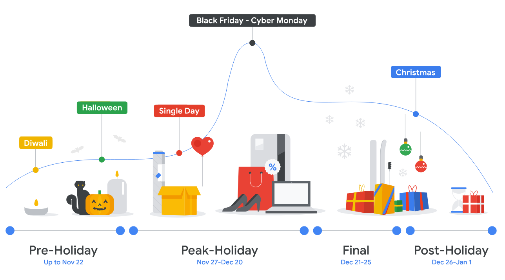
이미지 출처 : [Google Ad Manager - Seasonality](https://support.google.com/admanager/answer/9544845?hl=en)

이 때, 클라우드 환경이라면 이런 문제를 비교적 쉽게 해결할 수 있습니다.

AWS의 경우, EC2 오토 스케일링을 사용하면 컴퓨팅 사용률 혹은 네트워크 트래픽에 따라 자동으로 컴퓨팅 클러스터의 크기를 조절해주기 때문에 비용 효율적인 운영이 가능합니다.

다시 말해, 컴퓨팅 자원을 미리 확보해놓는 방식이 아니라 수요에 따라 컴퓨팅 자원을 확보해서 사용하고 반납하는 방식을 사용하는 것입니다.

실질적인 AWS 클라우드 아키텍처로 표현해보자면 아래와 같습니다.

다중 가용영역으로 고가용성을 확보하고 부하 분산(ALB; Application Load Balancer)을 통해 성능을 극대화 시키며 오토 스케일링으로 가변적인 사용자를 대응할 수 있는 아키텍처입니다.

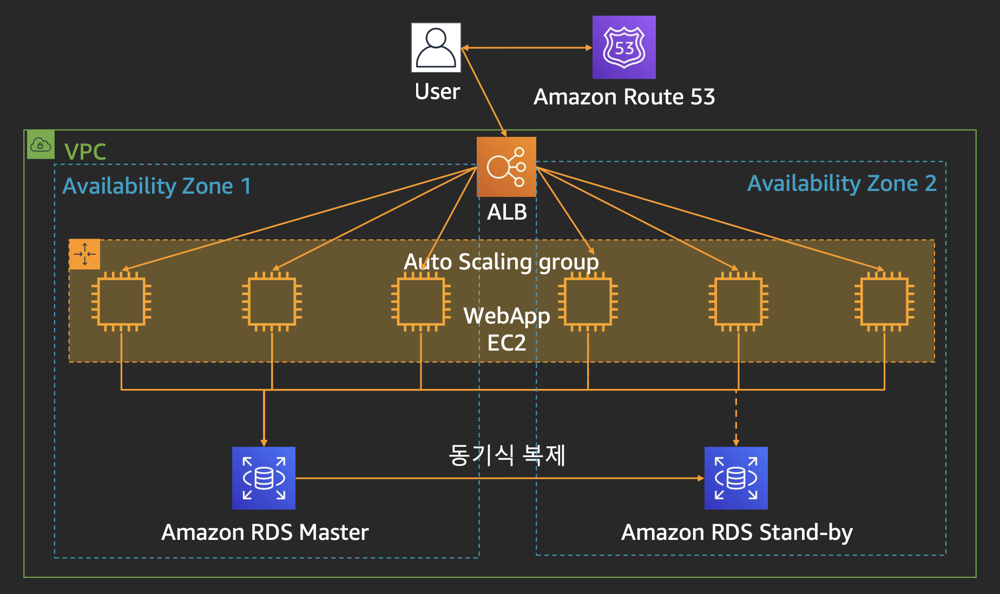
이미지출처 : [천만 사용자를 위한 AWS 클라우드 아키텍처 진화하기](https://www.youtube.com/watch?v=z68l2X5KoC4)

하지만 위와 같이 자동으로 확장되는 아키텍처일지라도 갑작스럽게 짧은 순간 대량의 트래픽이 발생한다면 애플리케이션 구현에 따라 다양한 문제가 생길 수 있습니다.

- 시스템 어딘가에 병목이 없을까?
- 내 서비스는 SaaS인데 무료 사용자한테 굳이 이렇게 많은 자원을 할당할 필요가 있을까?
- 데이터베이스의 확장성은 괜찮나?
- 서비스별 리밋은 어떻게 줄 것인가?
- 외부 연동 시스템이 지연되면 어떻게 하지?
- 라이선스 때문에 확장이 안되는데 어떻게 하지?

이처럼 비즈니스 요구사항에 따라, 구현 방식에 따라 너무나 많은 문제가 발생할 수 있기 때문에 때로는 시스템이 감당할 수 있는 만큼만 트래픽을 받는 것도 하나의 대안이 될 수 있습니다.

다시 말해서 사이트에 도착하는 순서대로 번호표를 발급하고 사용자를 대기하도록 한 다음에, 순서대로 입장시키는 전략을 가져가는 것입니다.

이 전략을 선택해서 개선한다는 가정하에 AWS 기반 서버리스 아키텍처로 순번대기시스템을 만드려면 어떤 서비스를 사용하여 비용 효율적으로 구성할 수 있는지 알아보겠습니다.

## 순번대기시스템 아키텍처

서버리스 컴퓨팅은 클라우드 공급자가 고객을 대신하여 서버를 관리하면서 필요에 따라 컴퓨팅 자원을 할당하는 클라우드 컴퓨팅 실행 모델입니다.

AWS의 대표적인 서버리스 서비스는 다음과 같습니다. 이와 같은 서비스들을 이용하여 아키텍처를 구성하면 얻을 수 있는 이점은 서버 운영에 신경쓰지 않아도 되고 확장성이 보장되며 비용 효율적이라는 것입니다. 하지만 확장성이 무한은 아니기 때문에 서비스별 제약사항에 대한 이해가 필요합니다.

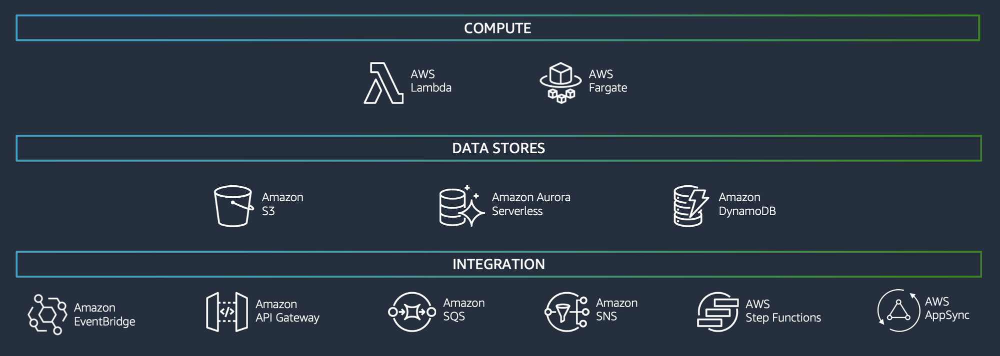

순번대기시스템의 프로세스는 아래 그림과 같습니다. 번호표는 토큰을 발급해서 관리하고, 입장 대기는 주기적으로 사용자의 상태를 점검하여 판단합니다.

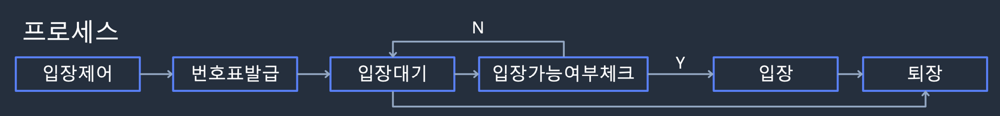

레거시 시스템은 확장이 불가능해 부하가 늘어나면 자주 장애가 발생하는 시스템이라고 가정하고 순번대기시스템은 레거시 시스템 앞단에 추가하겠습니다.

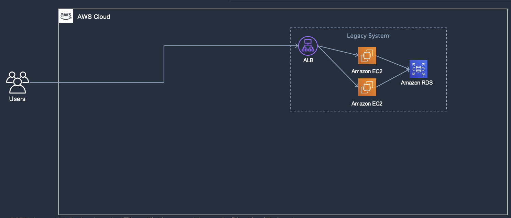

### Lambda@Edge를 이용한 토큰 생성

> Lambda@Edge는 CloudFront 기능 중 하나로서 애플리케이션의 사용자에게 더 가까운 위치에서 코드를 실행하여 성능을 개선하고 지연 시간을 단축할 수 있게 해 줍니다.

Route53(DNS)으로 ALB에 연결되어 있던 서비스 도메인의 목적지를 CloudFront로 설정합니다.

ALB와 사용자 사이에 CloudFront와 Lambda@Edge가 위치시켜 사용자의 요청을 중간에 제어할 수 있습니다.

- 사용자 브라우저에서 전달된 쿠키에 토큰이 없으면 새로 발급하여 DynamoDB에 저장하고 사용량이 많은 경우 요청을 제어합니다.
- 발급된 토큰을 사용자 브라우저가 유지할 수 있도록 응답(Response) 헤더에 쿠키값을 설정해서 전달합니다.

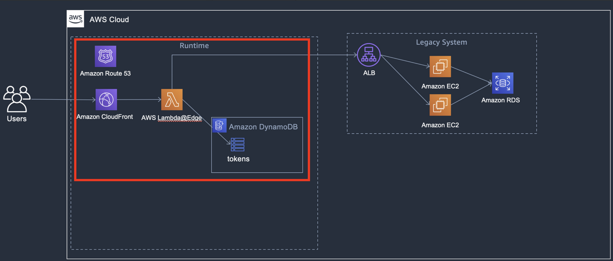

### Heartbeat 처리 (AWS S3, API Gateway, Lambda)

사용자가 브라우저에서 사이트에 접속한 상태인지 체크하기 위해 5초 간격으로 heartbeat를 수집합니다.

상태를 체크하는 자바스크립트 파일은 S3 버킷으로 호스팅되며 자바스크립트가 주기적으로 API Gateway를 호출하여 heartbeat 요청을 받으면 DynamoDB에 있는 토큰의 heartbeatTime을 갱신합니다. 이를 이용하여 일정시간 이상 heartbeat가 오지 않는 토큰을 삭제합니다.

그림상에서는 사용자가 직접 요청하는 것으로 표현되어 있어서 헷갈릴 수 있지만, 실제로는 CloudFront를 이용하고 있고 경로를 기준으로 나뉘어 처리되고 있습니다.

`waiting/static/*` 경로는 S3 정적 콘텐츠를 사용하고, `waiting/api/*` 경로는 API Gateway를 사용하도록 CloudFront Behavior에 연결되어 있습니다.

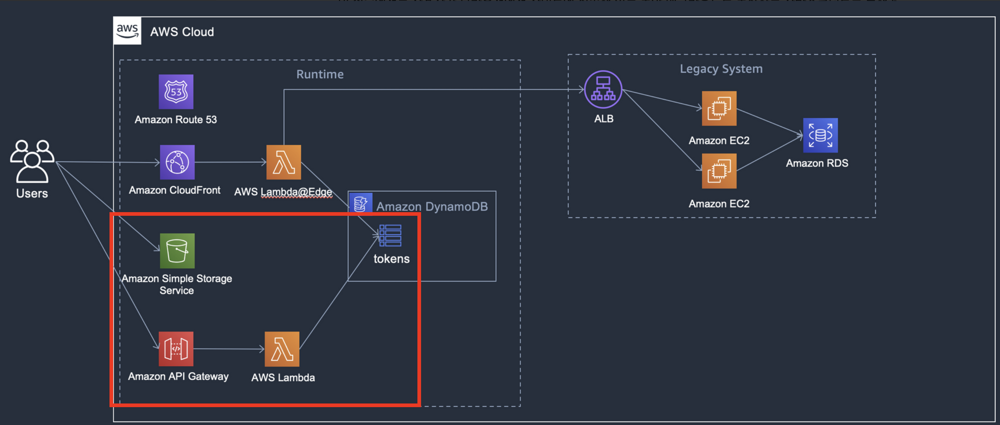

### 토큰체크 및 관리 (AWS DynamoDB, SQS, Lambda)

주기적으로 사용자의 상태를 체크하여 토큰을 삭제해야 합니다.

1. DynamoDB에 새로운 토큰이 생성되면 stream을 통해서 Lambda가 실행됩니다.
2. 이 Lambda는 SQS에 10초의 DelaySeconds를 추가하여 토큰을 입력합니다.
3. 이후 이 SQS를 바라보고 있는 Lambda는 해당 토큰을 검사하여 20초 이상 heartbeat요청이 없으면, 해당 토큰을 삭제하고 새로운 사용자를 입장시킵니다.
4. 만약 heartbeat이 요청이 정상적인 토큰이라면 다시 10초의 DelaySeconds를 추가하여 SQS에 입력하고 이후 다시 토큰을 체크하는 과정을 거칩니다.

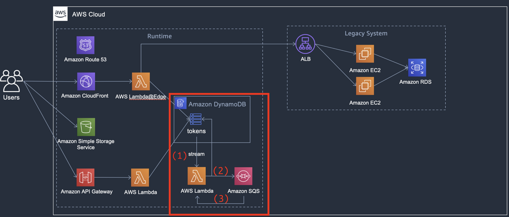

DynamoDB는 집계 쿼리를 바로 실행하는데 적합하지 않기 때문에 현재 사이트를 사용중인 접속자, 대기중인 접속자의 수는 별도의 통계 테이블을 구성하여 확인해야 합니다.

1. DynamoDB의 stream을 통해서 Lambda를 트리거합니다.
2. Lambda에서 데이터를 집계하여 status 테이블에 저장합니다.

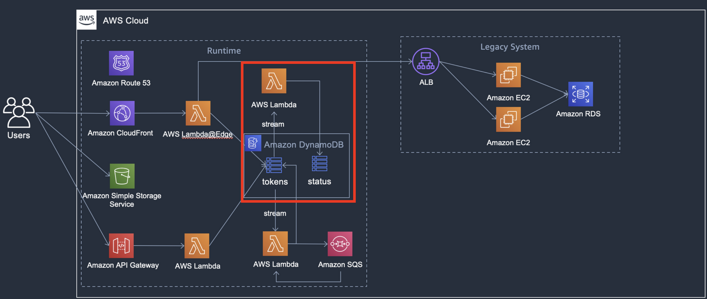

### 순번대기시스템 모니터링 구축 (AWS Step Functions, CloudWatch, SNS, Lambda)

1. CloudWatch의 Schedule 이벤트를 통하여 1분단위로 Step Functions를 호출합니다.
2. Step Functions은 10초 마다 6회 동안 Lambda를 호출합니다.
3. Lambda는 앞서 살펴보았던 status 테이블의 데이터를 주기적으로 조회하고 CloudWatch의 Custom 메트릭으로 저장합니다.
4. 이후 CloudWatch Alarm 통해 메트릭이 임계치를 초과하는 경우 Alarm이 발생합니다.
5. 이 CloudWatch Alarm은 SNS와 연동되어 리소스를 프로비저닝 할 때 입력했던 관리자 이메일로 Notification을 발송하게 됩니다.

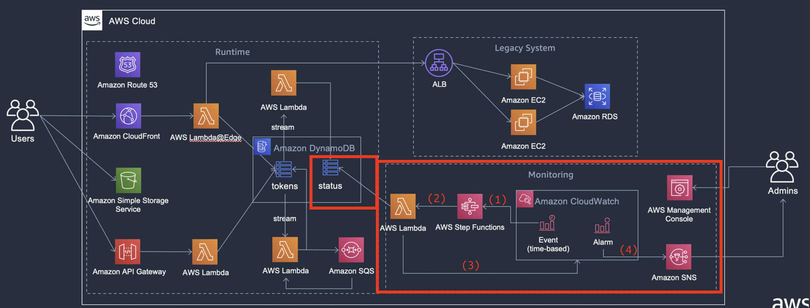

서버 허용량에 도달하여 접속 대기가 발생한 경우, CloudWatch로 집계된 Custom 메트릭은 AWS 콘솔에서 그래프로 확인할 수 있습니다.

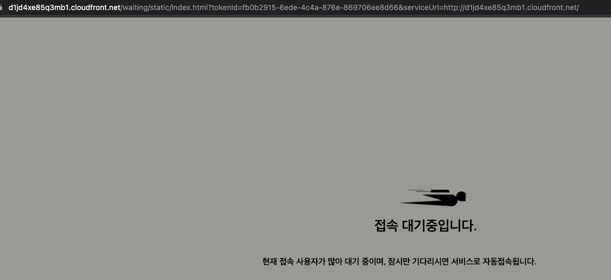

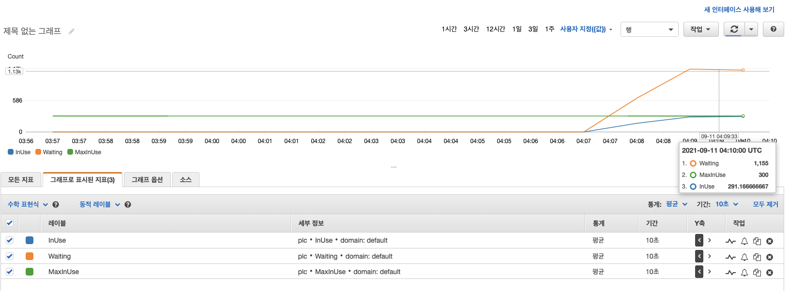

Custom 메트릭이 임계치를 초과하면 알람이 트리거 되어 SNS에 연결된 이메일 발송되고, 형식과 내용은 아래 그림과 같습니다.

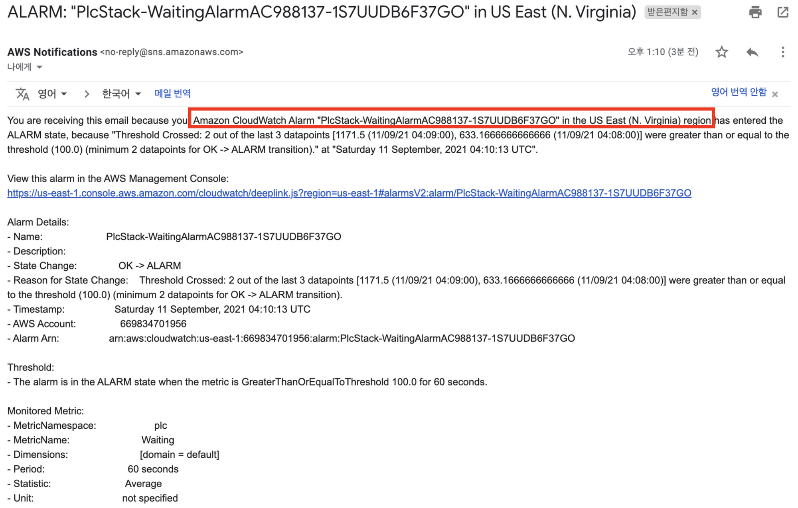

## 마무리

AWS DNA 프로그램을 통해 진행된 첫 번째 세션과 실습임에도 상당히 많은 것을 얻은 것 같은 기분이네요.

서버리스 서비스의 경우, 개념적으로만 알고 있었고 사용해 볼 기회가 없었는데 실습을 통해 맛보니 꿀맛이네요!

특히, 최근에 순번대기 시스템에 관심이 생겨서 구현해보고 싶었는데 어떤 식으로 구현하면 될지에 대한 가이드라인 딱 잡혀서 이 아키텍쳐 기반으로 디벨롭해서 토이 프로젝트 하나 완성해봐야 겠네요!

그리고 이제 `바퀴를 새로 발명하지 마라` 라는 말을 몸소 실천하여 개인 기술 부채를 줄여나가야 겠다고 다시 한번 다짐해봅니다 😂

남은 세션들도 벌써 기대가 되네요, 다루는 범위가 넓어서 다 소화는 못하겠지만 최대한 내재화할 수 있도록 노오오력 해야겠습니다!

## 참고 자료

- [Peak Load Control with Serverless](https://hackmd.io/oJlsK5q0R9W8Pa0piY3v-w)
- [Google Ad Manager - Seasonality](https://support.google.com/admanager/answer/9544845?hl=en)
- [천만 사용자를 위한 클라우드 아키텍처, 5년간의 여정](https://aws.amazon.com/ko/blogs/korea/5-years-scalling-up-to-10-million-users/)
- [천만사용자를 위한 AWS 클라우드 아키텍처 진화하기 – 문종민, AWS솔루션즈 아키텍트:: AWS Summit Online Korea 2020](https://www.youtube.com/watch?v=z68l2X5KoC4)
