> 이 글은 Amplify를 활용하여 서버리스 웹앱을 구축하는 방식에 대해 다룹니다.  
> Cloud Native한 풀스택 웹앱을 이런 방식으로도 구축할 수 있다는 것을 전달하는 것이 목적이므로, Amplify CLI 설치 방법, React 코드에 대한 설명 등은 다루지 않습니다.  
> (코드가 궁금하신 분은 https://github.com/Sungchul-P/amplify-ecommerce 를 참고해주세요)
>
> 본 글의 내용은 "AWS 솔루션즈 아키텍트 정우철"님의 세션과 실습(Hands-on Lab) 자료를 기반으로 작성되었습니다.

## AWS Amplify

AWS Amplify는 프론트엔드 웹 및 모바일 개발자가 AWS에 풀스택 애플리케이션을 쉽고 빠르게 구축할 수 있도록 특별히 제작된 도구이자 서비스 집합입니다.

Amplify는 웹 앱의 경우 JavaScript, React, Angular, Vue, Next.js를 비롯한 널리 사용되는 언어, 프레임워크 및 플랫폼을 지원하고 모바일 앱의 경우 Android, iOS, React Native, Ionic, Flutter를 지원합니다.

Amplify가 제공하는 주요 개발 기능은 인증(Authentication), 데이터 스토어, 스토리지, API(GraphQL, REST), 서버리스 함수(Functions), 분석(Analytics) 등이 있습니다.

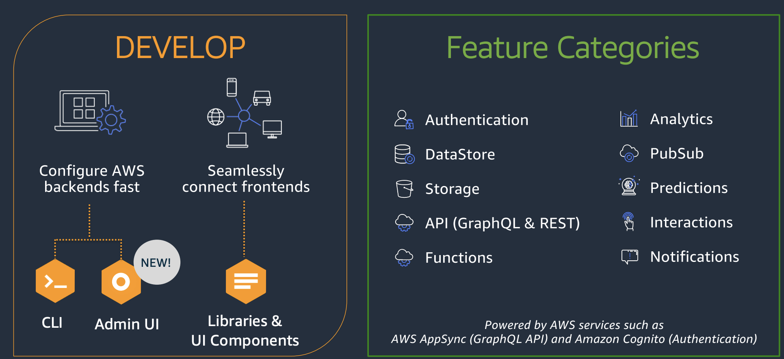

## 풀스택 서버리스 웹앱 아키텍쳐

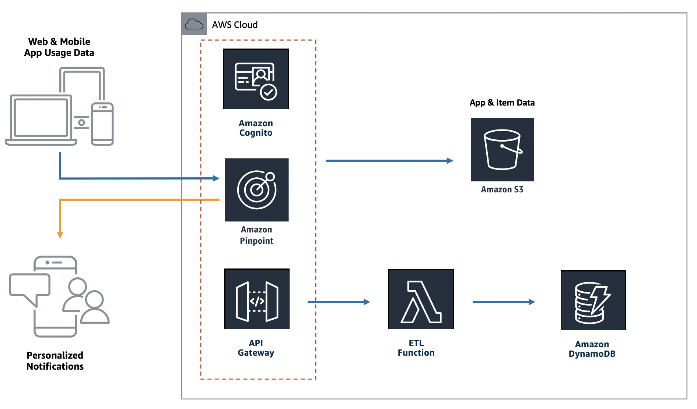

본 글에서는 React를 사용하여 사용자가 원하는 상품을 장바구니에 담아 구매하는 프로세스를 구현한 웹 앱을 구축할 것입니다.

다음과 같이 다양한 AWS 서비스를 활용하여 서버리스 아키텍쳐를 구현할 예정입니다.

- AWS Amplify CLI 로 클라우드 서비스를 빠르게 프로비저닝하고 구성합니다.
- AWS Amplify JavaScript 라이브러리로 프론트와 클라우드 리소스를 연결합니다.
- AWS Cognito를 사용하여 사용자를 인증하고 처리 합니다.
- AWS S3는 상품의 이미지를 제공하며 애플리케이션의 정적 에셋을 호스팅하는데 사용합니다.
- AWS API Gateway와 Lambda로 구성된 REST API는 DynamoDB에서 상품 정보를 조회하여 상품 리스트를 구성할 수 있습니다.
- 마지막으로, Amazon Pinpoint를 사용하여 고객 그룹을 분류하고, 특정 조건에 부합하는 타겟 고객에게 캠페인(이메일, SMS 전송 등)을 집행할 수 있습니다.

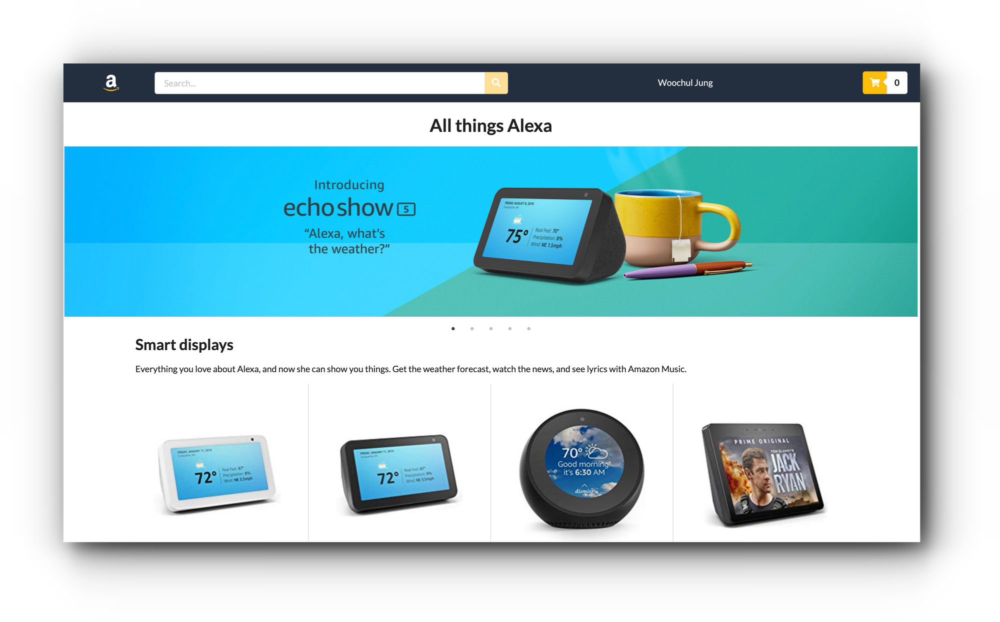

## 인증(Authentication) 구현

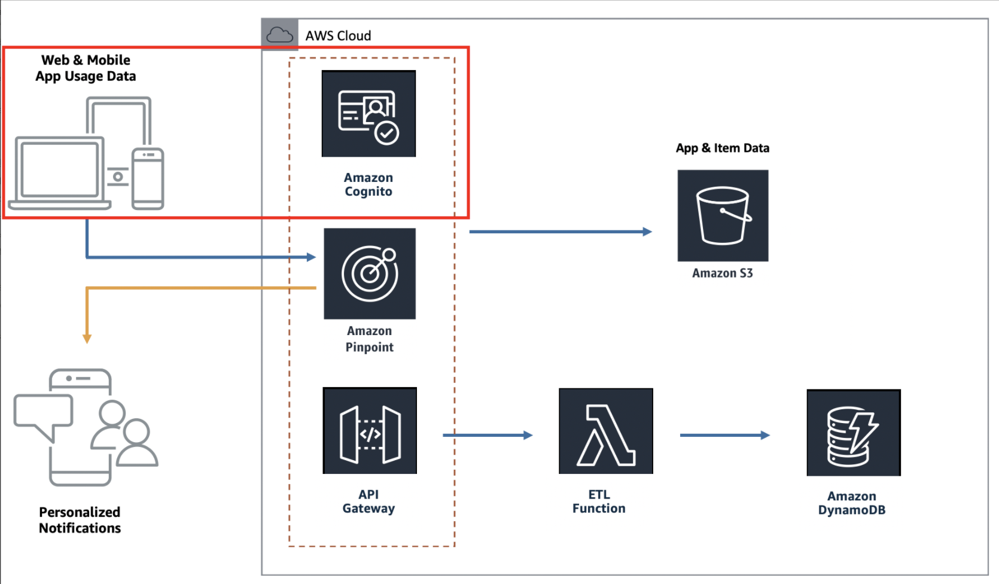

### 인증 백엔드 구성

create-react-app CLI로 새로운 리액트 웹 어플리케이션을 만들고, 사용자가 앱에 가입하고 로그인을 할 수 있도록 만들겠습니다.

백엔드 API를 조회 할 수 있는 기능을 추가할 때 시스템에 액세스하는 사용자를 알 수 있도록 하는것이 좋습니다.

AWS Amplify CLI를 사용하면 웹 및 모바일 앱에 클라우드 기능을 쉽게 추가 할 수 있습니다.

다음과 같이 웹앱에 **`Amplify를 초기화`** 하면 CloudFormation으로 클라우드 리소스가 생성됩니다. Amplify는 클라우드 리소스가 추가된 앱의 현재 상태를 S3에 저장하여 관리합니다.

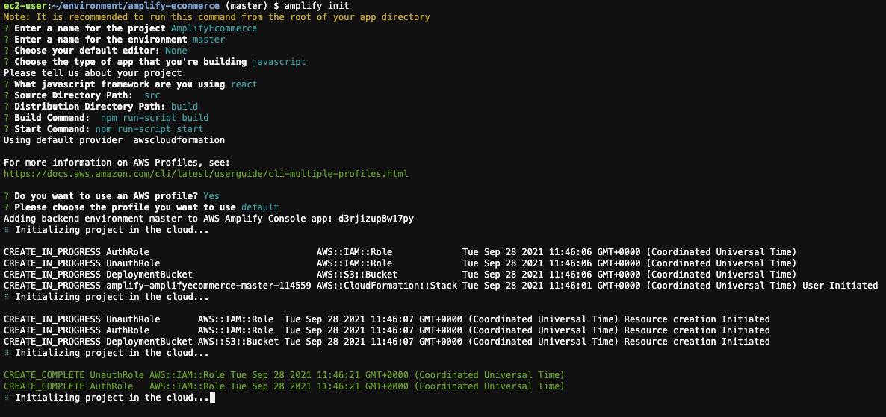

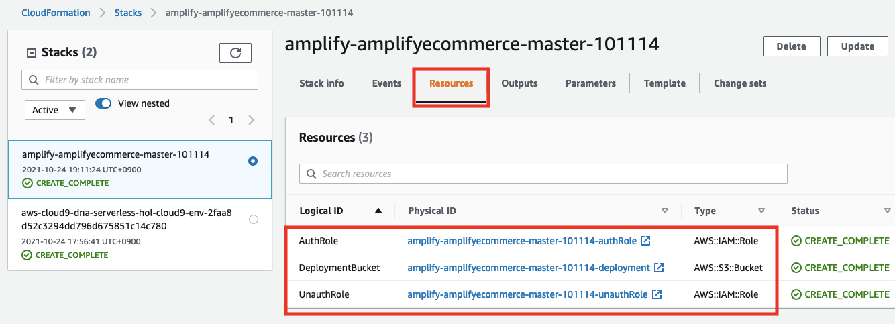

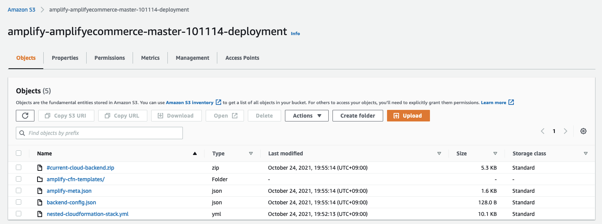

인증방식과 설정은 Amplify CLI 대화방식으로 지정할 수 있으며, **`AWS Cognito로 구현`**됩니다.

이렇게 하면 사용자가 가입 및 로그인 할 수있는 백엔드 역할을 하도록 Cognito 사용자 풀(UserPool)과 자격증명 풀(Identity Pool)이 생성됩니다.

사용자 풀은 사용자가 등록 중에 만든 사용자 이름과 암호로 로그인 할 수 있는 안전한 사용자 디렉터리입니다.

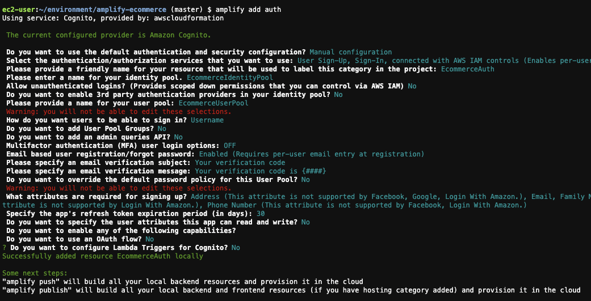

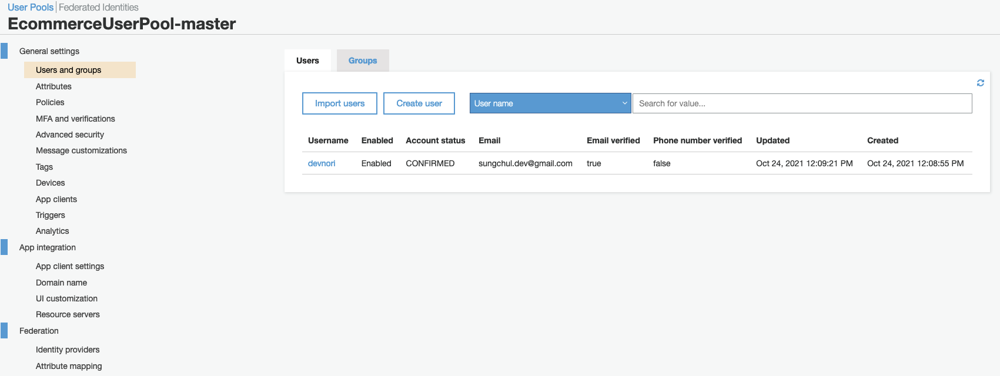

### 인증 프론트 엔드 구성

등록 및 로그인 관리를 위해 백엔드를 구성했으므로 **`withAuthenticator`** (@aws-amplify/ui-react 라이브러리에서 제공하는 리액트 컴포넌트)를 사용하여 기존 App 구성 요소를 감싸도록 합니다. 이렇게 하면 사용자가 가입, 계정 확인, 로그인, 로그 아웃 또는 비밀번호 재설정을 할 수 있도록 간단한 UI 렌더링을 처리합니다.

이것은 매우 간단한 인증 UI이지만 직접 React 컴포넌트로 교체하거나 완전히 호스팅 된 UI를 사용하여 앱으로 다시 리디렉션하는 등 사용자 정의 할 수있는 작업이 많이 있습니다. 자세한 내용은 AWS Amplify 인증 안내서의 사용자 지정 섹션을 참조하세요.

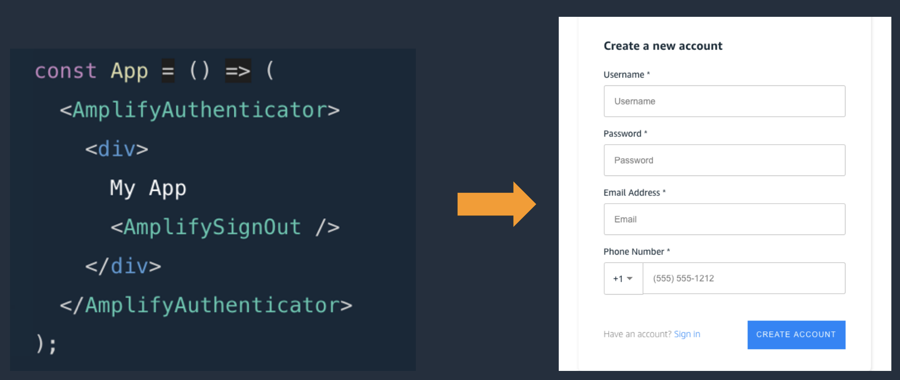

## 데이터베이스 구현

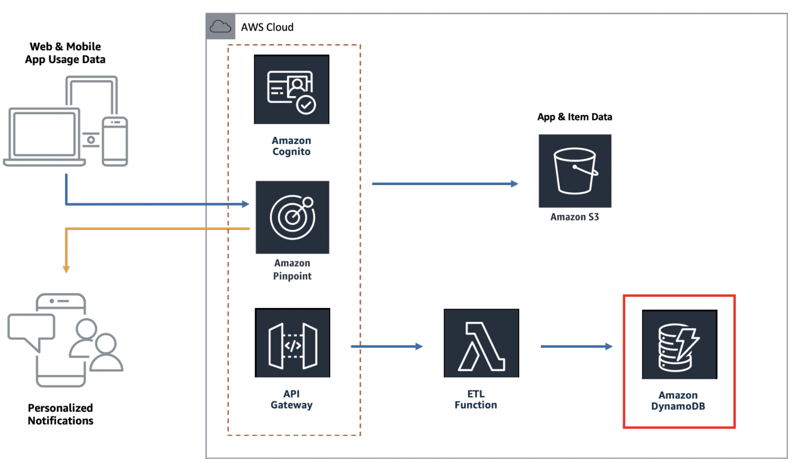

웹 사이트에서 사용할 상품 정보를 구성하기 위하여 **`Amplify를 이용하여 DynamoDB를 생성`**합니다.

DynamoDB를 사용하여 DB를 구축하고 데이터를 조회할 수 있도록 테이블을 구성합니다.

> Amazon DynamoDB는 어떤 규모에서도 빠르고 유연한 NoSQL 데이터베이스 서비스입니다.  
> 완전관리형의 내구성이 뛰어난 다중 리전, 다중 마스터 데이터베이스로서 인터넷 규모 애플리케이션을 위한 보안, 백업 및 복원, 인 메모리 캐싱 기능을 기본적으로 제공합니다.

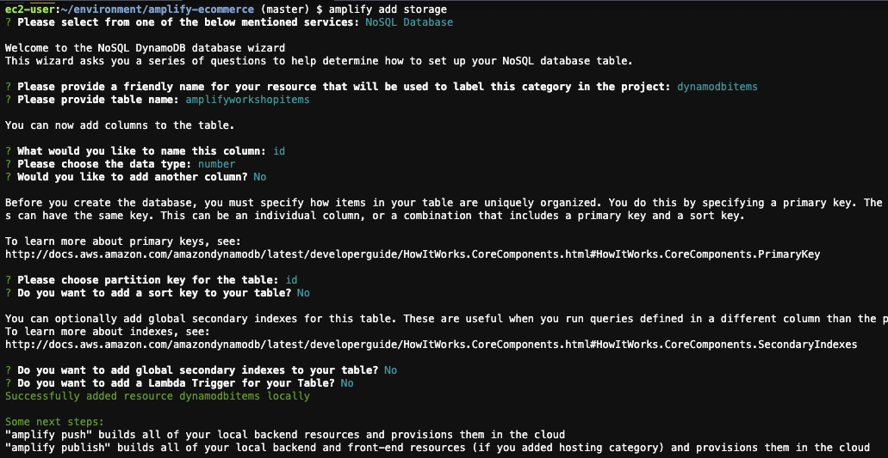

이제 상품정보를 조회할 수 있는 DB가 생겼습니다.

DynamoDB에 상품정보를 직접 입력하지 않고, 이후에 만들어지는 Lambda를 이용하여 상품정보를 입력하겠습니다.

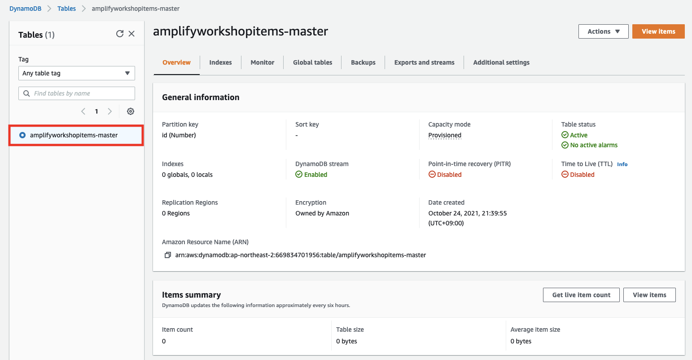

## REST API 구현

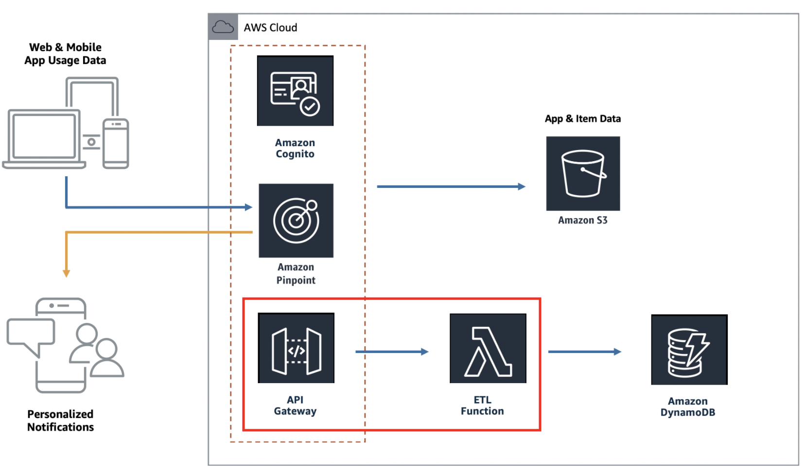

DynamoDB에서 상품을 조회하는 서비스를 API Gateway와 Lambda를 이용해서 만들어 보겠습니다.

AWS Lambda 및 Amazon API Gateway 위에서 기존 Node.js 애플리케이션 프레임 워크를 사용(aws-serverless-express/middleware)하여 서버리스 애플리케이션 및 REST API를 실행할 수 있습니다.

### Lambda 함수 구현

AWS Lambda는 DynamoDB에서 상품을 조회하여 상품이 없으면 기본 상품정보들을 생성하고, 있으면 조회 결과를 반환하도록 구현하였습니다.

DynamoDB에 접근해야 하기 때문에 권한을 적절히 적용해 줘야 합니다.

자세한 구현 내용은 [app.js](https://github.com/Sungchul-P/amplify-ecommerce/blob/main/amplify/backend/function/AmplifyWorkshopLambda/src/app.js) 를 참고해주세요.

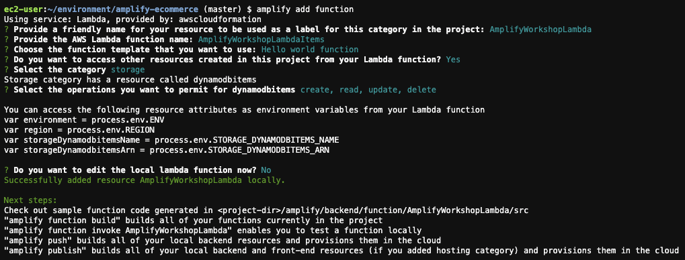

### API Gateway 구현

상품 정보 조회 서비스를 통해 고객은 웹사이트상의 품목에 대한 주문을 작성하고 구매를 할 수 있습니다. 이 서비스는 API Gateway - REST API를 통해 제공됩니다.

> Amazon API Gateway는 어떤 규모에서든 개발자가 API를 손쉽게 생성, 게시, 유지 관리, 모니터링 및 보안 유지할 수 있도록 하는 완전관리형 서비스입니다.  
> API는 애플리케이션이 백엔드 서비스의 데이터, > 비즈니스 로직 또는 기능에 액세스할 수 있는 "정문" 역할을 합니다.  
> API Gateway를 사용하면 실시간 양방향 통신 애플리케이션이 가능하도록 하는 RESTful API 및 WebSocket API를 작성할 수 있습니다.  
> API Gateway는 컨테이너식 서버리스 워크로드 및 웹 애플리케이션을 지원합니다.

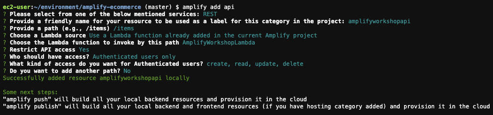

REST API 요청(경로 : /items)을 하면 Lambda 함수가 트리거되어 DynamoDB 에서 상품을 조회한 결과를 반환합니다.

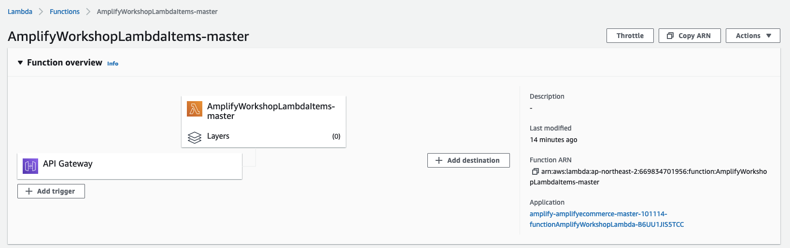

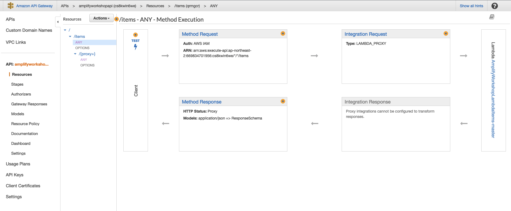

## 고객 행동 분석 및 캠페인 보내기

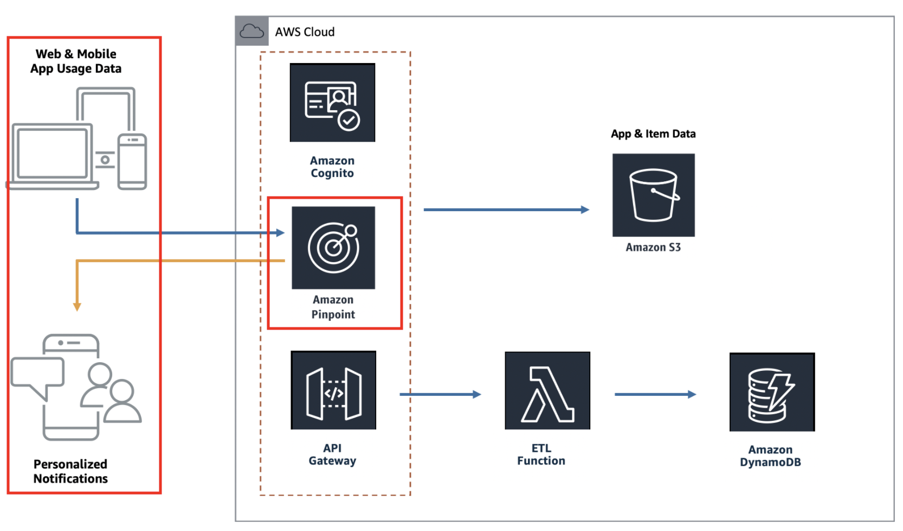

Amplify를 이용하여 Amazon Pinpoint를 추가합니다.

> Amazon Pinpoint를 사용하여 고객 행동 분석 및 고객 그룹을 분류하고, 특정 조건에 부합하는 타겟 고객에게 캠페인(이메일, SMS 전송 등)을 집행할 수 있습니다.

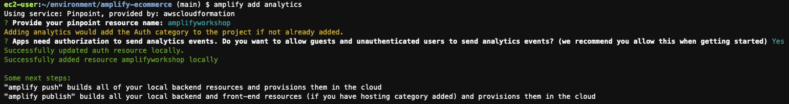

Amazon Pinpoint로 서비스 중인 웹앱의 고객 정보를 분석하려면 aws-amplify 라이브러리의 Analytics 컴포넌트를 이용하여 코드를 구현해야 합니다.

autoTrack을 이용하여 기본 고객 이벤트를 수집할 수 있으며, 아래와 같이 코드를 추가하여 사용자 정의 속성을 수집하는 것도 가능합니다.

조금 더 상세한 이벤트 수집 방법은 [https://docs.amplify.aws/lib/analytics/getting-started/q/platform/js/](https://docs.amplify.aws/lib/analytics/getting-started/q/platform/js/) 를 참고해 주세요.

```javascript{19,20,21}
Analytics.autoTrack('pageView', {
  enable: true,
  type: 'SPA',
})

Analytics.record('Store_Load')

Analytics.updateEndpoint({
  ChannelType: 'EMAIL',
  Address: data.attributes.email,
  location: {
    city: data.attributes['custom:city'],
    country: countryCode,
    postalCode: data.attributes['custom:postcode'],
    region: data.attributes['custom:state'],
  },
  optOut: 'NONE',
  attributes: {
    firstName: [data.attributes.given_name],
    hasShoppingCart: ['false'],
    completedOrder: ['false'],
  },
  metrics: {
    itemsInCart: 0,
    orderNumber: '0',
  },
})
```

Pinpoint 대시보드에서 활성 사용자, 사용자에 대해 집계한 데이터, 수익 지표 등을 확인할 수 있습니다.

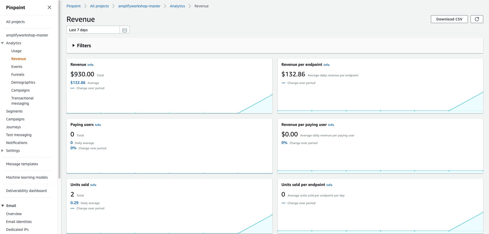

새로 가입한 모든 고객은 이메일 주소가 지정되도록 수집 코드가 작성되어 있습니다. 이를 이용하여 동적 고객 그룹(Segments)을 정의하고 해당 고객 그룹을 타겟팅하는 캠페인을 만들 수 있습니다.

새로 가입한 고객을 환영하는 새 캠페인을 생성하고, 고객의 이름으로 개인화된 메일을 전송해보겠습니다.

1. 동적 고객 그룹(Segments) 만들기

고객 그룹의 조건을 지정하면 화면 우측에 "Segment estimate" 를 통해 대상 고객 수를 확인할 수 있습니다. 테스트 시, 전체 고객이 1명이었기 때문에 1 endpoints로 확인되었습니다.

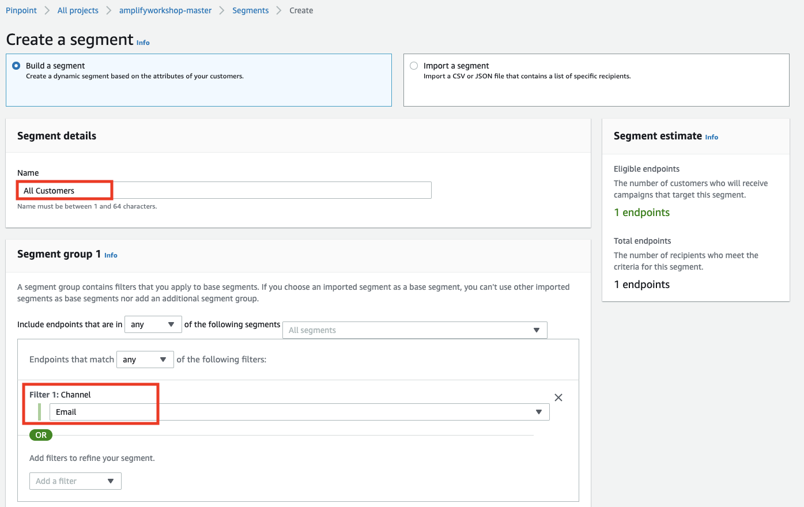

2. 캠페인 만들기

캠페인 채널(이메일, SMS 등)을 선택하고, 위에서 생성한 고객 그룹을 지정합니다.

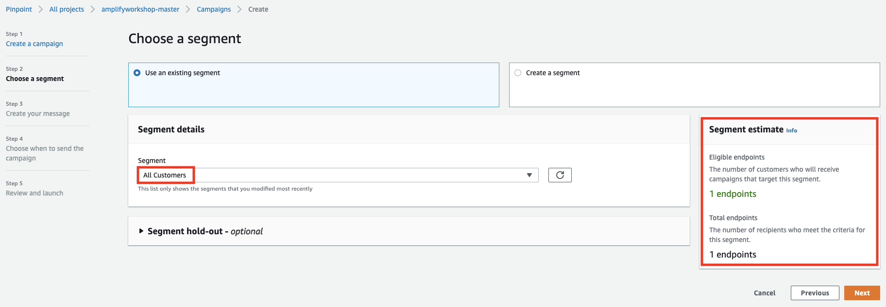

Pinpoint에 수집된 이벤트의 속성을 변수로 활용하여 전송할 메시지 템플릿을 작성할 수 있습니다. (전송 시점도 지정할 수 있습니다.)

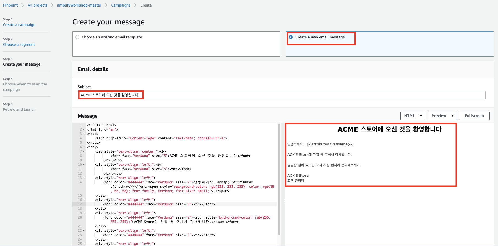

캠페인을 통해 전송된 메일은 다음과 같습니다. **`{{Attirubutes.firtName}}`** 부분이 개인화되어 전송된 것을 확인할 수 있습니다.

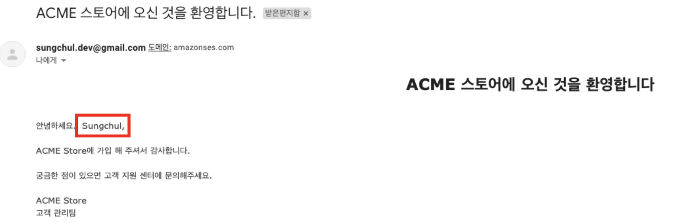

## 마무리

Amplify는 이번 기회에 처음 사용해봤는데, Cloud Native 하게 개발하기 너무 편리하네요.

다만, 너무 많은 기능이 있다보니 잘 쓰려면 러닝커브가 있다는 점과 애플리케이션이 AWS 리소스와 강결합 되는 느낌이라 개인적으로 조금은 걱정되는 부분도 있네요.

기존 개발되어 있는 앱을 연동하기는 넘어야 할 산이 많을 것 같아서, MVP(Minimum Viable Product) 만들어 볼 때 좋은 선택지가 될 것 같습니다.

## 참고 자료

- [Full Serverless App with React and Amplify](https://master.d3f5073vvso9t3.amplifyapp.com/)
- [Amplify Libraries](https://docs.amplify.aws/lib/q/platform/js/)
