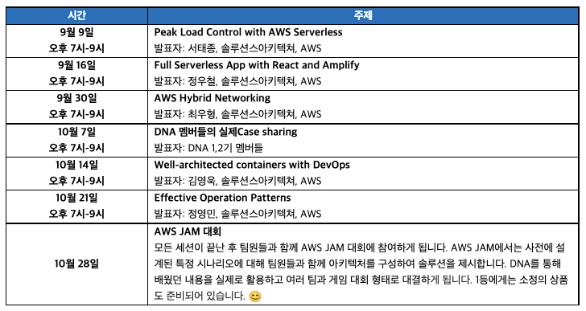
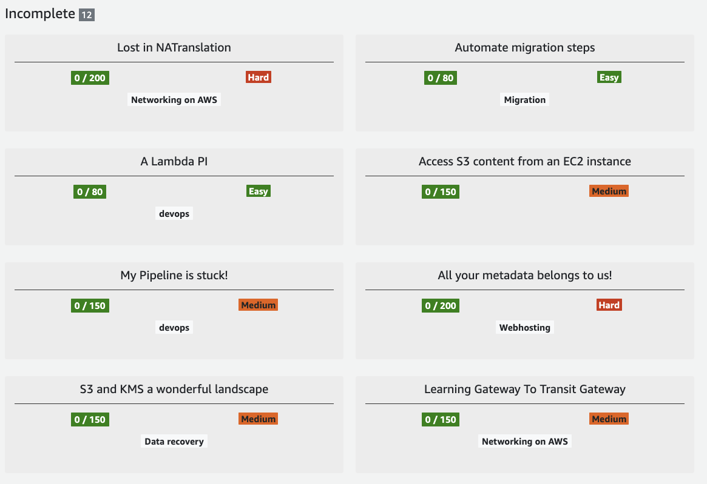
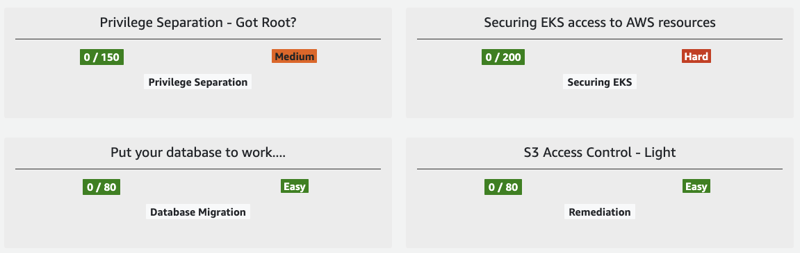
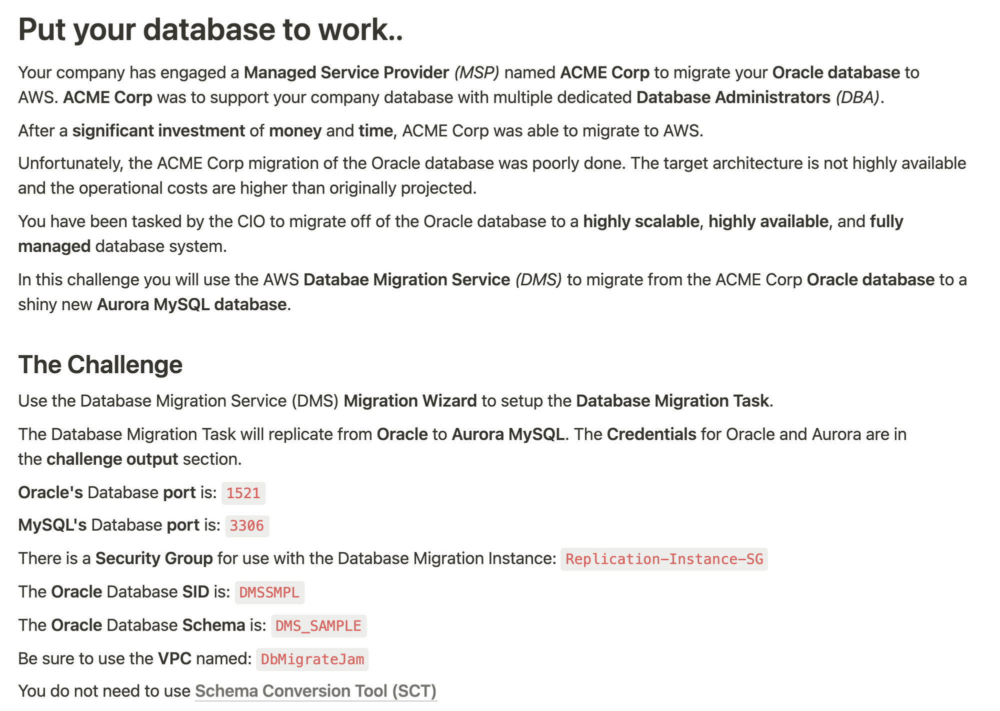

## AWS DNA 프로그램이란?

AWS DNA (Digital Native Architects) 프로그램은 AWS 코리아에서 제공하는 새로운 방식의 클라우드 교육 및 네트워킹 프로그램입니다.

AWS를 사용중인 고객사를 대상으로 멤버를 모집하며, [온라인 설명회](https://pages.awscloud.com/kr-aws-dna-online-reg.html)에서 지원서를 제출하여 참여를 신청할 수 있습니다. 한정된 인원을 모집하기 때문에, 지원서를 정성스레 작성하셔야 선별될 확률이 높아집니다. (이 부분을 번거롭게 느끼실 분이 많으실 것 같은데, 수료해본 결과 시간내어 작성할 만한 가치가 충분하다고 생각합니다!)

선별된 멤버는 약 2개월 동안 AWS 솔루션즈 아키텍트님들의 퀄리티 높은 세션, 기존 DNA 멤버들이 소개하는 Case들, 그리고 AWS JAM 등 다양한 교육과 혜택을 받을 수 있습니다.

## 세션에 대한 이야기

위 일정표의 주제만 보시면 어떤 내용인지 감이 잘 안잡히실 수 있지만, 모든 세션의 좋은 점은 특정 시나리오가 있다는 점입니다. 개념과 기능의 나열이 아닌 시나리오 기반으로 설명해 주신 점이 너무 좋았습니다.

예를 들어, 첫 번째 주제 였던 Peak Load Control 은 온라인 쇼핑몰을 서비스 하는 입장에서 다양한 원인으로 인해 발생할 수 있는 트래픽 급증을 처리하기 위해 "대기열 시스템"을 도입하고, 이를 서버리스 구조로 구현해 보는 것입니다.

세션시간에 완전히 이해하지 못했더라도 과제를 통해 다시 한번 복습이 가능합니다. 과제를 수행하기 위한 가이드 페이지를 제공하기 때문에, 따라서 진행하기만 한다면 막힘 없이 진행할 수 있어서 여러 시나리오를 다양한 서비스를 활용하여 구현하는 경험을 해볼 수 있습니다. 하지만, 편의를 위해서 제공해주시는 코드와 CloudFormation 템플릿 등을 한땀 한땀 뜯어보시기를 권장드립니다. 제 경험으로는 과제만 수행해서는 크게 남길 수 있는 부분이 많지 않고, 직접 수정이 가능한 정도까지 삽질(?)을 해야 해당 시나리오가 내것으로 소화되는 것 같았습니다.(물론 완벽하진 않겠지만, 나중에 응용해볼 수 있겠다 정도?)

권장은 드렸지만, 가이드 따라서 진행만 해도 최소 2~3시간을 걸리기 때문에 많은 시간을 할애할 수 있는 상황이 아니라면 힘드실 것이라 생각합니다. (단, 실무에 근접한 시나리오가 하나라도 있다면 그걸 파보는건 충분히 투자 가치가 있습니다. AWS SA 분들이 설계하신 베스트 프랙티스니까요!)

저 역시도 과제 수행하고, 이해하는 것만으로도 벅찬 일정이었지만 각 주제들에 대해 제 나름대로 정리해서 기록으로 남겼습니다. (모든 주제에 대해 정리하는 것이 목표라서 아직 진행중입니다..)

정리하면서 힘들 때마다, 어느 분이 말씀하셨던 '고통은 지나가지만, 기록은 남는다' 라는 명언(?)을 떠올리며 블로그 글로 남겼습니다. 상세 내용이 궁금하신 분은 아래 글들도 많은 관심과 피드백 부탁드립니다 🙂

[AWS DNA 3기 #1 - Peak Load Control](https://sungchul-p.github.io/aws-dna3-peak-load-control)

[AWS DNA 3기 #2 - Amplify를 활용한 서버리스 웹앱 구축](https://sungchul-p.github.io/aws-dna3-amplify-webapp)

## AWS JAM 대회

AWS JAM은 다양한 주제에 걸쳐 실제 AWS 사용 사례에 대한 문제를 해결하여 실력을 테스트해 볼 수 있는 플랫폼(?)입니다. 제한 시간내에 아래와 같은 문제들을 해결하여 점수를 획득하는 방식입니다.

문제의도 파악과 정답 제출 방식을 이해하지 못해서 헤매는 바람에 개인적으로 아쉬움이 많이 남지만, 그럼에도 불구하고 매우 흥미로운 경험이었습니다. 네트워크, 데브옵스, 데이터 복원, 마이그레이션, EKS 설정 등 다양한 주제가 있고, 각 문제에는 시나리오가 있기 때문에 몰입하는데 도움이 됩니다.

기회가 있다면, 다시 꼭 해보고 싶습니다. AWS 서비스 이해도 점검 뿐 아니라, 있을 법한 문제에 대해 장애처리 해보는 경험이 스킬업에 상당히 도움이 된다고 생각합니다. 특정 문제를 설계하여 구성해 보는 것도 공부 많이 될 것 같다고 생각되어, 저의 To-Do 리스트에 추가해 두었습니다. (언제 완성할지는 모르겠지만)

## 마무리

생각보다 일정이 빠르게 마무리 되어 놀랐는데, 이런 생각이 드는 이유는 한 주마다 알찬 세션과 과제 그리고 전폭적인 지원이 있어서 소속감을 가지고 몰입했기 때문이라고 생각합니다.

사용해 보지 못했던 다양한 AWS 서비스 경험을 물론이고, 여러 시나리오를 통해 문제 해결 방식에 대해서도 인사이트를 얻은 점이 많아서 매우 만족하고 있습니다.

과제를 다시 곱씹어보며, 저의 것으로 만드는 것은 여전히 진행중입니다만.. 앞으로 저의 실무에 큰 도움이 될 것이라는 것은 확신하고 있습니다. (멀티 리전, EKS 마이그레이션, IaC 등의 작업이 기다리고 있는데 모두 세션에서 다뤄졌던 내용이기 때문이죠!)

주변에도 강추하고 있지만, AWS DNA 프로그램에 참여하시고 하는 분이 있다면 주저 마시고 기회를 잡으시길 강추드립니다. (못 먹어도 Go! ㅎㅎ)
