> 이 글에서는 TransitGateway로 글로벌 네트워크를 구성 및 모니터링 방법에 소개합니다.
> VPC, 서브넷, 라우팅 테이블 등에 대한 자세한 설명은 다루지 않으므로, AWS 네트워크 기초 수준의 이해도가 있으신 분이 읽으시기에 적합합니다.
> 본 글에서 사용된 VPC 구성 상세내용은 https://github.com/whchoi98/tgw 의 CloudFormation 템플릿을 참고해주시기 바랍니다!
>
> 본 글의 내용은 "AWS 솔루션즈 아키텍트 최우형"님의 세션과 실습(Hands-on Lab) 자료를 기반으로 작성되었습니다.

## VPC란 무엇인가?

VPC(Virtual Private Cloud)는 AWS 계정 전용 가상 네트워크입니다. 기본 VPC는 IPv4 CIDR 블록의 크기가 /16 이며, 최대 65,536개의 프라이빗 IPv4 주소를 제공합니다.  
(CIDR : [https://ko.wikipedia.org/wiki/사이더\_(네트워킹)](<https://ko.wikipedia.org/wiki/사이더_(네트워킹)>))  
각 가용 영역에 VPC의 IP 주소 범위에 해당하는 퍼블릭, 프라이빗 서브넷을 생성하여 사용할 수 있습니다. 각 서브넷에는 네트워크 트래픽 경로를 제어하는 라우팅 테이블을 추가하고, 퍼블릭 서브넷의 경우 라우팅 테이블에 인터넷 게이트웨이로 전달되는 경로를 추가하여 VPC 리소스와 인터넷 간의 통신을 활성화합니다.

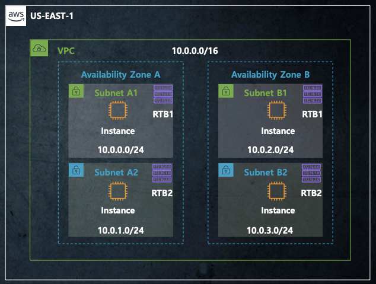

## TransitGateway 사용 이점

연결을 관리해야하는 VPC 수가 적을 때는 VPC Peering 만으로도 충분하지만, 네트워크가 기하 급수적으로 확장되는 경우에는 아래 그림과 같이 매우 복잡한 아키텍처가 구성됩니다.

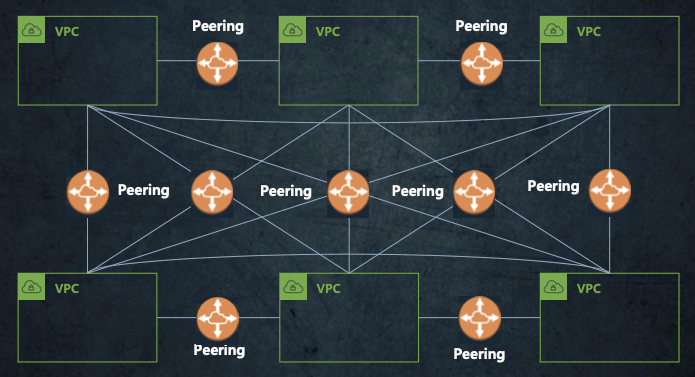

위와 같은 복잡한 구성은 Transit Gateway를 사용해서 간소화할 수 있습니다. (연결하려는 VPC를 Transit Gateway에 연결하고, 라우팅 테이블에 등록만 하면 됩니다.)

글로벌 구성이 필요한 경우에도 리전 간 피어링을 사용하여 간단하게 연결할 수 있습니다.

그리고 Transit Gateway 네트워크 관리자를 사용하면 중앙 콘솔에서 VPC 연결을 모니터링할 수 있어서 문제를 빠르게 식별하여 대응할 수 있습니다. VPC와 Transit Gateway 간의 트래픽은 AWS의 글로벌 프라이빗 네트워크에서 유지되며 모든 트래픽을 암호화하기 때문에 보안 강화 측면에서도 유리합니다.

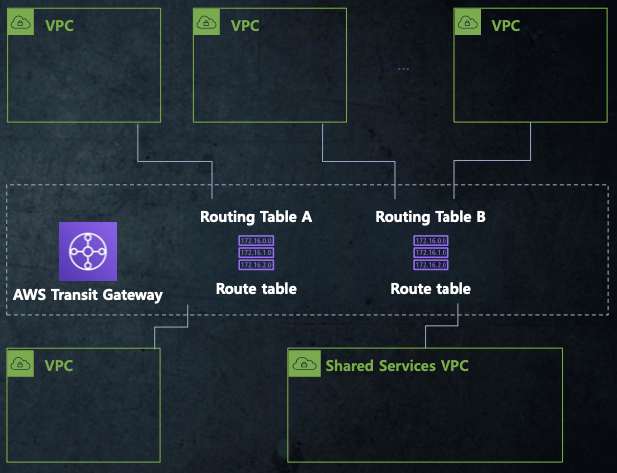

## TransitGateway 기본 구성

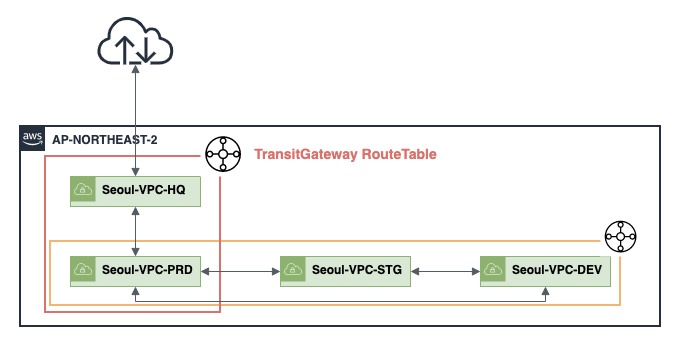

### 기본 구성 시나리오

1. 컴퍼니는 아래와 같은 VPC를 하나의 계정에 소유하고 있습니다. (서울 리전 : ap-northeast-2)

- IT 컨트롤 타워 : Seoul-VPC-HQ (보안 강화를 위해 인터넷 통신이 모두 이곳을 거쳐가도록 합니다.)
- 운영 환경 : Seoul-VPC-PRD
- 스테이징 환경 : Seoul-VPC-STG
- 개발 환경 : Seoul-VPC-Dev

2. 같은 서울 리전(ap-northeast-2)에 TransitGateway를 생성 후, 4개의 VPC를 연결하고 각 VPC의 라우팅 테이블을 업데이트 합니다.

3. 내부 VPC간 통신을 위한 라우팅 테이블을 생성합니다. (East-West 트래픽)

- STG, DEV VPC는 개발 진행 동안 잦은 네트워크 연결이 필요합니다.
- 개발 완료 후에 PRD와 잠시 연결이 필요합니다. (블랙홀 구성으로 특정 대역을 격리시킬 수 있습니다.)

4. 운영 환경이 보안 정책을 적용 후 인터넷 통신을 연결하도록 라우팅 테이블을 생성합니다. (North-South 트래픽)

- PRD 개시 전에 직접 인터넷 연결은 차단하고, HQ를 통해서 인터넷을 연결합니다.

위에서 간단하게 표현한 그림에 가용영역, 서브넷, 라우팅 테이블, CIDR 까지 상세히 덧붙이면 아래와 같습니다. 각 VPC의 모든 라우팅 테이블에는 TransitGateway가 추가되어 있고, TrasitGateway 라우팅 테이블은 트래픽 제어 방식에 따라 "East-West", "North-South" 2개가 생성되어 있습니다.

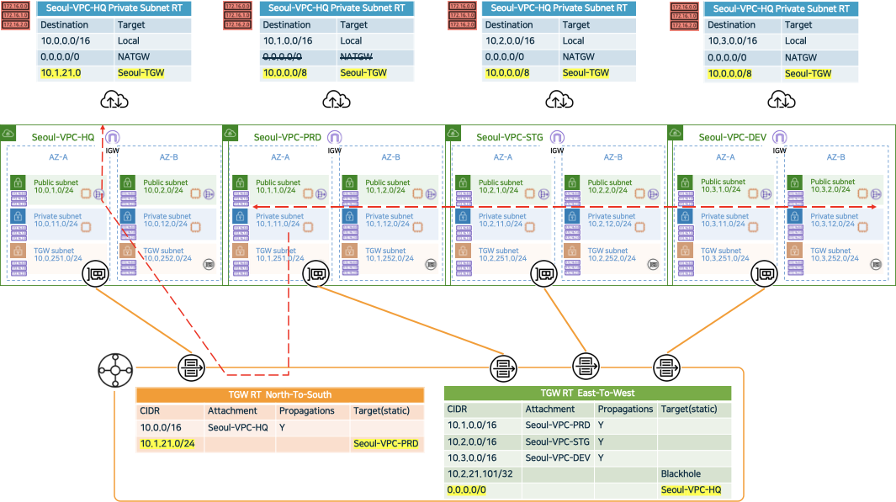

## TransitGateway 멀티 리전 피어링

Transit Gateway는 서로 다른 리전에서 동일한 Transit Gateway를 사용할 수 없습니다. 서로 다른 리전은 서로 다른 Transit Gateway를 구성해야 하고, 상호 연결을 위해서는 Transit Gateway Peering을 사용해야 합니다.

### 피어링 시나리오

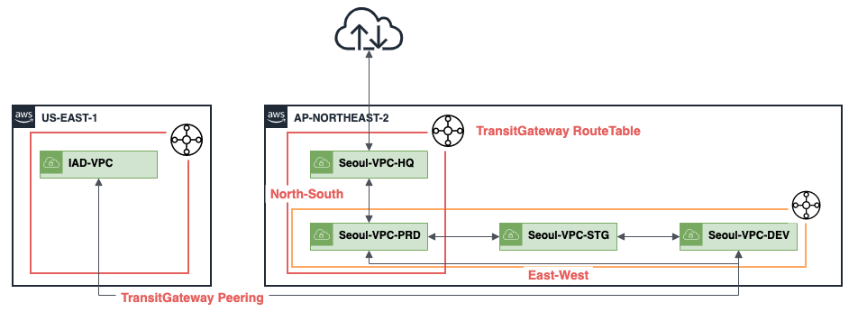

1. 컴퍼니는 아래와 같은 VPC를 2개의 리전(버지니아, 서울)에 소유하고 있습니다.

- 서울 IT 컨트롤 타워 : Seoul-VPC-HQ (ap-northeast-2)
- 서울 운영 환경 : Seoul-VPC-PRD (ap-northeast-2)
- 서울 스테이징 환경 : Seoul-VPC-STG (ap-northeast-2)
- 서울 개발 환경 : Seoul-VPC-DEV (ap-northeast-2)
- **미국 개발 환경: IAD-VPC (us-east-1)**

2. 미국의 개발자들은 서울의 개발자들(Seoul-VPC-DEV)과의 잦은 네트워크 연결이 필요합니다.
3. 미국의 개발자들은 서울 리전의 인터넷을 사용하지 않습니다. (개발환경 외에는 접근 불가)

### 버지니아 리전과 서울 리전 피어링

버지니아 리전에서 TransitGateway 피어링을 요청한 다음, 서울 리전에서 수락하면 두 리전간 피어링이 맺어집니다. 특정 대역으로 연결할 수 있도록 TransitGateway 라우팅 테이블에 피어링을 등록합니다.

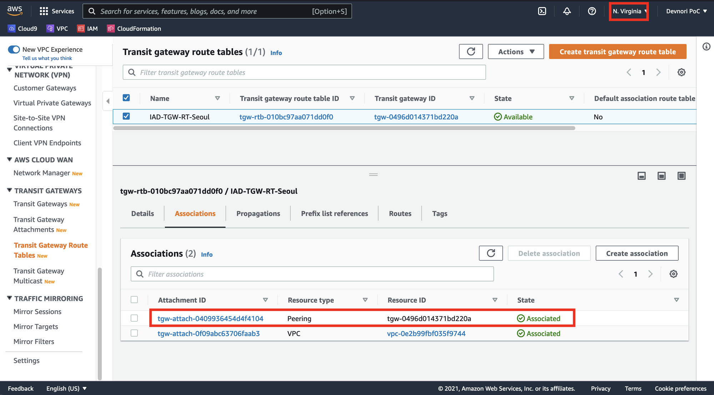

서울리전에서는 개발환경에만 접근하도록 구성할 것이기 때문에 "East-West" 라우팅 테이블에 피어링을 등록합니다.

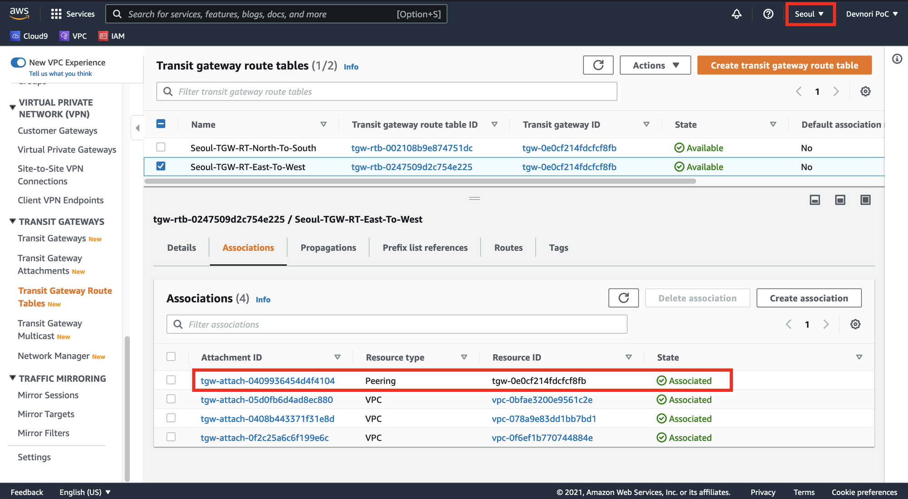

### 리전간 트래픽 전송 확인

IAD-VPC-Private 10.5.21.101 에서 정상적으로 Seoul-VPC-DEV 10.3.21.101로 ping 이 이뤄지는 지 확인합니다.

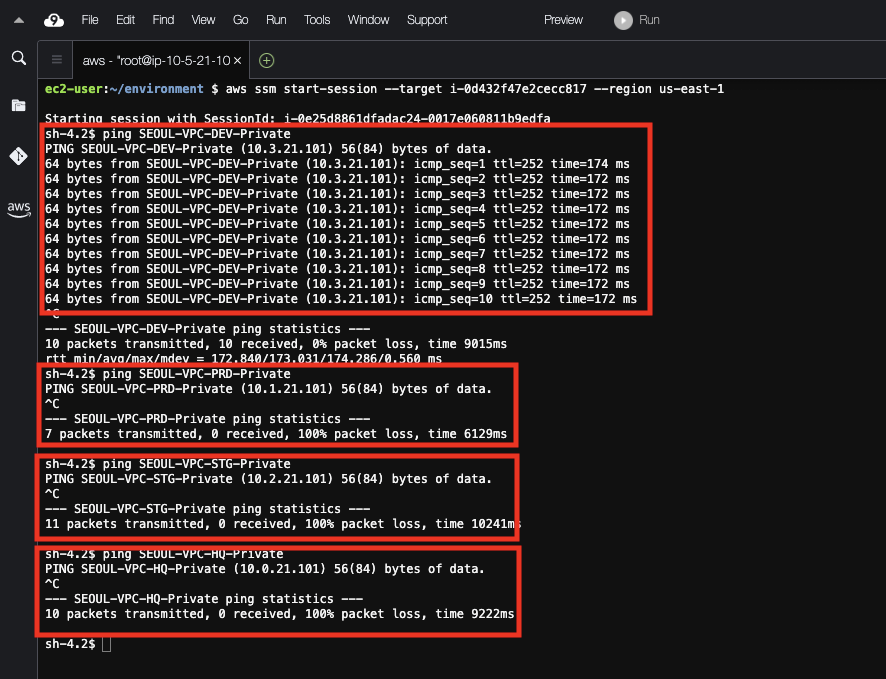

## TransitGateway 모니터링

### 네트워크 매니저 소개

Transit Gateway Network Manager(Network Manager)를 사용하면 전송 게이트웨이를 중심으로 구축된 네트워크를 중앙에서 관리할 수 있습니다. AWS 리전 및 온프레미스 위치에서 글로벌 네트워크를 시각화하고 모니터링할 수 있습니다.

Geography 탭에서 피어링 현황을 세계지도로 시각화하여 볼 수 있습니다.

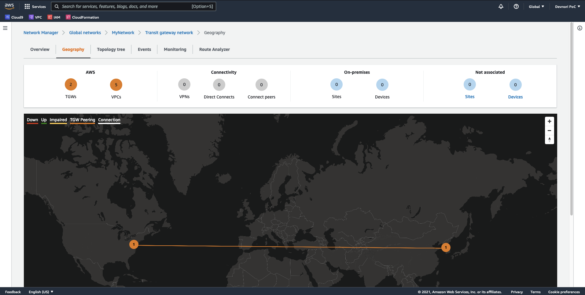

Topology tree 탭에서는 전체 TransitGateway에 대하여 트리 구조로 볼 수 있고, 각 VPC에 대한 간단한 내용도 확인할 수 있습니다.

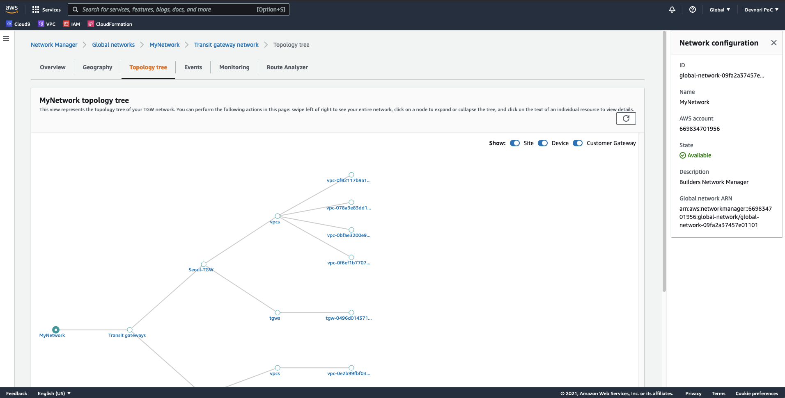

Route Analyzer 탭에서는 출발지와 도착지를 지정하면 어떤 게이트웨이와 라우팅 테이블을 통해서 트래픽이 전송되는지 분석할 수 있습니다.

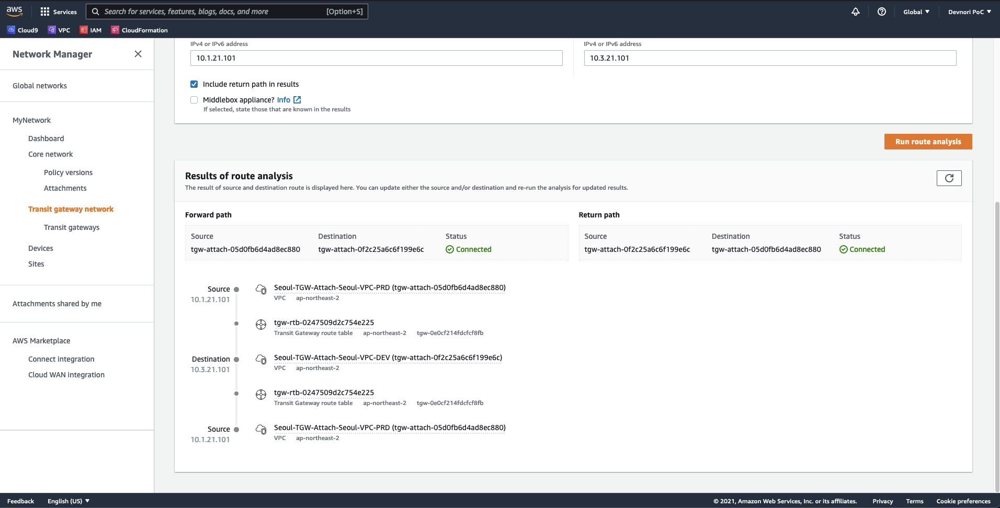

## 마무리

이번 Transit Gateway 핸즈온랩을 통해서 글로벌 서비스를 개발하고 운영할 때, AWS 상에서 네트워크 아키텍처를 어떤식으로 구성하면 되는지 아주 좋은 가이드라인이 됐습니다.

다중 VPC와 다중 리전이 생각보다 쉽게 연결되고 관리할 수 있다는 점이 제대로 구성 한것이 맞나 싶을 정도로 간단해서 놀라운 경험이었습니다!

글로벌 웹 서비스를 운영한다면 CloudFront(CDN 서비스), Route53 등 함께 고려해야할 부분이 더 많아지겠지만 이번에 다뤄본 시나리오를 기반으로 확장해 봐야 겠습니다.

## 참고 자료

- [Amazon VPC란 무엇인가?](https://docs.aws.amazon.com/ko_kr/vpc/latest/userguide/what-is-amazon-vpc.html)
- [TransitGateway HoL](https://whchoi98.gitbook.io/transitgateway/)
- [TransitGateway HoL - CloudFormation](https://github.com/whchoi98/tgw)
