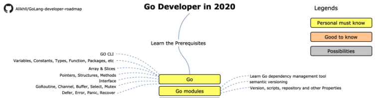
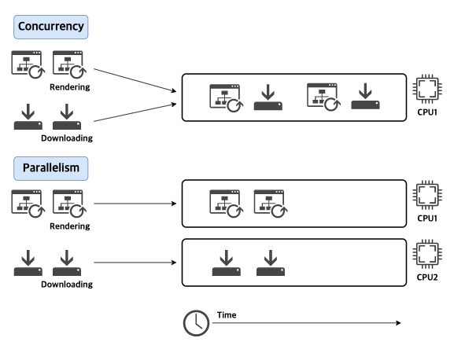

## Golang 로드맵

[golang-developer-roadmap](https://github.com/Alikhll/golang-developer-roadmap)에서 제시하는 로드맵을 따라가며 취향에 따라 주제를 선택하여 "Golang 로드맵 따라가기" 시리즈로 정리해 보고자 합니다.

 [[출처] : https://github.com/Alikhll/golang-developer-roadmap](https://github.com/Alikhll/golang-developer-roadmap)

기본 문법이나 튜토리얼은 워낙 잘 적어놓은 글들이 많으므로 개인적으로 도움이 됐던 사이트들을 소개하고 넘어가려고 합니다. (더 잘 적을 자신이 없어서..)

- [Golang tutorial series](https://golangbot.com/learn-golang-series/)
  - 로드맵에서 소개하고 있는 튜토리얼 사이트 입니다.  
    주제별로 깔끔하게 잘 정리 되어 있습니다.
- [The Ultimate Go Study Guide](https://ultimate-go-korean.github.io/translation/)
  - 코드를 단계별로 부분적으로 설명하고 있어서, 처음 보실 때는 조금 헷갈리실 수 있습니다.  
    전체 코드를 [https://github.com/hoanhan101/ultimate-go](https://github.com/hoanhan101/ultimate-go)에서 먼저 확인하고 해당 주제에 대해 읽어보시길 권장드립니다.
- [https://github.com/Sungchul-P/go-learning/tree/main/ultimate-go](https://github.com/Sungchul-P/go-learning/tree/main/ultimate-go)
  - 하나씩 코드를 실행하면서 진행하고 싶으신 분은 제가 포크하여 재정리한 레포지터리를 참고하셔도 좋을 것 같습니다.

위 내용 중 잘 이해가 가지 않는 부분에 대해서는 여러 자료를 참고하여 재정리할 예정입니다.  
이번 글에서는 고 언어(Golang)의 특별한 개념 중 하나인 **`고루틴(Goroutine)`**에 대해서 정리해 보겠습니다.

## 동시성 및 병렬성 (Concurrency vs Parallelism)

고루틴을 사용하기에 앞서 동시성과 병렬성의 차이를 구분할 필요가 있습니다.

**동시성(Concurrency)**은 시간 분할과 같은 스케쥴링을 사용하여 동일한 코어에서 여러 작업을 **`번갈아 가면서`** (사용자는 거의 동시로 느낄 정도) 실행하는 것을 의미하고,

**병렬성(Parallelism)**은 서로 다른 코어에서 여러 작업을 **`동일한 시간`**에 실행하는 것을 의미합니다.

웹 브라우저에서의 웹 페이지 렌더링과 파일 다운로드 작업을 예로 둘의 차이를 비교해보겠습니다.

브라우저가 싱글 코어 프로세서에서 실행된다면 두 작업간에 문맥 교환(Context Switch)을 수행하게 됩니다. 즉, 잠시 동안 파일을 다운로드 한 다음 사용자가 요청한 웹 페이지를 렌더링하도록
작업이 전환됩니다. 이를 **동시성(Concurrency)** 이라고 합니다.

동일한 브라우저가 멀티 코어 프로세서에서 실행된다면 다운로드 작업과 렌더링 작업이 동시에 실행될 수 있습니다. 이를 **병렬성(Parallelism)**이라고 합니다.



병렬 처리가 실행 시간이 빠를 것으로 보이지만 항상 그렇지는 않습니다. 브라우저의 경우, 다운로드가 완료되면 사용자에게 팝업을 띄우기 위해 렌더링 작업과 통신을 해야 하는데 이 때 병렬로
실행되는 경우 오버헤드가 높아서 동시성 처리보다 느려질 수 있습니다.

## 고루틴(Goroutine)

고루틴이란, 스케줄링 되어야 하는 실행의 경로(path of execution)입니다. Go에서는 모든 함수와 메소드는 고루틴으로 생성 될 수 있으며 특정 코어, 특정 OS 스레드에 의해 독립적 실행이 되도록 스케줄링이 가능합니다. 고루틴은 경량 스레드로 생각할 수 있으며, 스레드와 비교했을 때 생성 비용이 적습니다. 따라서 Go 애플리케이션은 수 천개의 고루틴을 동시에 실행하는 것이 일반적입니다.

고루틴 사용 예제 코드를 통해 고루틴의 동작 방식을 확인해 보겠습니다.

우선, 런타임 패키지의 환경변수를 사용하여 논리 프로세서 할당 수를 지정할 수 있습니다. (고루틴의 동작을 체크하기 위해 프로세서 수를 제한했습니다.)
Go에는 동시성을 관리하는 데 사용되는 sync.WaitGroup이 있으며 제로값 상태로 사용할 수 있는 매우 특별한 타입입니다.

n개의 고루틴은 WaitGroup의 Add, Done, Wait 메서드를 동시에 호출할 수 있고 모두 직렬화 되어 있습니다.

- 대략적인 고루틴 제어 흐름 : 메인 고루틴 -> 고루틴 생성(wg.Add()) -> 호출(go func()) -> 대기(wg.Wait()) -> 고루틴 종료(wg.Done())

```go
package main

import (
	"fmt"
	"runtime"
	"sync"
)

func init() {
	runtime.GOMAXPROCS(1)
}

func main() {
	var wg sync.WaitGroup // 동시성 관리
	wg.Add(2) // 2개의 고루틴 생성

	fmt.Println("Create Goroutines")

	go func() {
		printPrime("A")
		wg.Done()
	}()

	go func() {
		printPrime("B")
		wg.Done()
	}()

	fmt.Println("Waiting To Finish")
	wg.Wait()

	fmt.Println("Terminating Program")
}

// 프로그램을 실행하면 특정 소수에서 문맥교환(Context Switching)이 일어나는 것을 볼 수 있습니다.
// 하지만 문맥교환이 언제 일어날 지는 예측할 수 없기에 Go의 스케줄러가 협력 스케줄러임에도
// 불구하고 선점 스케줄러처럼 보인다고 말하는 이유입니다.
func printPrime(prefix string) {
next:
	for outer := 2; outer < 5000; outer++ {
		for inner := 2; inner < outer; inner++ {
			if outer%inner == 0 {
				continue next
			}
		}

		fmt.Printf("%s:%d\n", prefix, outer)
	}

	fmt.Println("Completed", prefix)
}
```

실행결과에서 고루틴 A와 고루틴 B의 문맥 교환(Context Switching)이 여러번 일어난 것을 확인할 수 있습니다.

```
Create Goroutines
Waiting To Finish
B:2
B:3
...
B:3061
B:3067
A:2
A:3
...
A:2803
A:2819
B:3079
B:3083
...
B:3559
B:3571
A:2833
A:2837
...
A:4993
A:4999
Completed A
B:3581
B:3583
...
B:4999
Completed B
Terminating Program
```

### 순서 (Sequence)

싱글 스레드에서 동작하기에 순간에 1개의 고루틴만 실행할 수 있는 점을 기억해야 합니다. 여러개의 고루틴이 있는 경우, 실행 순서는 알 수 없습니다.

- Wait을 하지 않으면 어떻게 될까?

  - Go 스케줄러가 프로그램 종료를 막고 새로운 고루틴을 만들어 작업을 할당하기 전에 프로그램이 종료되는 일종의 경쟁으로 보인다.  
    기다리지 않기 때문에 고루틴은 실행할 기회가 전혀 없게 됩니다.(메인 고루틴이 종료되어 버림)

- Done을 호출하지 않으면 어떻게 될까?
  - 교착상태(Deadlock)가 발생합니다.  
    Go의 특별한 부분이며, 런타임에서 고루틴이 존재하지만 더 이상 진행할 수 없을 때 패닉(panic)상태가 됩니다.

## 참고 자료

- [https://github.com/Alikhll/golang-developer-roadmap](https://github.com/Alikhll/golang-developer-roadmap)
- [https://golangbot.com/concurrency/](https://golangbot.com/concurrency/)
- [https://homoefficio.github.io/2019/02/02/Back-to-the-Essence-Concurrency-vs-Parallelism/](https://homoefficio.github.io/2019/02/02/Back-to-the-Essence-Concurrency-vs-Parallelism/)
- [https://ultimate-go-korean.github.io/translation/](https://ultimate-go-korean.github.io/translation/)
- [https://github.com/hoanhan101/ultimate-go](https://github.com/hoanhan101/ultimate-go)
