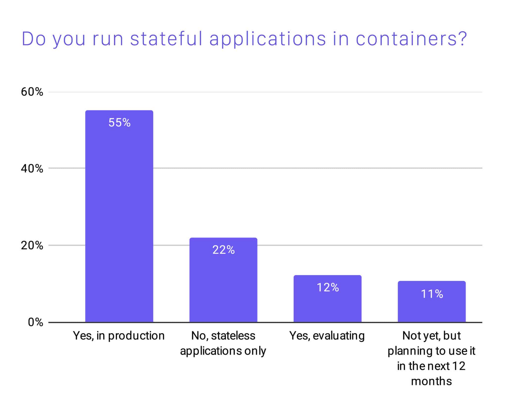
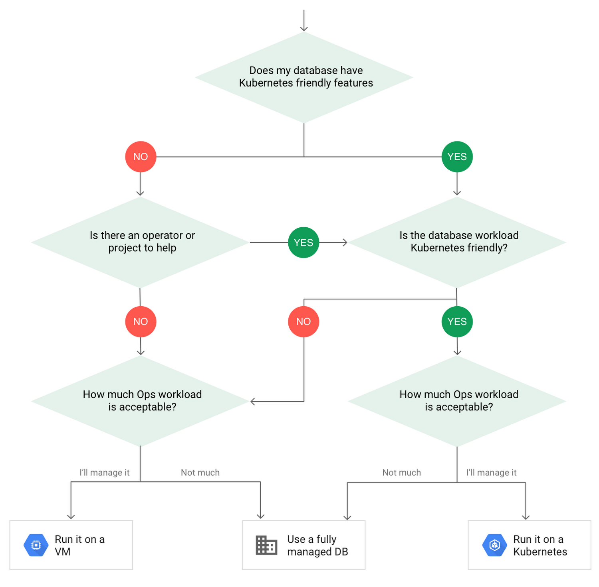
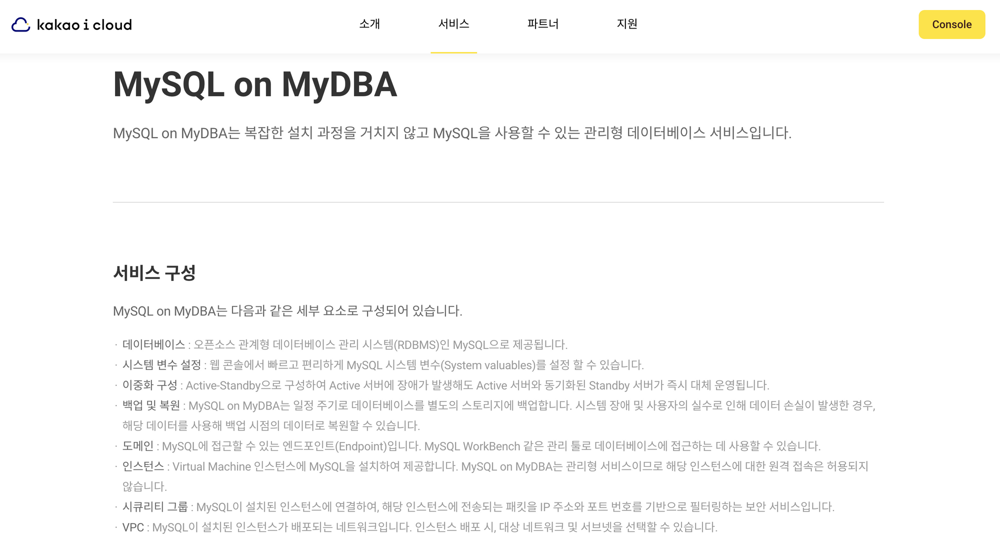
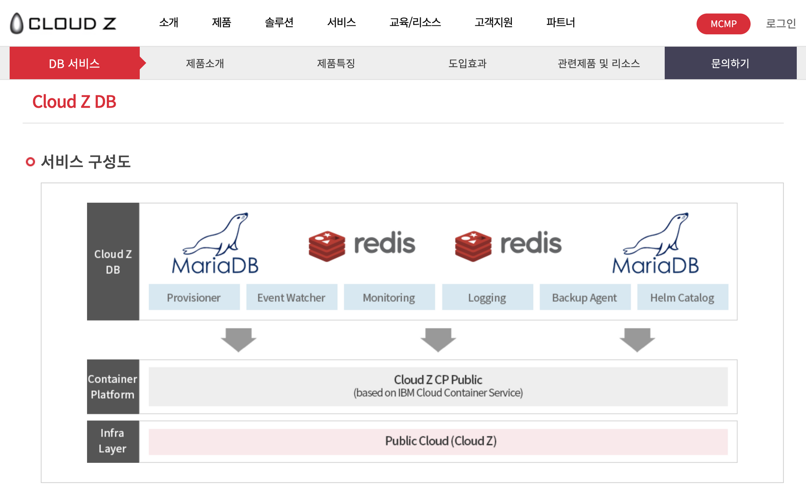

> 이 글은 쿠버네티스 입문 후에 '무엇을 더 해보면 좋을까' 고민하고 계신 분,
> 쿠버네티스에서 Stateful한 애플리케이션을 운영하는 것에 대해 고민하고 계신 분이 읽기에 좋습니다. 😄
>
> 물론, 저의 지식이 짧아서 정답을 제시하는것은 아니고 함께 고민하는 관점으로 읽어주시면 감사하겠습니다!

## 쿠버네티스 기반 데이터베이스

최근 개인의 일상과 기업 비즈니스가 급격히 변화하여 이에 대응하기 위해 많은 기업이 디지털 트랜스포메이션을 시도하고 있습니다.

변화된 요구 사항에 빠르게 대응하는 것이 중요하기에 인프라는 상대적으로 빠르게 구축할 수 있는 클라우드 기반 사례가 많이 알려지고 있고, 클라우드 네이티브 애플리케이션은 컨테이너화된 마이크로서비스로 구성되는 경우가 많습니다.

현시점(2021년 08월)에 클라우드, 컨테이너 기술 기반의 서비스를 운영할 때는 쿠버네티스를 사용하는 것이 **사실상 표준(de facto)**으로 받아들여지고 있습니다.

'사실상 표준'이라고는 하지만 상태가 없는(Stateless) 애플리케이션(웹 서버, WAS 등)에 비해 상태가 유지되어야 하는(Stateful) 애플리케이션(Database, Kafka 등)을 운영 환경에 사용하는 사례는 아직 많이 알려지지 않았습니다.

제가 처음 쿠버네티스를 접했던 시기(2019년 10월)에는 볼륨의 성능과 안정성 문제로 인해 우려의 목소리가 많았던 것으로 기억합니다.

하지만 CNCF Survey 2020 에서 운영 환경에 Stateful 애플리케이션을 컨테이너로 실행한다는 응답이 55%로 조사되었습니다. 이는 2016년 조사에 비해 300% 증가한 수치라고 합니다.
설문 결과도 그렇지만, 최근 몇년 동안 클라우드 서비스 제공업체들에서 DBaaS(Database as a Service)를 제공하기 위해 문제를 많이 해결했을 것이라 생각되어 발표된 사례들을 요약 정리해 봤습니다. (일단 국내 위주로)

## 구글 클라우드 블로그

쿠버네티스 기반 데이터베이스를 도입하기 전에 검토해야 할 항목들에 대해서 다음과 같은 의사결정 트리를 제안하고 있습니다.
주요 항목은 **'쿠버네티스 친화적인가?', '쿠버네티스 오퍼레이터가 개발되어 있고 지속적인 지원이 가능한가?', '워크로드를 운영할 리소스가 있는가?'** 입니다.
쿠버네티스에 직접 데이터베이스를 운영하려면 쿠버네티스 친화적인 데이터베이스(예: MySQL, PostgreSQL 등)를 사용하거나 데이터베이스를 쿠버네티스 오퍼레이터로 관리해야 합니다. (백업 및 복제와 같은 데이터베이스 유지 관리 작업을 수행할 수 있어야 함)

## 카카오 엔터프라이즈 - if(kakao) 2020

발표영상 링크 : [MySQL on Kubernetes: 발표자도 데이터베이스를 컨테이너로 운영하게 될 줄 몰랐다](https://if.kakao.com/session/75)

### 쿠버네티스 기반 운영을 선택한 이유

1. VM 대비 높은 리소스 관리 효율이 높습니다.
2. 쿠버네티스가 리눅스처럼 기본 OS가 되어가고 있습니다.
3. 1년동안 쿠버네티스 기반 Elasticsearch 서비스를 운영했으나 크게 이슈가 없었습니다.
4. 개인 취향. (매우 공감합니다)

### DBaaS는 어떻게 운영 될까?

CRD(Custom Resource Definition)으로 커스텀 오브젝트를 선언하고 컨트롤러로 관리합니다.
커스텀 오브젝트 종류는 InstanceSet, Instance, Backup, HA 가 있습니다.
각 오브젝트를 제어하는 컨트롤러가 있고, 특정 이벤트가 발생하면 오브젝트의 상태를 자동으로 변경합니다.
(발표 당시 기준으로는 아직 MySQL에 대해서만 지원된다고 합니다.)

예를 들어,

1. InstanceSet 오브젝트를 생성하면 spec 설정에 따라 Instance, HA Config 등을 InstanceSet 컨트롤러가 생성합니다.
2. Instance 오브젝트가 생성되면 Instance 컨트롤러가 파드, 볼륨 등을 생성합니다.
3. HA Config에 따라 HA 컨트롤러가 상태를 주기적으로 체크하며 장애가 발생하는 경우 Source, Replica를 교체합니다.

## SK C&C - CNCG Seoul 2020

발표영상 링크 : [K8S 기반의 데이터베이스 서비스를 운영경험 공유 및 팁](https://www.youtube.com/watch?v=GqHDR-1mVFI)

2018년부터 지금까지 나름 무탈하게 운영 중입니다.
총 30여개 클러스터, 수많은 DB 파드(MariaDB, redis, mongoDB, RabbitMQ, kafka 등)를 운영 하고 있습니다. (2020년 11월 기준)

### 경험 #1 : 컨테이너 Probe 비활성화 또는 제거

Probe를 적용해 놓으면 health-check가 실패할 경우 즉시 파드를 재시작 하기 때문에, Stateful 애플리케이션에는 적합하지 않습니다.
설정한 Probe의 의도와는 다른 이슈로 재시작 될 가능성이 큽니다. (Connection, DB Lock 등)

### 경험 #2 : kubectl exec로 장기간 수행되는 명령

kubectl exec을 이용해서 DB 백업 및 압축 그리고 업로드하는 스크립트를 실행했는데 이 과정에 이슈가 발생했습니다.

- 네트워크가 불안정 하거나, 사용량이 많으면 끊길 수 있습니다. 실행 중에 끊기더라도 컨테이너에 실행한 프로세스는 동작하고 있습니다. (이게 문제가 될 수 있음)
- kubectl exec는 생각보다 여러 과정을 거쳐서 컨테이너에 명령을 수행하게 되는 데 이 과정이 동기적으로 구현되어 있어서 과정 중 하나만 실패해도 연결이 끊기게 됩니다.
- 프로세스마다 검증 스크립트를 추가해서 해결했습니다.

### 경험 #3 : podAffinity / taint 설정

노드 하나에 장애가 발생하더라도 가용성을 보장하기 위해서 한 노드에 하나의 파드만 스케쥴링되도록 설정해야 합니다.

### 경험 #4 : k8s 버전 업그레이드 대응

쿠버네티스 버전은 주기적으로 업데이트를 해야 하는데, 이 과정에서 데이터베이스 중단 시간이 발생할 수 있습니다.
중단 시간을 최소화 하기 위한 대응 절차가 필요합니다. (사용하는 매니지드 서비스나 쿠버네티스 운영 방식에 따라 다릅니다.)

- 마스터 노드 업그레이드 -> 워커 노드 주문 -> 기존 워커 노드 코돈(cordon)처리 -> 임시 파드 구동(새로운 노드에 Image Pull) -> 파드 삭제

### 경험 #5 : 파드 구동중에 PVC Failedmount

업그레이드나 장애 등 노드가 변경되는 경우, 기존의 노드의 볼륨이 unmount 실패하여 새로 스케쥴링된 파드가 실패하는 경우가 있습니다.
빠르게 해결하려면 직접 노드를 재시작하거나 동일 노드에 다시 스케쥴링 하면 됩니다. unmount 이슈는 CSP(Cloud Service Provider)의 문제일 경우가 있는데 처리 시간이 오래걸릴 수 있습니다.

### 경험 #6 : CPU Steal Time

쿠버네티스와 애플리케이션에는 이상이 없으나, 클라우드의 Multi Tenant 특성 상 CPU 사용량이 비정상적으로 높아지는 경우가 있습니다.

### 경험 #7 : DiskPressure = Pod Restart

고객이 쿼리만 돌리면 파드가 재시작 되는 이슈가 있었습니다.
join, sort, full table scan 등 Worst SQL로 인해 overlay 영역에 임시 파일이 과도하게 쌓이면서 DiskPressure가 발생 했고, kubelet이 파드를 강제로 재시작한 케이스 입니다.
임시 공간을 별도의 스토리지를 사용하도록 설정하여 해결했습니다.

### 경험 #8 : 블록스토리지 성능 저하 문제

블록스토리지 성능에 경우 클라우드 서비스 공급측의 문제일 수 있지만, 네트워크 장비 설정 등의 영향으로 IOPS가 현저히 낮아질 수 있기 때문에 충분한 검토가 필요합니다.
쿠버네티스 기반 데이터베이스 특성 상 disk I/O 에 네트워크 트래픽이 발생되는데, 이 구간에 부하가 발생하면 클러스터 네트워크 전체에 영향을 미칠 수 있으므로 주의해야 합니다.

## 결론 및 앞으로 할 것

설문조사 결과 및 사례 발표 등을 전반적으로 살펴봤을 때, 블록 스토리지와 네트워크 설정만 주의 한다면 쿠버네티스 기반 데이터베이스 운영은 검증된 수준이라고 판단됩니다.

따라서, 앞으로 이어지는 글에서는 다양한 데이터베이스(MySQL, Clickhouse, CockroachDB, Cassandra 등..)를 쿠버네티스에 실행하여 쿼리 성능, 장애를 강제로 발생시킨 후의 복원력 등을 시험(혹은 체험?)해보는 글들을 적어보도록 하겠습니다.

부족하겠지만, 많은 지적과 응원 부탁드립니다!

## 참고 자료

- [Cloud Native Survey 2020](https://www.cncf.io/blog/2020/11/17/cloud-native-survey-2020-containers-in-production-jump-300-from-our-first-survey/)
- [To run or not to run a database on Kubernetes: What to consider](https://cloud.google.com/blog/products/databases/to-run-or-not-to-run-a-database-on-kubernetes-what-to-consider)
- [MySQL on Kubernetes: 발표자도 데이터베이스를 컨테이너로 운영하게 될 줄 몰랐다](https://if.kakao.com/session/75)
- [K8S 기반의 데이터베이스 서비스를 운영경험 공유 및 팁](https://www.youtube.com/watch?v=GqHDR-1mVFI)
