> Data Mesh 아키텍처 등장 배경과 기본개념, AWS기반 구성 방식, 실제 적용 사례를 소개합니다.
> 구체적인 구현 방법까지는 다루지 않으며, 아키텍처에 사용된 AWS 서비스에 대한 상세한 설명 또한 생략합니다.
>
> 본 글은 “AWS Summit Korea 강연 내용”을 정리한 글입니다. 자세한 발표 내용이 궁금하신 분은 글 마지막에 첨부된 강연 영상 링크를 확인해주세요!

## Data Mesh 등장배경

기업은 비즈니스가 확장됨에 따라서 다양한 사업부 다양한 비즈니스 단위를 갖게 됩니다. 결국 분산된 구조의 비즈니스와 조직을 운영하게 되고, 해결해야 하는 비즈니스 과제는 더욱 복잡해질 수 밖에 없습니다.

비즈니스 가치를 창출하기 위해서 데이터를 더 잘 이해하고, 데이터로부터 보다 의미 있는 통찰력을 얻을 수 있어야 합니다.

하지만 데이터를 활용하는 과정에서 데이터가 안전하고 정확하게 운영되고 관리되어야 합니다. 특히 내외부적인 규정 요구 사항을 준수하도록 하는 거버넌스와 보안은 어떤 조직에서 공통적으로 중요한 요소입니다.

이 모든 것을 충족시키면서 빠르게 변화하는 비즈니스 환경에 맞도록 민첩성과 비용 효율성을 가지는 것이 중요한데, 이를 해결하기 위해 다양한 데이터 아키텍처가 활용되기 시작했습니다.

### Data Lake 및 Lake House 접근 방식

Data Lake를 중심으로 하는 Lake House 아키텍처는 중앙 집중식 저장소를 중심으로 하고 있습니다. 그리고 분석 목적에 맞는 다양한 서비스를 사용해서 다양한 형태로 분석할 수 있는 장점을 제공합니다.

이 장점을 잘 활용하면 데이터 접근 제어와 규정 준수를 보장할 수 있는 우수한 보안성과 높은 가격 대비 성능을 제공할 수 있습니다.

하지만 데이터 모놀리스 구조는 확장에 따라 생길 수 있는 문제점이 있습니다.

- 전문성을 가진 소수의 데이터 엔지니어링팀이 기업 내 모든 실시간이나 배치 파이프라인을 생성하고 또 실행할 관리할 책임까지 갖게 됩니다.

- 데이터 접근 제어와 규정 준수로 인해 조직내 데이터 고립(Data Silo) 현상이 발생할 수 있습니다.

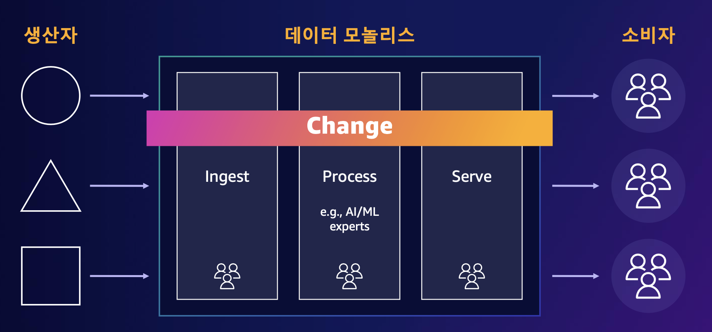

많은 기업들이 공통적으로 아래와 같은 어려움을 겪고 있다고 합니다. 결국은 데이터는 활용하기에 충분할 정도로 축적되어 있으나 데이터 공유와 활용이 유연하지 못하다는 것입니다.

> "데이터 공유 및 검색이 어렵다."  
> "우리 팀은 다른 팀과 격리된 데이터 파이프라인 및 리포지토리를 소유해야 한다."  
> "서로 다른 사업부에서 모든 요구 사항을 충족하기 어렵다."  
> "현재 데이터 아키텍처는 복잡하고 모놀리식이며 변경 속도가 느리다."  
> "데이터 과학 팀은 원하는 데이터를 쉽게 찾고 다른 사람들과 공유할 수 있어야 한다.”  
> "필요한 데이터에 접근하고 싶다."

### Data Mesh 접근 방식

Data Mesh는 중앙 집중식 데이터 거버넌스를 중심으로 했던 방식과는 다른 분산 기반의 데이터 분석 아키텍쳐입니다.

분산된 조직의 소유권과 자율성을 강화하면서도, 전사적인 거버넌스 정책을 동시에 적용하기 위해서 연합(Federated) 거버넌스 모델을 사용합니다.

데이터 파이프라인의 수집, 처리나 제공 같은 기능이 아닌 도메인을 중심으로 조직을 구성하면 각 도메인 조직이 비즈니스 데이터를 변환하고 제공하는 책임을 가지는 생산자가 됩니다. 그리고 소비자는 각 도메인에 의해 완전하게 제공되는 데이터를 그대로 사용하기만 하면 됩니다.

예를 들어, 디지털 광고 도메인 데이터는 생산자가 변환을 마친 상태로 제공되는 데, 소비자는 영업에 필요한 디지털 광고 데이터를 검색해서 찾고 가져다가 쓰기만 하면 되는 것이다.

이렇게 되면, 도메인에 대한 이해가 높은 생산자는 고품질의 데이터를 제공할 수 있게 되고, 소비자는 파이프라인에 대한 이해 없이도 원하는 데이터를 사용할 수 있게 된다.

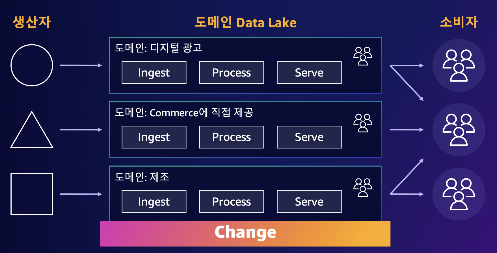

## Data Mesh의 핵심 개념

### 도메인과 소유권

Data Mesh에서는 도메인의 자율성을 높이기 위해서 데이터 소유권을 각 도메인이 갖게 합니다. 분석 데이터와 메타데이터 등에 대한 소유권은 데이터 품질을 유지하고 접근 제어와 데이터 수명 등을 관리하는 책임을 포함하는 것입니다.

소유권을 분산시키는 이유는 데이터를 가장 잘 이해하는 조직을 통해서 지속적인 변화와 확장을 지원하기 위한 것입니다.

Data Mesh를 도메인별 Lake House들의 서로 연결된 모음으로 생각할 수도 있습니다. 각 도메인은 소유한 데이터에 특정 거버넌스 규칙을 시행하거나 다른 도메인에 공유하기 위한 작업을 Lake House를 통해서 하게 됩니다.

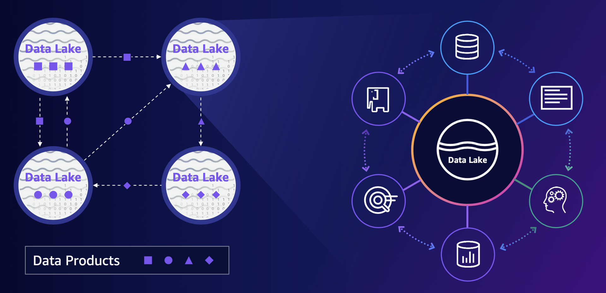

### Data Product

각 도메인이 데이터를 제품으로 제공하게 합니다. 생산자는 사용자에게 마치 제품을 판매하듯이 데이터를 제공한다는 의미입니다.

사용성 있는 데이터를 가치 있고 신뢰할 수 있는 고품질의 제품으로써 만들어서 소비자에게 제공하듯이 데이터를 다루는 것입니다.

데이터 외에도 접근 제어와 데이터 정책, 메타데이터와 사용 코드 그리고 인프라스트럭처까지도 포함되어질 수 있습니다.

도메인별 데이터를 소유한 팀은 Data Product을 공유하는 것 외에도 구축, 배포, 모니터링 등 데이터 생명주기 전체를 관리합니다.

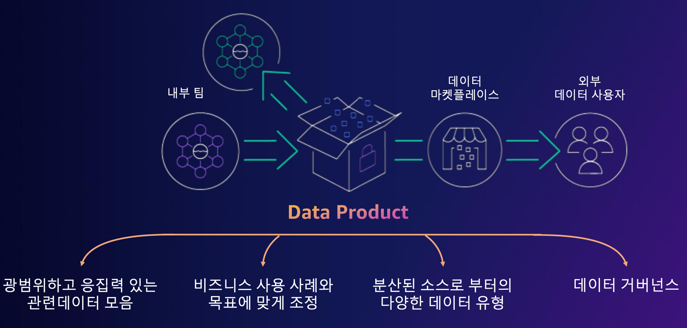

### 셀프서비스 데이터 플랫폼

셀프서비스 데이터 플랫폼은 도메인팀이 Data Product을 개발하고 운영할 수 있도록 지원하는 플랫폼입니다.

데이터 제품을 만들기 위한 컴퓨팅 클러스터와 파이프라인 개발, 스키마 관리 등의 각종 도구들을 지원합니다.

메타데이터를 관리하는데 사용하는 카탈로그나 도메인 요구사항을 위한 고유한 데이터 처리 기술, 그리고 중앙에서 제공되는 거버넌스 정책 적용 등이 포함됩니다.

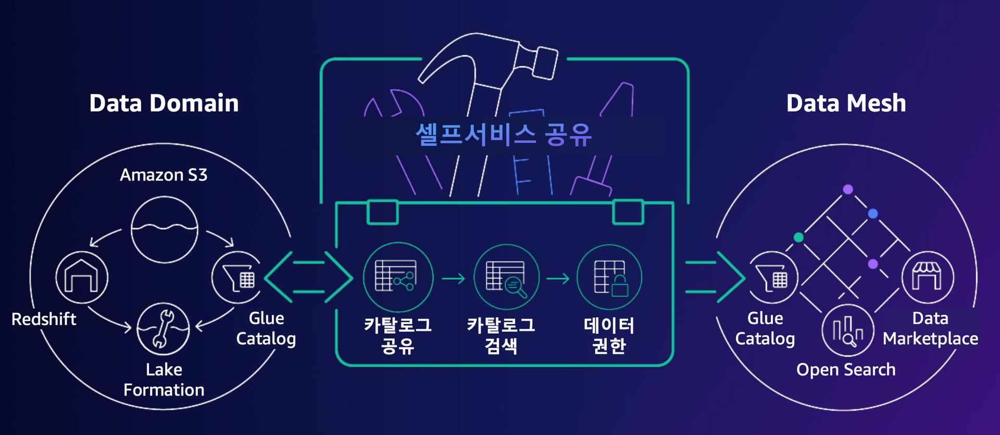

### 데이터 거버넌스

Data Mesh에서는 중앙집중화와 분산화 사이의 균형을 이루는 거버넌스 체계, 즉 연합(Federated) 거버넌스라는 개념을 적용하게 됩니다.

데이터 모델링이나 인터페이스, 품질 등은 기본적으로 개별 도메인의 의해서 관리되게 됩니다. 보안이나 프라이버시, 컴플라이언스 적용에 대한 책임과 의사결정 구조 또한 도메인이 우선적으로 가지도록 해서 독립성을 가지도록 합니다.

단, 조직 전체에 공통적으로 정의되는 컴플라이언스와 보안, 여러 관리 규칙 등 일종의 조직 표준을 모든 데이터 제품에 적용되도록 해야 합니다.

연합거버넌스에서는 이런 거버넌스 모델을 실행하기 위해 중앙 카탈로그 기반의 보안과 데이터 거버넌스 정책을 사용합니다. 또 자원 공유를 위한 상세 권한과 정보 그리고 데이터 제품 사용을 위한 서비스 권한을 관리하는 서비스 카탈로그 등도 정의합니다.

이런 연합 거버넌스는 전체 조직의 거버넌스 비용과 어려움을 줄여주고 급변하는 환경에서 민첩성을 향상시켜줄 수도 있습니다.

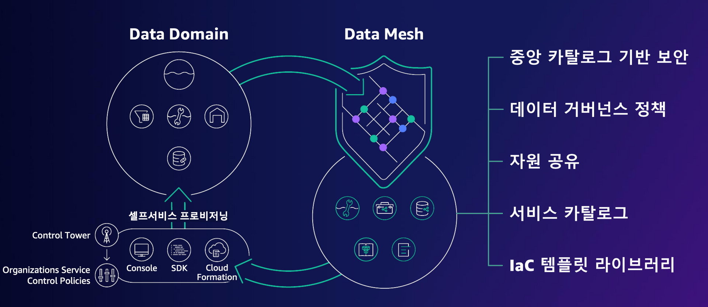

## AWS에서 Data Mesh 구성하기

각 도메인의 Data Product는 Data Lake를 중심으로 목적에 맞는 다양한 분석 시스템들이 필요에 따라 적절하게 데이터를 이동하거나 즉시 분석에 활용할 수 있도록 구성이 되어 있습니다. 이러한 구성을 Lake House 아키텍처라고 부르고 이런 구성들이 모여서 Data Mesh를 이루게 됩니다.

Data Mesh를 구성함으로써 일관된 인증 및 조직구성 뿐 아니라 통합 거버넌스와 보안을 적용함으로써 궁극적으로 쉽고 단순한 서비스 운영을 가져갈 수가 있습니다.

Data Mesh에서 하나의 점이 되는 Data Product를 AWS 서비스를 활용하여 구성하면 다음과 같습니다.

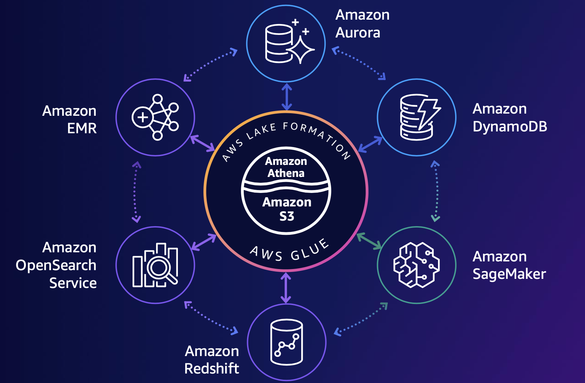

Lake Formation은 기본적으로 데이터를 저장하는 S3와 데이터를 분석하는 다양한 솔루션들의 중간에 위치하면서 자동화와 접근제어 데이터 카탈로그와 같은 인터페이스 역할을 합니다. Glue와 비슷한 역할을 한다고 생각할 수 있으나 Lake Formation에서 Glue의 크롤링, 블루프린트와 같은 기능을 통합해서 이용하는 구조를 가지고 있습니다.

여러 계정에 걸쳐 데이터 생산자와 소비자가 나누어 있는 각 주체들을 서로 연결하고 일관성있는 데이터 거버넌스를 구성할 뿐 아니라 데이터를 공유하는 역할을 Lake Formation에서 수행함으로써 Data Mesh 구성에 핵심적인 역할을 담당합니다.

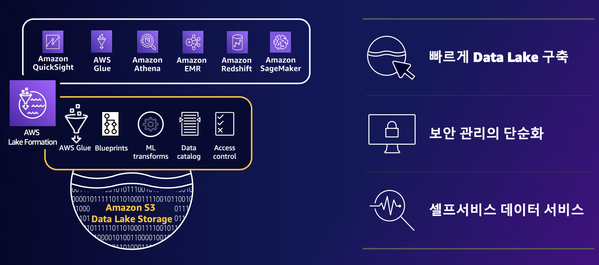

### 데이터 카탈로그 워크플로우

중앙에 연합 거버넌스 계정을 통해서 다른 도메인의 데이터를 사용하는 과정은 다음과 같이 구성할 수 있습니다.

1. 연합 거버넌스 계정에 데이터 위치 등록
2. 공통 데이터 카탈로그에 데이터베이스 및 테이블 생성
3. 생산자 도메인 계정에서 로컬 데이터베이스 생성
4. 테이블 리소스 링크 생성
5. Glue 크롤러 권한 추가
6. 카탈로그 테이블 크롤러 실행(리소스 링크 테이블)
7. 공통 데이터 카탈로그의 메타데이터 변경 동기화
8. 소비자 도메인 계정에서 데이터베이스 및 테이블 리소스 링크 생성
9. IAM 역할에 LF 로 Select 권한 부여
10. 생산자 도메인 계정으로 쿼리를 실행

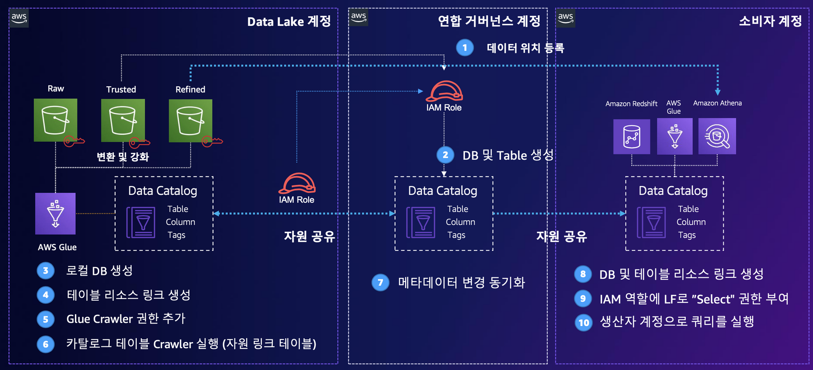

Data Product 간 데이터 공유 권한은 Lake Formation을 통해서 테이블 형태로 관리됩니다.

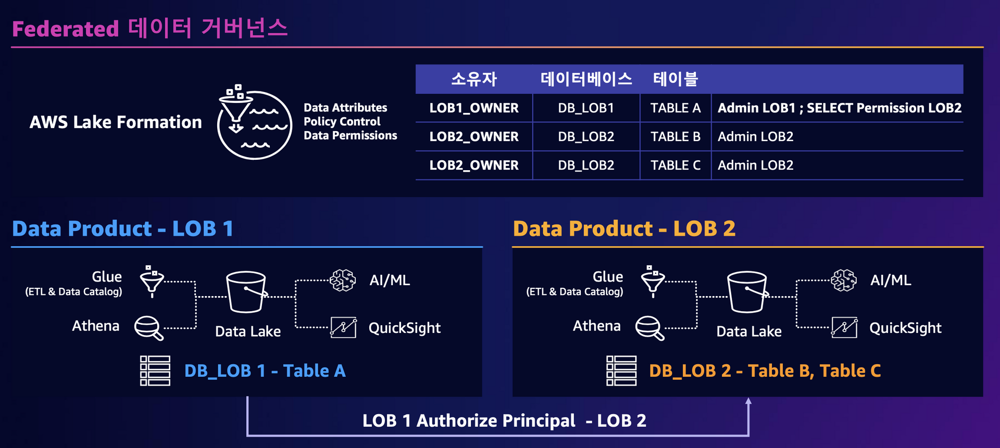

## Data Mesh 아키텍처 적용 사례

### 삼성전자 빅데이터 플랫폼

오픈 소스 기반이었던 기존 데이터 플랫폼에 ETL/ELT 파이프라인이 많아지면서 데이터 중복 저장, 데이터 처리 시간 증가, 권한 복잡도 증가 등 수많은 이슈 발생했고, GDPR 대응까지 더해져서 운영 인력의 피로도가 급증했습니다.

따라서 오픈소스가 가지는 여러 제약사항을 해결하기 위해 완전 관리형 서비스(AWS Lake Formation) 도입을 결정하였고, 이를 통해 얻고자 했던 것은 다음과 같습니다.

- ETL/ELT 과정 간소화
  - 전사 레이크 하우스 환경 구축을 통한 ETL/ELT 과정 간소화
- 권한 관리 창구 일원화
  - Federated Metastore 구성 및 컬럼 수준 보안 설정을 통한 권한 관리 창구를 일원화
- 사용자 수 관리
  - Hive/Spakr User Impersonation을 통한 사용자 수 제한 해결

아래는 Lake Formation을 활용하여 현대화된 삼성전자 빅데이터 플랫폼 아키텍처입니다. 데이터 생산자들이 각각의 VPC 환경을 가지고 있는 독립된 서비스들로 데이터를 S3에 저장하고 있습니다. 소비자 VPC는 빅데이터 플랫폼으로 Athena, EMR, Redshift 등을 사용하여 LakeHouse를 구성하였습니다.

데이터 분석가들은 SSO로 애플리케이션단에서 인증을 하고 데이터 플랫폼내의 분석 도구를 활용하여 허용된 데이터만 접근하도록 구성되어 있습니다.

메타데이터 및 데이터 접근은 모두 중앙의 Lake Formation을 통해 이루어지도록 되어 있습니다.

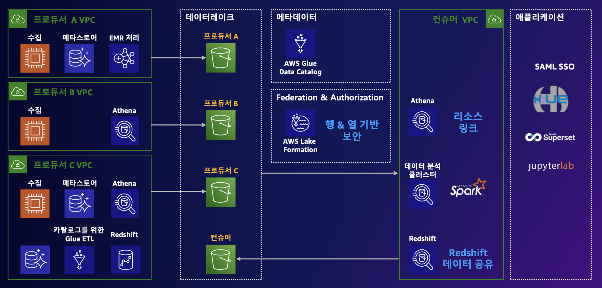

위와 같은 구성으로 변경하여 얻게된 점은 다음과 같습니다.

- SSO 기반 유저관리
  - SAML 유저/그룹 설정을 통해 인원수 제한 없이 자사 SSO 기반 권한 관리 지원
- 민감정보 Masking
  - View 테이블 구성, UDF 처리 등 별도 작업으로 지원하던 Masking 과정이 단순화
- 손쉬운 레이크하우스 환경 구성
  - 공유/권한 부여가 Lake Formation으로 통일되어 관리 과정이 일원화

### JPMorgan Chase 사례

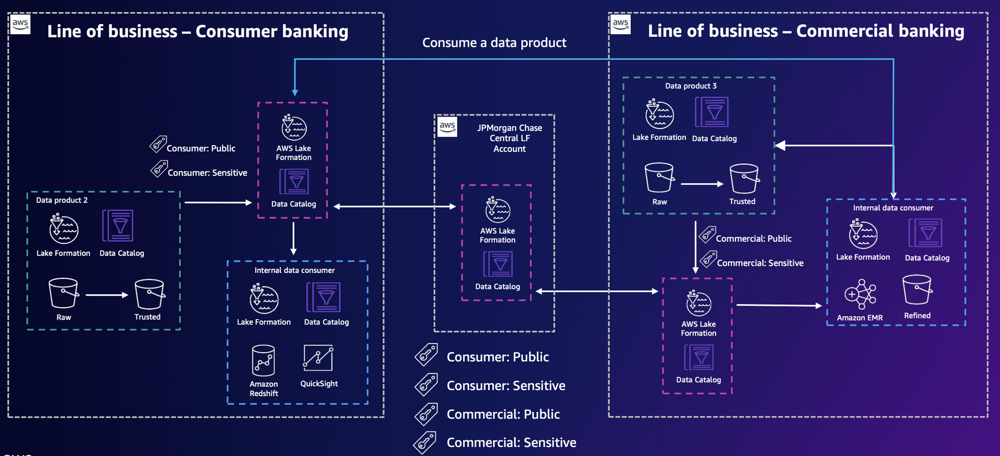

그림 좌측이 소비자 금융, 그림 우측이 상업 금융 조직이고 두 조직은 각각의 데이터 레이크를 별도로 가지고 있습니다.

그리고 모든 금융사들이 그렇듯이 민감 데이터에 대한 관리가 매우 중요한데, 이를 Lake Formation에서 제공하는 태그를 통해서 관리하고 있습니다.

양쪽 조직은 외부에 공개해도 되는 데이터를 Public으로, 공개하면 안되는 데이터를 Sensitive로 태깅하고 각각의 로컬 Lake Formation에 등록해 두었습니다.

그리고 중앙의 센트럴 Lake Formation 계정에서 각각의 Data Product를 연결하고 권한을 제어하는 역할을 하고 있습니다.

## 요약 및 마무리

Data Mesh는 기존의 Monolithic 데이터 레이크가 가지고 있는 한계를 극복하고자 대두되었고, 개별 조직의 자율성을 확보하고 혁신을 가속화하기 위한 개념입니다.

Lake Formation은 Data Mesh를 AWS 상에서 구축하기 위한 가장 중요한 역할을 제공하고, 내부적으로 AWS Glue와 완전 통합되어 관리 됩니다.

Lake House 아키텍처는 Data Mesh에서 연결해야 하는 각각의 지점들에 대해 공통 기술 스택을 단순화하는 역할을 합니다.

강연에서도 말씀하시지만 Data Mesh 구조가 모든 조직에 적합한 것은 아닐 것입니다. 하지만 데이터 공유와 권한 및 보안 관리 측면에서 어려움을 겪고 있는 경우에는 좋은 선택지가 될 수 있을 것 같습니다.

데이터 플랫폼 아키텍처와 데이터 거버넌스에 대한 작업을 앞두고 있어서 고민이 많았는데, 방향성을 잡을 수 있는 계기가 됐습니다. Lake Formation의 경우, 개인적으로 너무 훌륭한 서비스로 느껴져서 제가 속한 조직의 문제점들을 풀어주리라 기대해보고 있습니다.

적합성 검토를 통해 구성을 진행하게 되면 후속글을 적어보고 싶네요!

## 참고 자료

- [Data Lake를 넘어 Data Mesh로, 효과적인 데이터 활용법](https://summits-korea.virtual.awsevents.com/media/02.%20Data%20Lake%EB%A5%BC%20%EB%84%98%EC%96%B4%20Data%20Mesh%EB%A1%9C%2C%20%ED%9A%A8%EA%B3%BC%EC%A0%81%EC%9D%B8%20%EB%8D%B0%EC%9D%B4%ED%84%B0%20%ED%99%9C%EC%9A%A9%EB%B2%95/1_j7vre8c1)
- [Mass Data 통합과 실시간 분석으로 살펴보는 삼성전자의 분석 현대화 여정](https://summits-korea.virtual.awsevents.com/media/05.%20Mass%20Data%20%ED%86%B5%ED%95%A9%EA%B3%BC%20%EC%8B%A4%EC%8B%9C%EA%B0%84%20%EB%B6%84%EC%84%9D%EC%9C%BC%EB%A1%9C%20%EC%82%B4%ED%8E%B4%EB%B3%B4%EB%8A%94%20%EC%82%BC%EC%84%B1%EC%A0%84%EC%9E%90%EC%9D%98%20%EB%B6%84%EC%84%9D%20%ED%98%84%EB%8C%80%ED%99%94%20%EC%97%AC%EC%A0%95/1_mlykyc5v)
