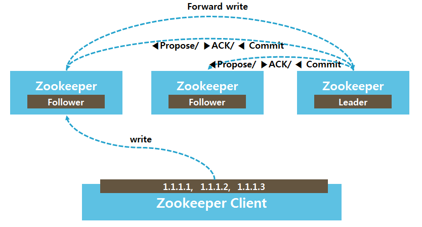
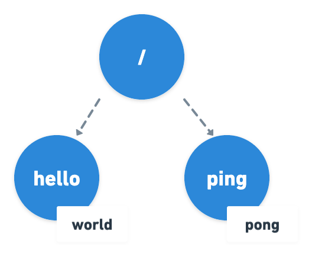
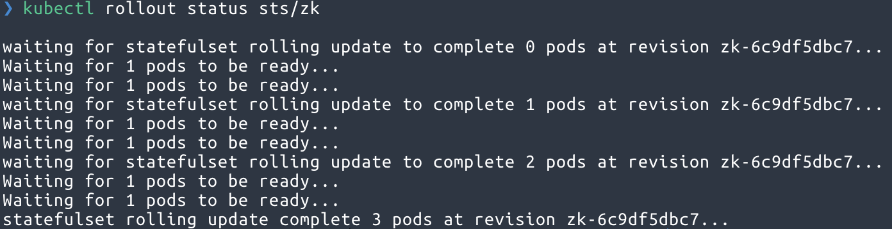
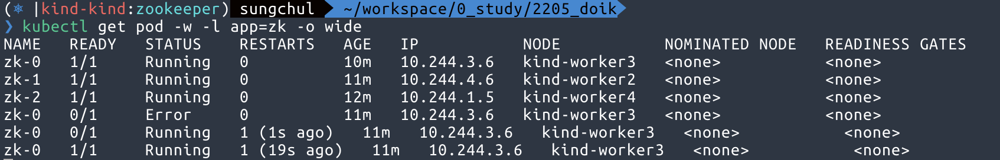
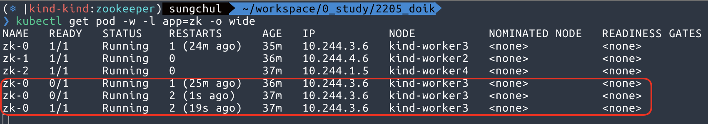
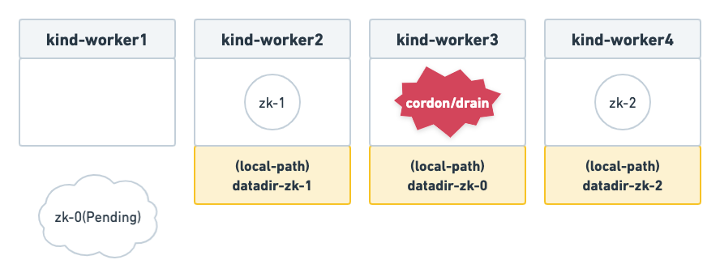
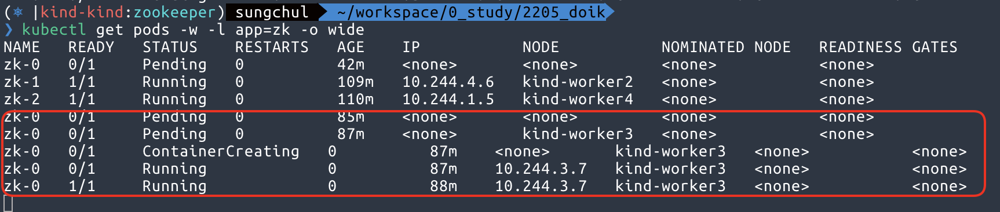

> 쿠버네티스 공식 문서 튜토리얼 중 “분산 시스템 코디네이터 Zookeeper 실행하기"를 따라 실습하며 정리한 글입니다.
> 본 글에서 쿠버네티스 기본 개념에 대해서는 직접 다루지 않습니다!
> 따라서, 쿠버네티스 기본 개념을 숙지하고 쿠버네티스 상에서 Zookeeper 클러스터의 가용성이 어떻게 보장되는지 궁금하신 분께 적합한 글입니다.

## 시작하기 전에

### 쿠버네티스 클러스터 구성

테스트용으로 간단하게 구성하기 위해, kind(kubernetes in docker)를 사용했습니다.

실습을 함께 실습하실 분은 [kind Quickstart](https://kind.sigs.k8s.io/docs/user/quick-start/) 를 참고하셔서 설치 후, 진행하시면 됩니다. 실습에서 워커 노드를 통제(cordon)하고 비우게(drain)하여 가용성을 테스트하기 때문에 최소 3개 이상의 워커노드가 필요합니다. 이미 구성해놓은 클러스터에서 실습하실 경우, 주의하시기 바랍니다.

이 실습에서는 퍼시스턴스볼륨(PV)을 스테이트풀셋(StatefulSets)에 volumeClaimTemplates로 정의하여 동적으로 프로비저닝 되도록 합니다. 클러스터에 볼륨 동적 구성이 설정되어 있지 않다면 수동으로 3개의 20GiB 볼륨 프로비저닝해야 합니다.

```yaml
# 1 control plane node and 4 workers
kind: Cluster
apiVersion: kind.x-k8s.io/v1alpha4
nodes:
  # the control plane node config
  - role: control-plane
  # the three workers
  - role: worker
  - role: worker
  - role: worker
  - role: worker
```

```bash
kind create cluster --config kind-config.yaml
```

## Zookeeper

ZooKeeper는 분산 애플리케이션을 위한 분산 오픈 소스 코디네이션 서비스입니다. 다시 말해, '분산 작업을 제어하기 위한 트리 형태의 데이터 저장소'라고 할 수 있습니다.

Zookeeper의 기능은 사실상 단순합니다. 디렉터리 구조기반으로 znode라는 데이터 저장 객체(key-value식)를 제공하고, 이 객체에 데이터를 넣고 빼는 기능만을 제공합니다. 일단 디렉터리 형식을 사용하기 때문에 데이터를 계층화된 구조로 저장하기 용이합니다. 이 기능을 어떻게 조합하느냐에 따라 분산 서버 간의 정보 공유, 서버 투입/제거 시 이벤트 처리, 서버 모니터링, 시스템 관리, 분산 락 처리, 장애 상황 판단 등 다양한 분야에서 활용됩니다.

### Zookeeper 앙상블(Ensemble)이란?

이 코디네이션 서비스는 분산 작업을 제어하기 위해 사용되는 만큼 ZooKeeper 서버가 중단되면 ZooKeeper에 의존하는 모든 서버가 영향을 받습니다. 따라서 ZooKeeper는 최대한 정상 동작을 보장하여야 합니다. 이를 위해 여러 대의 ZooKeeper 서버를 클러스터링하여 고가용성을 지원하도록 설정할 수 있습니다. 이 ZooKeeper 클러스터를 앙상블(Ensemble)이라 부릅니다. 이와 같은 특성으로 이미 유명한 분산 솔루션에 많이 사용되고 있습니다. NoSQL의 한 종류인 Apache HBase, 대용량 분산 큐 시스템인 Kafka, 컬럼 기반 분석 데이터베이스 Clickhouse 등이 그 대표적인 사례입니다.

앙상블로 묶인 ZooKeeper 서버 중 한 대는 쓰기 명령을 총괄하는 리더 역할을 수행하고, 나머지는 팔로워 역할을 수행합니다. 리더 선출과 선거가 완료되기 전까지 앙상블은 데이터를 쓸 수 없습니다. 읽기 명령의 경우, 연결된 서버에서 바로 반환하지만 쓰기 명령은 리더 역할을 수행하는 서버로 전달(Forward)되며 모든 팔로워 서버에게 해당 쓰기를 수행할 수 있는지 질의(Propose)합니다. 팔로워 중 과반수 이상이 쓸 수 있는 상황이라고 응답(ACK)하면 리더는 팔로워들에게 데이터를 쓰도록 지시(Commit)합니다. 승인된 모든 쓰기 명령은 쿼럼에 복제됩니다. 앙상블이 3개 서버인 경우, 리더와 서버로 쿼럼을 구성하며 쿼럼을 달성할 수 없다면 데이터를 쓸 수 없습니다.

|             <div style="width:600px">  </div>              |
| :---------------------------------------------------------------------------------------------------: |
| <b>Zookeeper 앙상블의 쓰기 요청 처리 절차 ([이미지 출처](https://d2.naver.com/helloworld/583580))</b> |

> <b>쿼럼(Quorum)?</b>
>
> 사전적 의미로는 어떤 일이 발생하였을 때 투표를 통해 의사결정을 진행하는 것을 뜻합니다.
> HA에서 말하는 쿼럼이란 클러스터의 분할로 스플릿 브레인(Split-brain)이 발생하는 것을 방지하기 위해 사용하는 알고리즘으로써, 각 노드로부터 투표를 받아 운영(Active) 노드를 결정하는 것을 뜻합니다.

## Zookeeper 앙상블 생성하기

아래 매니페스트(manifest)에는 Headless Service, Service, PodDisruptionBudget, StatefulSet이 포함되어 있습니다.

```bash
kubectl apply -f https://k8s.io/examples/application/zookeeper/zookeeper.yaml
```

```bash
service/zk-hs created
service/zk-cs created
poddisruptionbudget.policy/zk-pdb created
statefulset.apps/zk created
```

스테이트풀셋 컨트롤러가 스테이트풀셋 podManagementPolicy에 의해 순차적으로 파드가 생성되는지 확인합니다. replicas 설정에 따라 서버 3개의 Zookeeper 앙상블이 생성됩니다.

```bash
kubectl get pods -w -l app=zk -o wide
```

```bash
NAME   READY   STATUS        RESTARTS   AGE   IP           NODE           NOMINATED NODE   READINESS GATES
zk-0   0/1     Pending       0          0s     <none>       <none>         <none>           <none>
zk-0   0/1     Pending       0          0s     <none>       kind-worker3   <none>           <none>
zk-0   0/1     ContainerCreating   0          0s     <none>       kind-worker3   <none>           <none>
zk-0   0/1     Running             0          1s     10.244.3.4   kind-worker3   <none>           <none>
zk-0   1/1     Running             0          20s    10.244.3.4   kind-worker3   <none>           <none>
zk-1   0/1     Pending             0          0s     <none>       <none>         <none>           <none>
zk-1   0/1     Pending             0          0s     <none>       kind-worker2   <none>           <none>
zk-1   0/1     ContainerCreating   0          0s     <none>       kind-worker2   <none>           <none>
zk-1   0/1     Running             0          1s     10.244.4.4   kind-worker2   <none>           <none>
zk-1   1/1     Running             0          20s    10.244.4.4   kind-worker2   <none>           <none>
zk-2   0/1     Pending             0          0s     <none>       <none>         <none>           <none>
zk-2   0/1     Pending             0          4s     <none>       kind-worker4   <none>           <none>
zk-2   0/1     ContainerCreating   0          4s     <none>       kind-worker4   <none>           <none>
zk-2   0/1     Running             0          21s    10.244.1.3   kind-worker4   <none>           <none>
zk-2   1/1     Running             0          34s    10.244.1.3   kind-worker4   <none>           <none>
```

### 리더 선출 촉진

익명 네트워크에서 리더 선출을 위한 종료 알고리즘이 없기에, Zab(Zookeeper Atomic Broadcast)은 리더 선출을 위해 명시적인 멤버 구성을 해야 합니다. 앙상블의 각 서버는 고유 식별자(myid)를 가져야 하고, 모든 서버는 식별자 전역 집합을 알아야 하며, 각 식별자는 네트워크 주소에 연관되어야 합니다.

ZooKeeper 앙상블에 서버들은 고유 식별자로서 자연수를 이용하고 서버 데이터 디렉터리에 `myid` 라는 파일로 서버 식별자를 저장합니다. 각 서버에서 다음 명령어를 이용하여 `myid` 파일의 내용을 확인합니다.

```bash
for i in 0 1 2; do echo "myid zk-$i";kubectl exec zk-$i -- cat /var/lib/zookeeper/data/myid; done
```

```bash
myid zk-0
1
myid zk-1
2
myid zk-2
3
```

`zk` 스테이트풀셋의 각 파드 Fully Qualified Domain Name(FQDN)을 얻기 위해 다음 명령어를 이용합니다.

```bash
for i in 0 1 2; do kubectl exec zk-$i -- hostname -f; done
```

```bash
zk-0.zk-hs.zookeeper.svc.cluster.local
zk-1.zk-hs.zookeeper.svc.cluster.local
zk-2.zk-hs.zookeeper.svc.cluster.local
```

ZooKeeper는 애플리케이션 환경설정을 `zoo.cfg` 파일에 저장하며, `server.1`, `server.2`, `server.3` 속성에서 `1`, `2`, `3`은 ZooKeeper 서버의 `myid`
파일에 구분자와 연관됩니다. 이 속성들은 `zk` 스테이트풀셋 파드의 FQDN을 설정합니다.

```bash
kubectl exec zk-0 -- cat /opt/zookeeper/conf/zoo.cfg
```

```bash{12,13,14}
clientPort=2181
dataDir=/var/lib/zookeeper/data
dataLogDir=/var/lib/zookeeper/log
tickTime=2000
initLimit=10
syncLimit=2000
maxClientCnxns=60
minSessionTimeout= 4000
maxSessionTimeout= 40000
autopurge.snapRetainCount=3
autopurge.purgeInterval=0
server.1=zk-0.zk-hs.default.svc.cluster.local:2888:3888
server.2=zk-1.zk-hs.default.svc.cluster.local:2888:3888
server.3=zk-2.zk-hs.default.svc.cluster.local:2888:3888
```

각 파드의 A 레코드는 파드가 Ready 상태가 되면 입력됩니다. 따라서 ZooKeeper 서버의 FQDN은 단일 엔드포인트로 확인되고 해당 엔드포인트는 `myid`
파일에 구성된 식별자를 가진 고유한 ZooKeeper 서버가 됩니다.

### 앙상블 무결성(Sanity) 테스트

가장 기본적인 테스트는 한 ZooKeeper 서버에 데이터를 쓰고 다른 ZooKeeper 서버에서 데이터를 읽는 것입니다.

아래 명령어는 앙상블 내에 **`zk-0`** 파드에서 `zkCli.sh`스크립트를 실행하여 `/hello` 경로에 `world`를 쓰게 합니다. (/ping pong 도 마찬가지)

```bash
kubectl exec zk-0 -- zkCli.sh create /hello world
```

```bash
......

WATCHER::

WatchedEvent state:SyncConnected type:None path:null
Created /hello
```

```bash
kubectl exec zk-0 -- zkCli.sh create /ping pong
```

```bash
......

WATCHER::

WatchedEvent state:SyncConnected type:None path:null
Created /ping
```

위 명령을 실행하고 나면 아래와 같이 디렉터리 형식으로 계층 구조 데이터가 저장됩니다.



zk-1 파드에서 데이터를 읽기 명령을 수행합니다. zk-0 파드에서 생성한 데이터를 앙상블 내의 모든 서버에서 사용할 수 있습니다.

```bash
kubectl exec zk-1 -- zkCli.sh get /hello
```

```bash{5,14}
WATCHER::

WatchedEvent state:SyncConnected type:None path:null
cZxid = 0x100000002
world
ctime = Sat May 28 16:12:39 UTC 2022
mZxid = 0x100000002
mtime = Sat May 28 16:12:39 UTC 2022
pZxid = 0x100000002
cversion = 0
dataVersion = 0
aclVersion = 0
ephemeralOwner = 0x0
dataLength = 5
numChildren = 0
```

```bash
kubectl exec zk-2 -- zkCli.sh get /ping
```

```bash{5,14}
WATCHER::

WatchedEvent state:SyncConnected type:None path:null
cZxid = 0x100000004
pong
ctime = Sat May 28 16:12:58 UTC 2022
mZxid = 0x100000004
mtime = Sat May 28 16:12:58 UTC 2022
pZxid = 0x100000004
cversion = 0
dataVersion = 0
aclVersion = 0
ephemeralOwner = 0x0
dataLength = 4
numChildren = 0
```

### 내구성있는 저장소 제공

ZooKeeper는 모든 항목을 내구성있는 WAL(Write Ahead Log)에 커밋하고 메모리 상태의 스냅샷을 저장 미디어에 주기적으로 저장합니다. 내구성을 제공하기 위해 WAL을 이용하는 것은 복제된 상태 머신을 이루는 합의(consensus) 프로토콜에서 이용하는 일반적인 기법입니다.

zk 스테이트풀셋을 삭제한 후에, 다시 생성합니다.

```bash
kubectl delete statefulset zk
kubectl apply -f https://k8s.io/examples/application/zookeeper/zookeeper.yaml
```

zk 스테이트풀셋은 spec에 퍼시스턴트 볼륨을 지정하여 프로비저닝 되도록 하고, 데이터 디렉터리에 마운트 하여 저장소로 활용합니다. (같은 이름으로 생성되어 있는 경우, 마운트만 다시하여 유지됩니다.)

```yaml
spec:
	... (생략) ...
	template:
		spec:
			... (생략) ...
			volumeMounts:
      - name: datadir
        mountPath: /var/lib/zookeeper
	volumeClaimTemplates:
  - metadata:
      name: datadir
    spec:
      accessModes: [ "ReadWriteOnce" ]
      resources:
        requests:
          storage: 10Gi
```

파드는 지워지더라도 퍼시스턴트 볼륨(PV)는 그대로 남아있기 때문에 재성성된 앙상블은 여전히 원래 값을 돌려줄 수 있습니다.

```bash
kubectl get pvc -l app=zk
```

```bash
NAME           STATUS   VOLUME                                     CAPACITY   ACCESS MODES   STORAGECLASS   AGE
datadir-zk-0   Bound    pvc-2e44d658-014b-41c1-987e-5d4566520bad   10Gi       RWO            standard       86m
datadir-zk-1   Bound    pvc-15667394-b722-4f25-9de1-ae049ce9de83   10Gi       RWO            standard       85m
datadir-zk-2   Bound    pvc-7d4bd962-59b9-4697-b24b-1946f0947cb0   10Gi       RWO            standard       83m
```

앙상블이 재생성되면 zk-2 파드에서 무결성 테스트를 위해 생성한 데이터를 읽어옵니다.

```bash
kubectl exec zk-2 -- zkCli.sh get /hello
```

```bash{5,14}
WATCHER::

WatchedEvent state:SyncConnected type:None path:null
world
cZxid = 0x100000002
ctime = Sat May 28 16:12:39 UTC 2022
mZxid = 0x100000002
mtime = Sat May 28 16:12:39 UTC 2022
pZxid = 0x100000002
cversion = 0
dataVersion = 0
aclVersion = 0
ephemeralOwner = 0x0
dataLength = 5
numChildren = 0
```

## 일관된 구성 보장하기

ZooKeeper 앙상블 서버는 리더 선출과 쿼럼을 구성하기 위한 일관된 설정이 필요합니다. 스테이트풀셋에 파라미터로 환경 구성을 전달하여 일관된 구성을 달성할 수 있습니다. 환경 변수를 이용해서도 앙상블에 구성을 전달할 수 있습니다.

```yaml
containers:
  - name: kubernetes-zookeeper
    image: 'k8s.gcr.io/kubernetes-zookeeper:1.0-3.4.10'
    commnad:
      - sh
      - -c
      - "start-zookeeper \
        --servers=3 \
        --data_dir=/var/lib/zookeeper/data \
        --data_log_dir=/var/lib/zookeeper/data/log \
        --conf_dir=/opt/zookeeper/conf \
        --client_port=2181 \
        --election_port=3888 \
        --server_port=2888 \
        --tick_time=2000 \
        --init_limit=10 \
        --sync_limit=5 \
        --heap=512M \
        --max_client_cnxns=60 \
        --snap_retain_count=3 \
        --purge_interval=12 \
        --max_session_timeout=40000 \
        --min_session_timeout=4000 \
        --log_level=INFO"
```

## Zookeeper 프로세스 관리하기

ZooKeeper의 서버 프로세스(JVM)를 관리할 감독 프로세스가 필요합니다. 와치독(감독 프로세스)를 활용하여 실패한 프로세스를 재시작하는 것은 분산시스템에서 일반적인 방식입니다. 쿠버네티스에서 애플리케이션을 배포할 때에는 감독 프로세스로 외부 유틸리티를 사용하기보다 쿠버네티스를 애플리케이션의 와치독으로서 사용해야 합니다.

### 앙상블 관리하기

zk 스테이트풀셋은 RollingUpdate 업데이트 전략을 이용하도록 구성되었습니다. 업데이트를 수행하면 파드를 역순으로 한 번에 하나씩 종료하고, 새로운 구성으로 재생성합니다. 이는 롤링업데이트 동안에 쿼럼을 유지하도록 보장합니다.

`kubectl patch`로 서버에 할당된 cpu 수를 갱신하고, 업데이트 상황을 확인합니다.

```yaml
kubectl patch sts zk --type='json' -p='[{"op": "replace", "path": "/spec/template/spec/containers/0/resources/requests/cpu", "value":"0.7"}]'
```

```yaml
kubectl rollout status sts/zk
```



### 프로세스 장애 관리하기

재시작 정책은 쿠버네티스가 파드 내에 컨테이너의 진입점에서 프로세스 실패를 어떻게 다루는지 제어할 수 있습니다. `스테이트풀셋`의 파드에서 오직 적절한 `재시작 정책`는 Always이며 이것이 기본 값입니다. 상태가 유지되는 애플리케이션을 위해 기본 정책을 **절대로** 변경하지 않습니다.

zk-0 파드에서 실행 중인 Zookeeper 서버의 프로세스 트리는 다음과 같습니다. start-zookeeper 스크립트 프로세스가 Zookeeper(Java) 프로세스를 실행시키는 구조입니다.

```yaml
kubectl exec zk-0 -- ps -ef
```

```yaml
UID          PID    PPID  C STIME TTY          TIME CMD
zookeep+       1       0  0 17:19 ?        00:00:00 /usr/bin/qemu-x86_64 /bin/sh sh -c start-zookeeper --servers=3 --data_dir=/var/lib/zookeeper/data --data_log_dir=/var/lib/zookeeper/data/log --conf_dir=/opt/zookeeper/conf --client_port=2181 --election_port=3888 --server_port=2888 --tick_time=2000 --init_limit=10 --sync_limit=5 --heap=512M --max_client_cnxns=60 --snap_retain_count=3 --purge_interval=12 --max_session_timeout=40000 --min_session_timeout=4000 --log_level=INFO
zookeep+      11       1  1 17:19 ?        00:00:06 /usr/bin/qemu-x86_64 /usr/lib/jvm/java-8-openjdk-amd64/bin/java /usr/lib/jvm/java-8-openjdk-amd64/bin/java -Dzookeeper.log.dir=/var/log/zookeeper -Dzookeeper.root.logger=INFO,CONSOLE -cp /usr/bin/../build/classes:/usr/bin/../build/lib/*.jar:/usr/bin/../share/zookeeper/zookeeper-3.4.10.jar:/usr/bin/../share/zookeeper/slf4j-log4j12-1.6.1.jar:/usr/bin/../share/zookeeper/slf4j-api-1.6.1.jar:/usr/bin/../share/zookeeper/netty-3.10.5.Final.jar:/usr/bin/../share/zookeeper/log4j-1.2.16.jar:/usr/bin/../share/zookeeper/jline-0.9.94.jar:/usr/bin/../src/java/lib/*.jar:/usr/bin/../etc/zookeeper: -Xmx512M -Xms512M -Dcom.sun.management.jmxremote -Dcom.sun.management.jmxremote.local.only=false org.apache.zookeeper.server.quorum.QuorumPeerMain /usr/bin/../etc/zookeeper/zoo.cfg
```

Zookeeper 프로세스를 종료하면 부모 프로세스(start-zookeeper 스크립트)의 종료를 일으킵니다. 컨테이너 재시작 정책에 의해 부모 프로세스를 재시작하여 정상화 됩니다.

```yaml
kubectl exec zk-0 -- pkill java
```

```yaml
kubectl get pod -w -l app=zk -o wide
```



### 활성도(Liveness) 테스트하기

시스템의 프로세스는 살아있지만 응답이 없을 수 있고, 혹은 다른 문제로 비정상 상태일 경우의 시나리오도 있습니다. 애플리케이션 프로세스가 정상이 아니고, 재시작해야하는 상황임을 쿠버네티스에 알릴 수 있도록 활성도 검사를 주기적으로 해야 합니다. 활성도 검사는 다음과 같이 명시할 수 있습니다.

```yaml
livenessProbe:
  exec:
    command:
      - sh
      - -c
      - 'zookeeper-ready 2181'
  initialDelaySeconds: 15
  timeoutSeconds: 5
```

본 실습에서 사용된 컨테이너 이미지(k8s.gcr.io/kubernetes-zookeeper:1.0-3.4.10)에는 zookeeper-ready 스크립트가 생성되어 있는데, 내용은 간단합니다. Zookeeper 클라이언트 포트로 `ruok` 메시지를 전송했을 때, `imok`로 응답이 오는 것을 기준으로 활성도를 검사할 수 있습니다.

```bash
OK=$(echo ruok | nc 127.0.0.1 2181)
if [ "$OK" == "imok" ]; then
    exit 0
else
    exit 1
fi
```

livenessProbe에서 사용하는 zookeeper-ready 스크립트를 삭제하여, 활성도 검사를 실패하도록 유도합니다. 활성도 검사에 실패하면 자동으로 프로세스를 재시작하여 파드 재시작을 보증합니다.

```bash
kubectl exec zk-0 -- rm /opt/zookeeper/bin/zookeeper-ready
```



### 준비도(readiness) 테스트

준비도 검사를 지정하면, 쿠버네티스는 준비도가 통과할 때까지 애플리케이션 프로세스가 네트워크 트래픽을 수신하지 않게 합니다. ZooKeeper 서버에서는 준비도가 활성도를 내포합니다. 그러므로 준비도 검사는 활성도 검사와 동일합니다.

활성도와 준비도 검사가 동일함에도 둘 다 지정하는 것은 중요합니다. 이는 ZooKeeper 앙상블의 헬스체크 뿐만 아니라 네트워크 트래픽 수신도 보장합니다.

```yaml
readinessProbe:
  exec:
    command:
      - sh
      - -c
      - 'zookeeper-ready 2181'
  initialDelaySeconds: 15
  timeoutSeconds: 5
```

## 노드 실패 방지

서버 3개의 앙상블에서 성공적으로 저장하려면 서버 2개는 반드시 정상상태여야 합니다. 기본적으로 쿠버네티스는 동일 노드상에 스테이트풀셋의 파드를 여러개 배치시킬 수 있습니다. 서버 3개 중 2개가 같은 노드에 있다면 해당 노드 장애 발생 시 Zookeeper 서비스 클라이언트는 최소 2개중 1개가 재스케쥴링될 때까지 서비스 중단이 발생합니다.

노드에 문제가 생기더라도 중요 시스템의 프로세스가 재스케쥴링될 수 있게 항상 추가적인 용량을 확보해야 합니다. 그렇게 하면 쿠버네티스 스케줄러가 Zookeeper 서버 하나를 재스케쥴링하는 동안만 서비스가 중단될 것입니다. 그러나 서비스에서 노드 장애로 인한 다운타임을 방지하려면 podAntiAffinity를 설정해야 합니다.

```yaml
affinity:
  podAntiAffinity:
    requiredDuringSchedulingIgnoredDuringExecution:
      - labelSelector:
          matchExpressions:
            - key: 'app'
              operator: In
              values:
                - zk
        topologyKey: 'kubernetes.io/hostname'
```

requiredDuringSchedulingIgnoredDuringExecution 필드는 쿠버네티스 스케쥴러에 topologyKey로 정의된 도메인에서 app이 zk라고 레이블링된 파드가 한 개 이상 배치되지 않도록 합니다. 즉, 노드별로 같은 애플리케이션 파드는 한 개씩만 배치되게 됩니다. 다른 규칙과 레이블, 셀렉터를 사용하여 앙상블을 물리적, 네트워크, 전원 장애 분야에 걸쳐 확산하도록 이 기법을 확장할 수 있습니다.

## 유지 보수

계획된 점검으로 인해 발생하는 일시적인 노드 다운타임에 대한 계획도 필요합니다. 예상 가능한 시나리오일 때 다운타임없이 재구성할 수 있는 방법을 cordon, drain을 이용하여 알아보겠습니다.

업그레이드 또는 복구 등의 작업으로 비자발적인 중단일 경우에도 일시에 중지되는 파드의 수를 제한할 수 있습니다. PodDisruptionBudget의 max-unavailable 필드는 쿠버네티스가 스테이트풀셋에서 최대 1개의 파드는 언제든지 다운될 수 있음을 나타냅니다. 다르게 말하면, 파드 1개 이상이 동시에 다운되는 것은 허용하지 않는다는 것입니다.

`zk-0`파드가 스케줄되는 노드를 통제하기 위해 [kubectl drain](https://kubernetes.io/docs/reference/generated/kubectl/kubectl-commands/#drain)를 이용합니다.

```bash
kubectl drain $(kubectl get pod zk-0 --template {{.spec.nodeName}}) --ignore-daemonsets --force --delete-emptydir-data
```

```bash{1,5}
node/kind-worker3 cordoned
WARNING: ignoring DaemonSet-managed Pods: kube-system/kindnet-rxqbw, kube-system/kube-proxy-tl8hh
evicting pod zookeeper/zk-0
pod/zk-0 evicted
node/kind-worker3 drained
```

이 실습에서는 local path provisioner를 이용하여 볼륨을 동적 프로비저닝 했기 때문에, 볼륨이 노드에 종속되어 별도의 작업(스토리지 복제, 애플리케이션 복제 등)없이 다른 노드에 스케쥴링하는 것이 불가능 합니다.

```bash{5,9,14-16}
kubectl describe pv pvc-2e44d658-014b-41c1-987e-5d4566520bad

Name:              pvc-2e44d658-014b-41c1-987e-5d4566520bad
Labels:            <none>
Annotations:       pv.kubernetes.io/provisioned-by: rancher.io/local-path
Finalizers:        [kubernetes.io/pv-protection]
StorageClass:      standard
Status:            Bound
Claim:             zookeeper/datadir-zk-0
Reclaim Policy:    Delete
Access Modes:      RWO
VolumeMode:        Filesystem
Capacity:          10Gi
Node Affinity:
  Required Terms:
    Term 0:        kubernetes.io/hostname in [kind-worker3]
Message:
Source:
    Type:          HostPath (bare host directory volume)
    Path:          /var/local-path-provisioner/pvc-2e44d658-014b-41c1-987e-5d4566520bad_zookeeper_datadir-zk-0
    HostPathType:  DirectoryOrCreate
Events:            <none>
```

```bash
kubectl describe pod zk-0 | grep Event -A5

Events:
  Type     Reason            Age                 From               Message
  ----     ------            ----                ----               -------
  Warning  FailedScheduling  54s (x12 over 56m)  default-scheduler  0/5 nodes are available: 4 node(s) had volume node affinity conflict.
```

현재 상황을 다시 정리해보자면, zk-0 파드가 스케쥴 되지 못하고 중단된 상태입니다. zk-0 파드가 사용중이던 볼륨(PV)이 있는 kind-worker3 노드가 통제(cordon) 상태이기 때문에 별도의 조치 없이는 스케쥴 될 수 없는 상황입니다.



이 상태에서 podDisruptionBudget이 제대로 동작하는지 확인하기 위해 zk-1 파드가 스케쥴된 노드를 비워보겠습니다.

```bash
kubectl drain $(kubectl get pod zk-1 --template {{.spec.nodeName}}) --ignore-daemonsets --force --delete-emptydir-data
```

```bash{1,4}
node/kind-worker2 cordoned
WARNING: ignoring DaemonSet-managed Pods: kube-system/kindnet-h6r7d, kube-system/kube-proxy-2bthb
evicting pod zookeeper/zk-1
error when evicting pods/"zk-1" -n "zookeeper" (will retry after 5s): Cannot evict pod as it would violate the pod's disruption budget.
```

podDisruptionBudget을 위반하기 때문에 통제(cordon) 상태는 되지만, 파드는 축출(evict) 되지 않는 것을 확인할 수 있습니다. 따라서 여전히 서비스는 가용합니다. 아래와 같이 zk-1 서버에서 데이터를 조회할 수 있습니다.

```bash
kubectl exec zk-1 -- zkCli.sh get /ping
```

```bash{4,14}
WATCHER::

WatchedEvent state:SyncConnected type:None path:null
pong
cZxid = 0x100000004
ctime = Sat May 28 16:12:58 UTC 2022
mZxid = 0x100000004
mtime = Sat May 28 16:12:58 UTC 2022
pZxid = 0x100000004
cversion = 0
dataVersion = 0
aclVersion = 0
ephemeralOwner = 0x0
dataLength = 4
numChildren = 0
```

이제 다시 zk-0 파드가 스케쥴되었던 노드(kind-worker3)의 통제를 풀어보겠습니다.(uncordon)

```bash
kubectl uncordon kind-worker3
```

적용과 동시에 zk-0 파드가 다시 스케쥴되어 정상화되었습니다.



```bash
kubectl exec zk-0 -- zkCli.sh get /hello
```

## 리더 재선출 테스트

현재 앙상블의 리더/팔로워 모드를 확인하고, 리더 서버를 강제 재시작 했을 때 리더의 재선출이 일어나는지 보겠습니다.

```bash
for i in 0 1 2; do echo "zk-$i"; echo srvr | kubectl exec -i zk-$i -- nc 127.0.0.1 2181 | grep Mode; echo "";  done
```

```bash
zk-0
Mode: follower

zk-1
Mode: follower

zk-2
Mode: leader
```

zk-2가 리더이므로, 프로세스를 강제 종료하여 파드가 재시작 되도록 했습니다.

```bash
kubectl exec zk-2 -- pkill java
```

재시작 후, zk-2 로그를 살펴보면 아래와 같이 리더 선출이 진행되는 것을 확인할 수 있습니다. 리더였던 zk-2는 팔로워가 되고, zk-1 이 새로운 리더로 선출되었습니다.

```bash
[myid:3] - INFO  [main:FileSnap@83] - Reading snapshot /var/lib/zookeeper/data/version-2/snapshot.100000000
[myid:3] - INFO  [ListenerThread:QuorumCnxManager$Listener@739] - My election bind port: zk-2.zk-hs.zookeeper.svc.cluster.local/10.244.1.5:3888
[myid:3] - INFO  [QuorumPeer[myid=3]/0:0:0:0:0:0:0:0:2181:QuorumPeer@865] - LOOKING
[myid:3] - INFO  [QuorumPeer[myid=3]/0:0:0:0:0:0:0:0:2181:FastLeaderElection@818] - New election. My id =  3, proposed zxid=0x300000004
[myid:3] - INFO  [WorkerReceiver[myid=3]:FastLeaderElection@600] - Notification: 1 (message format version), 2 (n.leader), 0x300000004 (n.zxid), 0x53 (n.round), LOOKING (n.state), 1 (n.sid), 0x3 (n.peerEpoch) LOOKING (my state)
[myid:3] - INFO  [WorkerReceiver[myid=3]:FastLeaderElection@600] - Notification: 1 (message format version), 2 (n.leader), 0x300000004 (n.zxid), 0x53 (n.round), FOLLOWING (n.state), 1 (n.sid), 0x4 (n.peerEpoch) LOOKING (my state)
[myid:3] - INFO  [WorkerReceiver[myid=3]:FastLeaderElection@600] - Notification: 1 (message format version), 3 (n.leader), 0x300000004 (n.zxid), 0x1 (n.round), LOOKING (n.state), 3 (n.sid), 0x3 (n.peerEpoch) LOOKING (my state)
[myid:3] - INFO  [WorkerReceiver[myid=3]:FastLeaderElection@600] - Notification: 1 (message format version), 3 (n.leader), 0x300000004 (n.zxid), 0x53 (n.round), LOOKING (n.state), 3 (n.sid), 0x3 (n.peerEpoch) LOOKING (my state)
[myid:3] - INFO  [WorkerReceiver[myid=3]:FastLeaderElection@600] - Notification: 1 (message format version), 2 (n.leader), 0x300000004 (n.zxid), 0x53 (n.round), LOOKING (n.state), 2 (n.sid), 0x3 (n.peerEpoch) LOOKING (my state)
[myid:3] - INFO  [WorkerReceiver[myid=3]:FastLeaderElection@600] - Notification: 1 (message format version), 2 (n.leader), 0x300000004 (n.zxid), 0x53 (n.round), FOLLOWING (n.state), 1 (n.sid), 0x4 (n.peerEpoch) LOOKING (my state)
[myid:3] - INFO  [WorkerReceiver[myid=3]:FastLeaderElection@600] - Notification: 1 (message format version), 2 (n.leader), 0x300000004 (n.zxid), 0x53 (n.round), LEADING (n.state), 2 (n.sid), 0x4 (n.peerEpoch) LOOKING (my state)
[myid:3] - INFO  [QuorumPeer[myid=3]/0:0:0:0:0:0:0:0:2181:QuorumPeer@935] - FOLLOWING
[myid:3] - INFO  [QuorumPeer[myid=3]/0:0:0:0:0:0:0:0:2181:Learner@86] - TCP NoDelay set to: true
[myid:3] - INFO  [QuorumPeer[myid=3]/0:0:0:0:0:0:0:0:2181:Follower@64] - FOLLOWING - LEADER ELECTION TOOK - 82
[myid:3] - INFO  [QuorumPeer[myid=3]/0:0:0:0:0:0:0:0:2181:QuorumPeer$QuorumServer@167] - Resolved hostname: zk-1.zk-hs.zookeeper.svc.cluster.local to address: zk-1.zk-hs.zookeeper.svc.cluster.local/10.244.4.6
[myid:3] - INFO  [QuorumPeer[myid=3]/0:0:0:0:0:0:0:0:2181:Learner@332] - Getting a diff from the leader 0x300000004
```

```bash
for i in 0 1 2; do echo "zk-$i"; echo srvr | kubectl exec -i zk-$i -- nc 127.0.0.1 2181 | grep Mode; echo "";  done
```

```bash
zk-0
Mode: follower

zk-1
Mode: leader

zk-2
Mode: follower
```

## 마무리

Zookeeper를 사용하는 오픈소스 솔루션을 쓰고 있지만, 직접 제어할 일이 없어서 이해도가 낮았는데 이번 기회에 조금이나마 이해하게된 시간이 되었습니다.

Zookeeper 자체가 고가용성에 특화되어 있지만, 쿠버네티스의 기능을 활용하면 강력한 시너지 효과가 나는것을 몸소 느꼈네요!

추후 과제로는 Kafka와 Clickhouse에서는 Zookeeper를 어떻게 활용하고 있는지도 심도있게 살펴봐야겠습니다. (물론, Kafka와 Clickhouse 모두 Zookeeper 종속성을 없애기 위해 자체 코디네이터를 만들어 왔고 최근에 적용도 되었지만, 과거를 알아야 현재 구성에 대해 이해할 수 있다고 생각하기에 공부는 꼭 해봐야 할듯합니다!)

## 참고 자료

- [Running ZooKeeper, A Distributed System Coordinator](https://www.notion.so/Zookeeper-d67933e5ab5440ac8df7bfb5a3fcc9e1)

- [ZooKeeper를 활용한 Redis Cluster 관리](https://www.notion.so/Zookeeper-d67933e5ab5440ac8df7bfb5a3fcc9e1)

- [손쉽게 사용하는 ZooKeeper 스토리지, Zoopiter!](https://www.notion.so/Zookeeper-d67933e5ab5440ac8df7bfb5a3fcc9e1)

- [분산 코디네이터 Zookeeper(주키퍼) 소개](https://www.notion.so/Zookeeper-d67933e5ab5440ac8df7bfb5a3fcc9e1)

- [Quorum에 대하여](https://www.notion.so/Zookeeper-d67933e5ab5440ac8df7bfb5a3fcc9e1)
