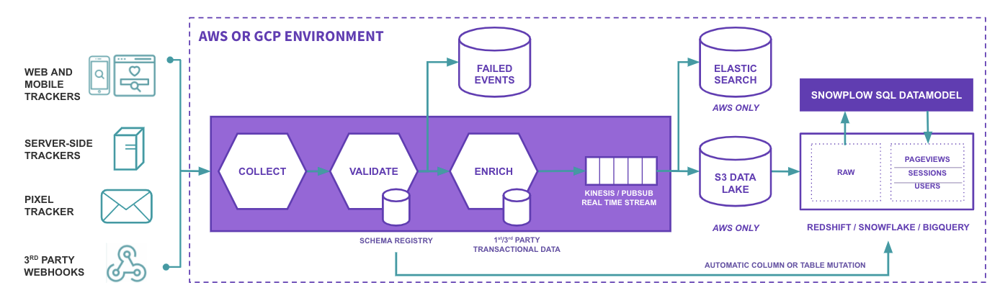
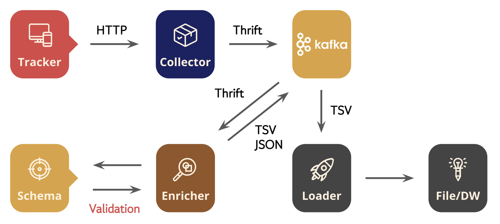
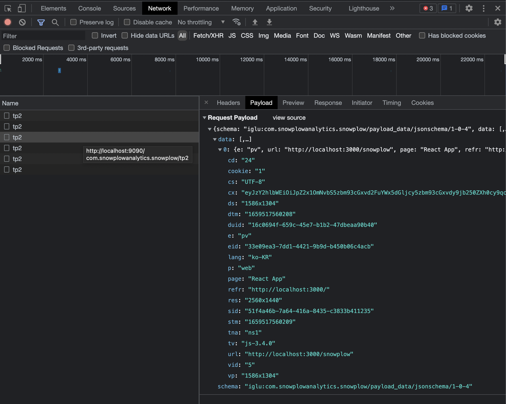
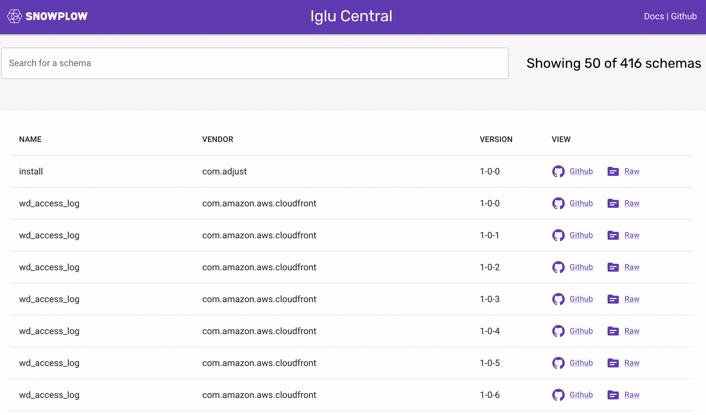
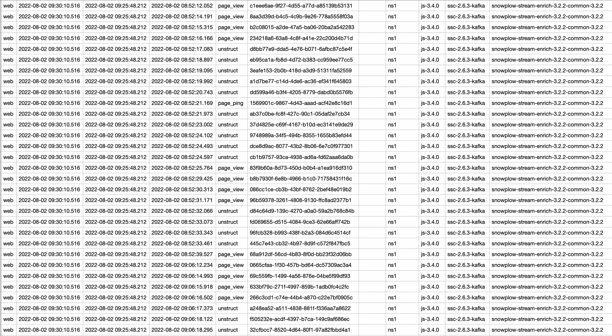

> 본 글에서는 각 컴포넌트의 상세한 로직을 다루지는 않습니다.
> 소개성 글이라서 과정을 최대한 간결하게 적었기에 다소 불친절하게 느낄 수 있습니다.
> 직접 실습하고자 하시는 분은 어느정도 데이터 파이프라인 경험과 쿠버네티스를 맛보셨다면 쉽게 경험해 보실 수 있을 것이라 예상됩니다!
>
> 실질적인 구축에 대한 내용은 별도의 레포지터리(https://github.com/Sungchul-P/snowplow-pipeline) 에서 다루고 있습니다.

## Snowplow?

Snowplow는 고객 행동 데이터 플랫폼을 서비스하는 회사입니다. AWS와 GCP 기반으로 데이터 플랫폼을 상용서비스하고 있지만, 대부분의 기능을 오픈소스로 사용할 수 있도록 공개하고 있습니다. (TMI; 최근 Snowflake, DataBricks와 협업을 통해 여러 데이터 웨어하우스들과의 연동을 힘쓰고 있는것 같네요.)

오픈소스에서 본인들의 솔루션을 “행동 데이터를 수집하기 위한 개발자용 엔진"이라고 소개하고 있기에, 내부 구성과 컨셉이 궁금해져서 가이드에 따라 간단한 파이프라인을 구성해보기로 했습니다.



## Snowplow 오픈소스 파이프라인



Snowplow의 파이프라인은 “데이터 수집 → 데이터 보강(변환) → 데이터 적재” 라는 큰 흐름은 일반적인 데이터 파이프라인과 크게 다르지 않지만 자체 개발한 스키마 레지스트리 서버(Iglu)와 각 역할별롤 잘 구분되어 관리되고 있는 컴포넌트들을 살펴보고자 했습니다. (대부분 컴포넌트는 스칼라로 개발되어 있습니다.)

Snowplow는 클라우드 기반 서비스이다 보니, 공식 문서 가이드가 클라우드 환경 위주로 설명되어 있는데 로컬 환경에서 더 간편하게 구현하기 위해 쿠버네티스를 사용했습니다. 역할별로 컴포넌트를 분리하여 관리되고 있으며, 쉽게 구현할 수 있도록 컨테이너 이미지까지 함께 제공하고 있기에 편하게 구성할 수 있었습니다.

쿠버네티스 및 카프카 클러스터 구성과 배포에 대한 내용은 [별도 레포지터리](https://github.com/Sungchul-P/snowplow-pipeline)를 참고해주시기 바랍니다. (쿠버네티스는 kind, 카프카는 Strimzi Operator를 사용해서 구성하였습니다.)

### 1. Collector

Collector는 Tracker로부터 HTTP 통신으로 원시 데이터(Raw Data)를 전달 받아서 **Thrift 레코드 포맷으로 직렬화(Serialize)** 한 다음 Sink(여기서는 카프카 사용)로 전송합니다. Thrift으로 직렬화 됐기 때문에 카프카 토픽에서 직접 데이터(메시지)를 확인하면 일부 인코딩이 깨지는 것을 확인할 수 있습니다.

```bash
d	127.0.0.1
��]�u��UTF-8�ssc-2.6.3-kafka,uMozilla/5.0 (Macintosh; Intel Mac OS X 10_15_7) AppleWebKit/537.36 (KHTML, like Gecko) Chrome/103.0.0.0 Safari/537.366http://localhost:3000/@#/com.snowplowanalytics.snowplow/tp2T#{"schema":"iglu:com.snowplowanalytics.snowplow/payload_data/jsonschema/1-0-4","data":[{"e":"pv","url":"http://localhost:3000/","page":"React App","refr":"http://localhost:3000/form","eid":"c71f7c96-597b-4545-be45-ce09649660bd","tv":"js-3.4.0","tna":"ns1","p":"web","cookie":"1","cs":"UTF-8","lang":"ko-KR","res":"2560x1440","cd":"24","dtm":"1659432367557","vp":"306x1304","ds":"306x1304","vid":"4","sid":"b33e46c2-b941-4485-bb99-aa1ed0db449b","duid":"16c0694f-659c-45e7-b1b2-47dbeaa90b40","cx":"eyJzY2hlbWEiOiJpZ2x1OmNvbS5zbm93cGxvd2FuYWx5dGljcy5zbm93cGxvdy9jb250ZXh0cy9qc29uc2NoZW1hLzEtMC0wIiwiZGF0YSI6W3sic2NoZW1hIjoiaWdsdTpjb20uc25vd3Bsb3dhbmFseXRpY3Muc25vd3Bsb3cvd2ViX3BhZ2UvanNvbnNjaGVtYS8xLTAtMCIsImRhdGEiOnsiaWQiOiJkOWFkNGRmOC0xYTViLTQxMDYtYWQzMy01N2JjOTE3OGVmZjMifX1dfQ","stm":"1659432367558"}]}^Timeout-Access: <function1>Host: localhost:9090Connection: keep-aliveMsec-ch-ua: ".Not/A)Brand";v="99", "Google Chrome";v="103", "Chromium";v="103"sec-ch-ua-mobile: ?0�User-Agent: Mozilla/5.0 (Macintosh; Intel Mac OS X 10_15_7) AppleWebKit/537.36 (KHTML, like Gecko) Chrome/103.0.0.0 Safari/537.36sec-ch-ua-platform: "macOS"Accept: */*Origin: http://localhost:3000Sec-Fetch-Site: same-siteSec-Fetch-Mode: corsSec-Fetch-Dest: emptyReferer: http://localhost:3000/"Accept-Encoding: gzip, deflate, br7Accept-Language: ko-KR, ko;q=0.9, en-US;q=0.8, en;q=0.7�Cookie: _sp_ses.1fff=*; sp=23741c49-73a2-4bfb-ac0f-e6658947c969; _sp_id.1fff=16c0694f-659c-45e7-b1b2-47dbeaa90b40.1658819065.4.1659432368.1658915156.b33e46c2-b941-4485-bb99-aa1ed0db449bapplication/jsonhapplication/json�	localhost�$23741c49-73a2-4bfb-ac0f-e6658947c969ziAiglu:com.snowplowanalytics.snowplow/CollectorPayload/thrift/1-0-0
```

현재 Snowplow Collector가 지원하는 시스템은 Kafka, NSQ, Amazon Kinesis, Amazon SQS, Google PubSub, stdout 이 있으며, 아래와 같이 간단한 설정을 통해 데이터를 전달할 시스템과 연결할 수 있습니다.

```bash
collector {
  interface = "0.0.0.0"
  port = 8080

  streams {
    good = "good"
    bad = "bad"

    sink {
      brokers = "localhost:9092,another.host:9092"
    }
  }
}
```

> Thrift ?
>
> Thrift는 RPC 프레임워크 중 하나로 IDL(Interface Definition Language)로 정의한 인터페이스 코드를 각 언어의 보일러 플레이트 코드로 컴파일 할 수 있습니다.
> 이 보일러 플레이트 코드를 사용하면 서버와 클라이언트간 주고 받는 메시지를 관리하기 편리합니다. (멀티 플랫폼도 지원함)
>
> 좀 더 자세한 내용은 참고자료 링크를 확인해주세요..

- Thrift IDL 예시

```java
namespace java com.snowplowanalytics.snowplow.CollectorPayload.thrift.model1

struct CollectorPayload {
  31337: string schema
  10: optional string querystring
  20: string collector
  30: string encoding
  40: optional string hostname
  50: i64 timestamp
  60: string ipAddress
  70: optional string userAgent
  80: optional string refererUri
  90: optional list<string> headers
  100: optional string networkUserId
  110: string path
  120: optional string contentType
  130: optional string body
}
```

### 2. Tracker

다양한 프로그래밍 언어, 기기, 써드파티 웹훅 등에서 데이터를 수집할 수 있도록 개발되어 있습니다. 이번 구축에서는 [JavaScript Tracker 예제](https://github.com/snowplow-incubator/snowplow-javascript-tracker-examples/tree/master/react)를 사용했습니다.

구글 애널리틱스와 같이 Tracker 스크립트 코드를 삽입하면 행동 데이터를 수집하여 Collector에게 전송합니다.

```javascript
<!-- Snowplow starts plowing -->
<script type="text/javascript">
;(function(p,l,o,w,i,n,g){if(!p[i]){p.GlobalSnowplowNamespace=p.GlobalSnowplowNamespace||[];
p.GlobalSnowplowNamespace.push(i);p[i]=function(){(p[i].q=p[i].q||[]).push(arguments)
};p[i].q=p[i].q||[];n=l.createElement(o);g=l.getElementsByTagName(o)[0];n.async=1;
n.src=w;g.parentNode.insertBefore(n,g)}}(window,document,"script","{{URL to sp.js}}","snowplow"));

snowplow('newTracker', 'sp', '{{collector_url_here}}', {
    appId: 'my-app-id',
});

snowplow('enableActivityTracking', {
  minimumVisitLength: 30,
  heartbeatDelay: 10
});
snowplow('trackPageView');

</script>
<!-- Snowplow stops plowing -->
```

웹 브라우저에서 개발자 도구로 네트워크를 확인하면, 페이지뷰마다 페이로드에 정보를 담아서 Collector에 전송하는 것을 확인할 수 있습니다.



### 3. Enricher

Enricher Collector가 Thrift 포맷으로 직렬화해 놓은 데이터(메시지)를 읽어서 IP, UserAgent 에 대한 구문 분석을 통해 데이터를 보강하는 역할을 함과 동시에 스키마 레지스트리로부터 데이터 구조에 대해 유효성을 검증합니다. 또한 Enricher에는 다양한 데이터 보강 및 변환 기능이 내장되어 있으며 설정을 통해 활성화 여부를 결정할 수 있습니다. 각 기능에 대한 파라미터 전달도 스키마 레지스트리를 통해 검증 합니다.

```json{7,11}
{
  "schema": "iglu:com.snowplowanalytics.snowplow/referer_parser/jsonschema/2-0-0",

  "data": {
    "name": "referer_parser",
    "vendor": "com.snowplowanalytics.snowplow",
    "enabled": true,
    "parameters": {
      "internalDomains": [],
      "database": "referers-latest.json",
      "uri": "https://s3-eu-west-1.amazonaws.com/snowplow-hosted-assets/third-party/referer-parser/"
    }
  }
}
```

스키마 레지스트리는 Snowplow 팀에서 자체 구축한 Iglu를 사용하도록 구성되어 있습니다. Iglu는 JSON과 Thrift 스키마 모두 읽을 수 있도록 개발되었으며, 서버를 따로 띄우지 않더라도 [Iglu Central](http://iglucentral.com/)이라는 공개 레포지터리를 이용할 수 있습니다. (앱에 Embed 하는 방식도 가능합니다.)



Iglu 서버의 스키마 레지스트리를 통해 유효성 검증이 통과된 데이터는 Good Stream으로 보내고, 실패한 데이터는 Bad Stream으로 보내 데이터의 품질을 유지합니다. (카프카에서는 각각 지정한 토픽으로 전송)

유효성 검증에 실패한 데이터는 Bad Stream에서 아래와 같이 원본 데이터와 원인을 함께 확인할 수 있습니다.

```json{14}
{
   "schema": "iglu:com.snowplowanalytics.snowplow.badrows/schema_violations/jsonschema/2-0-0",
   "data": {
      "processor": {
         "artifact": "snowplow-stream-enrich",
         "version": "3.2.2"
      },
      "failure": {
         "timestamp": "2022-08-02T09:30:10.512839Z",
         "messages": [
            {
               "schemaKey": "iglu:com.my_company/product_view/jsonschema/1-0-0",
               "error": {
                  "error": "ResolutionError",
                  "lookupHistory": [
                     {
                        "repository": "Iglu Central",
                        "errors": [
                           {
                              "error": "NotFound"
                           }
                        ],
                        "attempts": 1,
                        "lastAttempt": "2022-08-02T09:30:10.499Z"
                     },
                     {
                        "repository": "Iglu Client Embedded",
                        "errors": [
                           {
                              "error": "NotFound"
                           }
                        ],
                        "attempts": 1,
                        "lastAttempt": "2022-08-02T09:30:10.284Z"
                     }
                  ]
               }
            }
         ]
      },
      "payload": {
         "enriched": {
            "app_id": "docs-example",
            ......
            "true_tstamp": null
         },
         "raw": {
            "vendor": "com.snowplowanalytics.snowplow",
            "version": "tp2",
            "parameters": [
               {
                  "name": "e",
                  "value": "ue"
               },
                 ......
               {
                  "name": "sid",
                  "value": "87c18fc8-2055-4ec4-8ad6-fff64081c2f3"
               }
            ],
            "contentType": "application/json",
            "loaderName": "ssc-2.6.3-kafka",
            "encoding": "UTF-8",
            "hostname": "localhost",
            "timestamp": "2022-08-02T09:23:31.702Z",
            "ipAddress": "127.0.0.1",
            "useragent": "curl/7.79.1",
            "refererUri": null,
            "headers": [
               "Timeout-Access: <function1>",
               "Host: localhost:9090",
               "User-Agent: curl/7.79.1",
               "Accept: */*",
               "Cookie: _sp=305902ac-8d59-479c-ad4c-82d4a2e6bb9c",
               "application/json"
            ],
            "userId": "3e5d4723-693d-4fc6-887c-d798820e4836"
         }
      }
   }
}
```

### 4. Loader

Enricher를 거쳐 저장된 데이터는 다양한 데이터 웨어하우스(또는 파일)로 적재할수 있습니다.

현재 Snowplow에서 지원하는 데이터 웨어하우스는 Big Query, S3, SnowFlake, RedShift, Postgres 등이 있습니다. 단, 현재 Snowplow에서 개발한 Loader들은 데이터 소스를 Kinesis와 PubSub만 지원하기 때문에 Kafka 데이터를 파일로 저장하기 위해서 이번 구축에서는 Kafka Connector를 사용했습니다.

이 때, 데이터는 TSV 포맷으로 저장되고 각 속성(컬럼)의 정의는 [공식문서](https://docs.snowplowanalytics.com/docs/understanding-your-pipeline/canonical-event/understanding-the-enriched-tsv-format/)를 참고해주세요.

Enricher를 통해 각 이벤트에 IP 기반 지역 정보, 유입 경로, UserAgent 기반 기기 정보 등의 데이터가 보강된 것을 확인할 수 있습니다.



## 마무리

Snowplow에서는 Loader 이후에, 데이터 모델링과 시각화까지 있으나 이번 글에서는 단순히 데이터 파이프라인 구축에만 집중하기 위해서 다루지 않았습니다.

나름 한땀 한땀 구축해보며, 느낀 점은 컴포넌트가 역할별로 명확히 나뉘어 있으니 이해하기 편하고 유지보수에도 유리할 것 같다는 점입니다. 거기에 데이터 품질을 보장하기 위한 자체 스키마 레지스트리 서버 구성이 상당히 흥미로웠습니다. (Kafka, Glue 스키마 레지스트리와 사용성이나 장단점을 비교해봐야 겠다는 생각이 들었어요!)

어떻게 보면 흔한 데이터 파이프라인이겠으나, 특정 플랫폼에서 사용하는 프로세스를 쭉 따라가다 보니 새롭게 알게된 것도 많고 아주 기본적인걸 캐치하지 못해서 헤맸던 부분도 있어서 나름 수확이 많은 과정이었던 것 같네요.

데이터 파이프라인 고도화나 새로운 기능 개발시에 참고하여 적용해서 사례를 만들어 가봐야 겠습니다.

## 참고 자료

- [Snowplow 가이드](https://docs.snowplowanalytics.com/docs/pipeline-components-and-applications/)

- [Apache Thrift - Wiki](https://ko.wikipedia.org/wiki/%EC%95%84%ED%8C%8C%EC%B9%98_%EC%8A%A4%EB%A6%AC%ED%94%84%ED%8A%B8)

- [RPC - Apache Thrift 입문 1부](https://blog.appkr.dev/work-n-play/how-to-use-apache-thrift-in-php-part-1/)

- [RPC - Apache Thrift 입문 2부](https://blog.appkr.dev/work-n-play/how-to-use-apache-thrift-in-php-part-2/)
