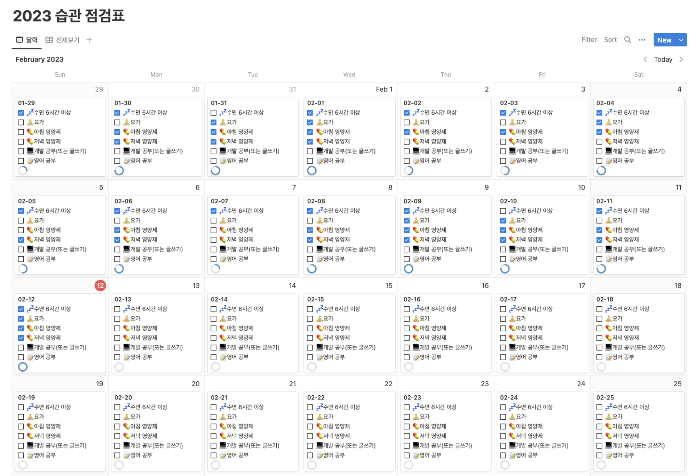

## 꾸준한 실패, 이제는 결실을 맺을 시기

이번 글또 8기를 참여하며, 지난 기수들에 참여했음에도 작성한 글의 수가 열손가락에 꼽힐 정도라는게 참 부끄러웠습니다. 하지만, 글또가 아니었다면 이마저도 없었겠다라는 생각을 하니 참 고맙다는 생각을 다시금 하게되었네요.

사실, 이번 글또 8기 참여를 결정하기 전에는 ‘실패의 경험만 쌓아가는 것이 아닌가?’, ‘오히려 글쓰기와 더 거리두게 되는 것은 아닌가?’ 라는 생각을 많이 했었습니다. 하지만 올해(2023년도) 초 개인 다짐으로 ‘**작은 실패들을 양분 삼아 회복 탄력성을 기르는 한해가 되자’**라고 결심한 뒤로는 ‘실패? 오히려 좋아’라는 마인드로 고민 없이 바로 신청서를 작성하게 되었네요.

지난 기수들에서의 실패가 거름이 되어 이번 만큼은 글쓰기 습관을 잘 만들어 갈 수 있겠다는 확신이 오히려 생겨버린 순간 이었습니다. 그럼에도 불구하고 다른 습관들을 형성하는데 에너지를 쏟다보니 글쓰기 습관은 미루고 미뤄서 마감기한을 다해 쓰고 있는 제 자신을 마주하고 있네요 ㅠ

하지만 좌절하지 않고, 이렇게라도 해내는 것으로 결실을 맺어보려 합니다. :)

## 거창한 계획 보다는 행동으로

지난 실패 원인 중 하나가 지나치게 글감을 깊이 있는 주제로만 선정했던 것 같습니다. 그러다보니 글을 쓰기위해 기획(?)을 하고, 준비하다가 지쳐서 글로 마무리 하지 못한 경우가 많네요. 역량이 부족해서 이것저것 확인 절차를 거치다보니 그런 것이 더 크지만요.

하지만, 이번에는 힘을 좀 빼고 **“글쓰기 습관”**에 좀더 집중한 뒤에 어느정도 습관이 자리 잡으면 깊이를 더해볼까 합니다.

지금 당장은 대단한 계획보다는 쓰고 싶은 글감 몇개만 선정해봤습니다.

- 최근에 재밌게 읽었던 데브시스터즈의 쿠키런 킹덤 장애사례를 재밌게 읽어서 CockroachDB 관심이 생긴지라, 해당 사례를 제 나름대로 재해석 및 재현(?)해보는 글을 써보고 싶습니다.
- 회사에서 AWS DataLab이라는 프로그램을 진행하게 되었는데, ML Ops를 AWS 서비스 위주로 먼저 익혀보며 글로 적어볼 예정입니다. (이후, 이해도가 올라오면 오픈소스들도 기웃거려볼 예정입니다.)

최근 읽었던 책에서 “계획은 항상 평가할 수 있는 지표가 있어야 한다”라고 했던 것을 보고, 습관이 얼마나 지속되고 계획이 행동으로 이어지는 지 확인하기 위해 노션에 습관 점검표를 만들어 체크해보고 있습니다. 아직은 글쓰기 외의 습관들이 많지만, 글쓰기 습관까지 온전한 습관으로 자리 잡게 만들고 싶네요!

## 마무리

처음에는 부담으로 다가왔던 글또 참여가 마음 가짐을 달리한 후로는 기대감이 더 커지게 되었네요. 글쓰기 습관 뿐만 아니라 커피챗을 통해서 좋은 분들과 대화를 이어나가는 것도 적극적으로 임하고 싶네요. 벌써부터 슬랙을 통해 공유해 주시는 좋은 내용들이 제 삶에 긍정적인 영향을 미치고 있는 것 같아서, 저도 분발해서 보답할 수 있는 기회가 있으면 좋겠습니다!

글또 8기, 2023년 성공도 좋고 실패도 좋으니 일단 해보는 한해가 되기를 :)
