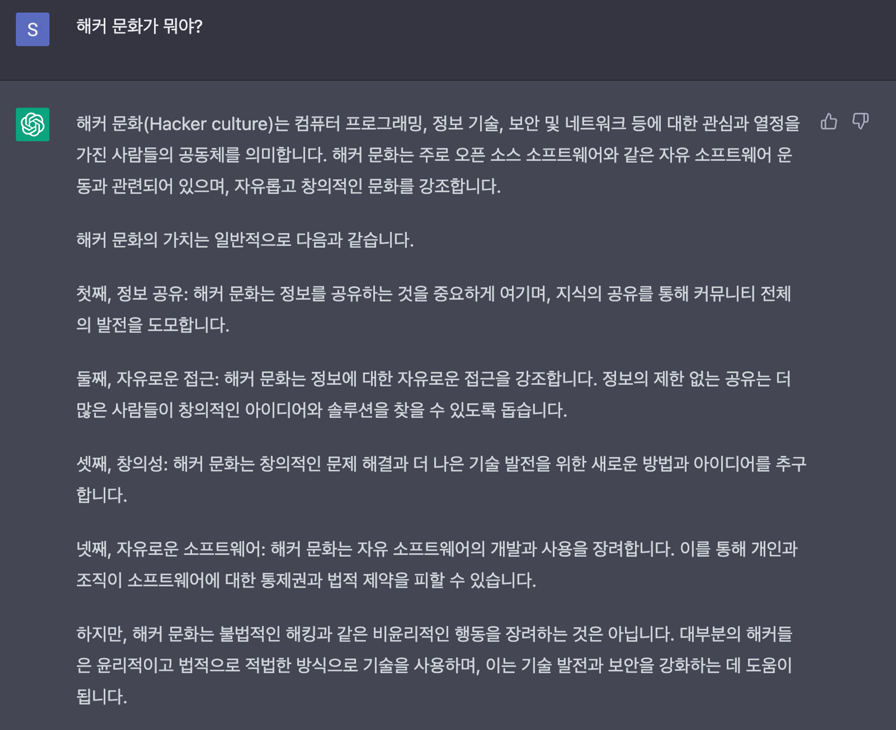
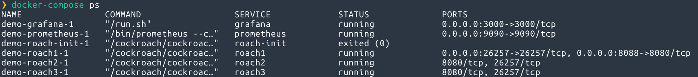
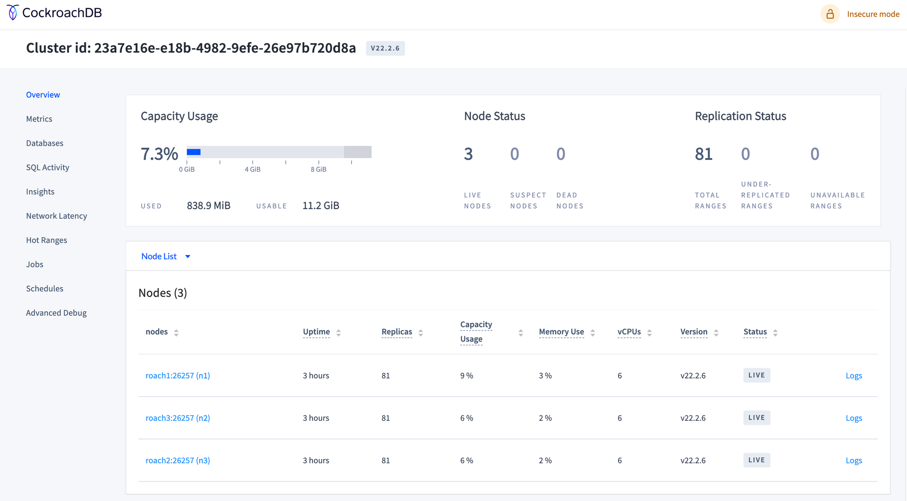
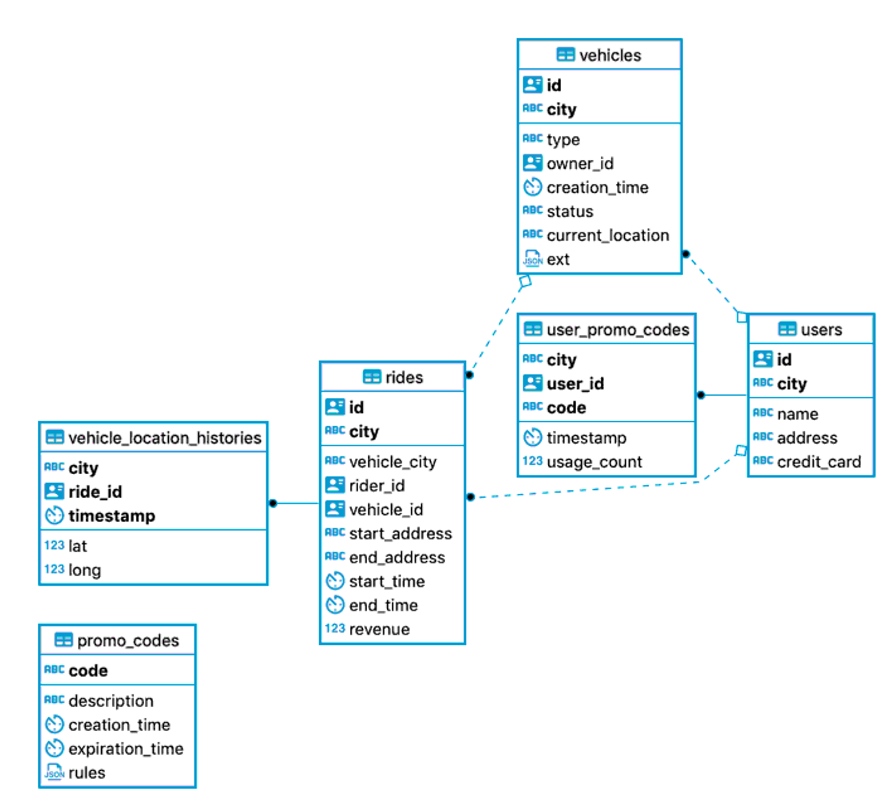
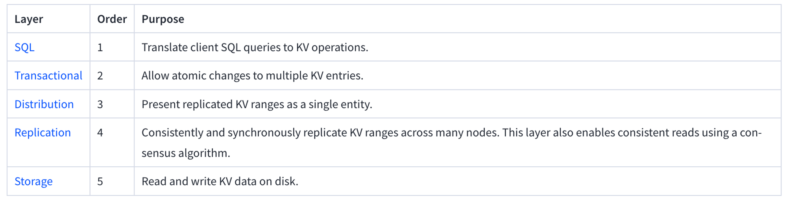
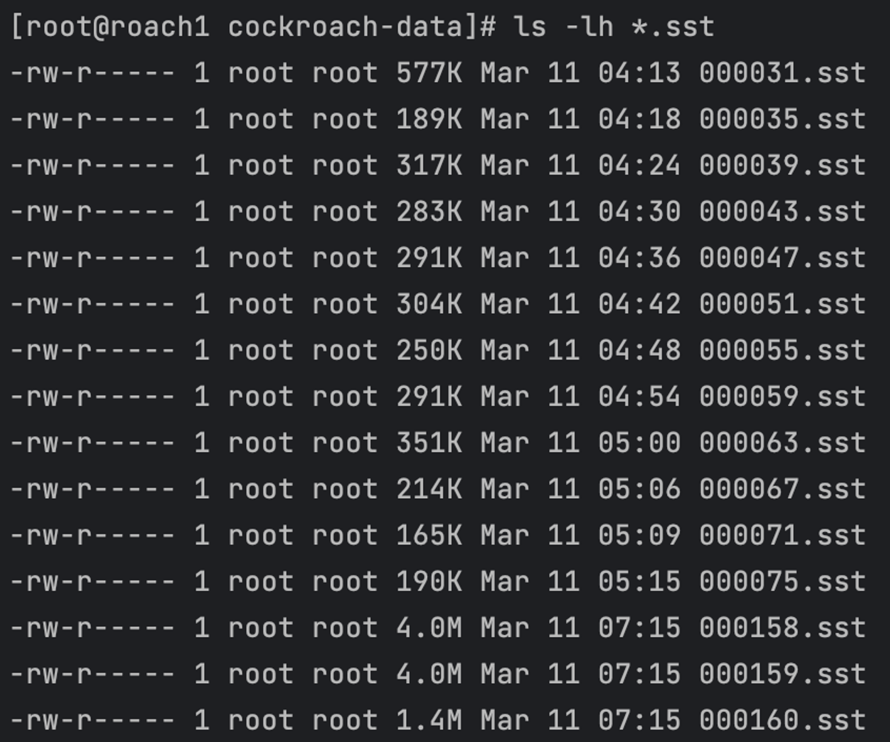
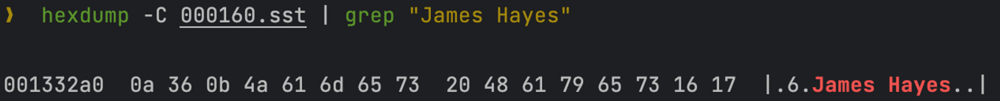
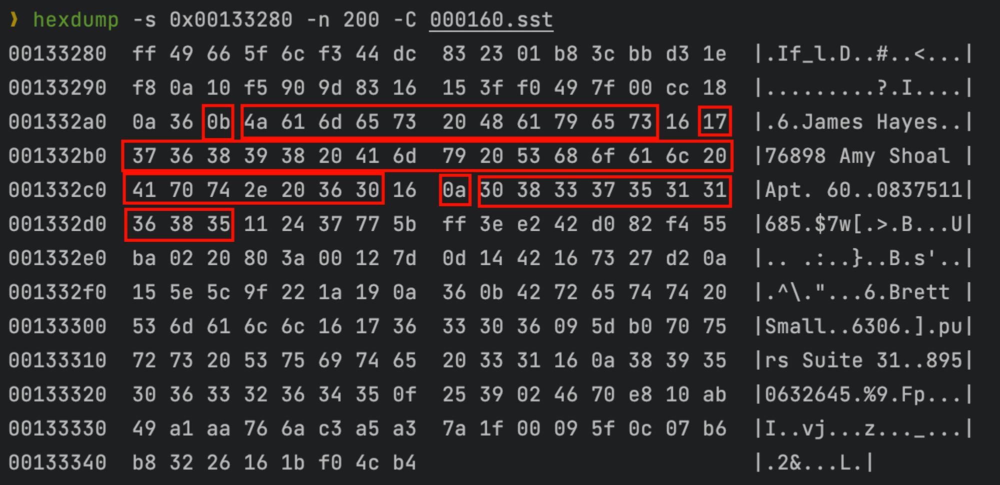

> 데브시스터즈의 기술 블로그를 참고 및 인용하여 작성된 글임을 밝힙니다.
>
> - 글을 따라가며, 직접 삽질해 보는 것을 목표로 했습니다.
>
> - 다루지 않는 것 : CockroachDB 및 각 이론에 대한 상세한 설명

## 쿠키런 킹덤 사례와 해커 문화

얼마 전에 데브시스터즈의 기술 블로그에서 “**[CTO가 커리어를 걸고 비트 레벨까지 내려가서 DB를 해킹했던 이야기](https://tech.devsisters.com/posts/bit-level-database-hacking/)**” 라는 글을 읽었는데, 주제 자체도 매우 흥미로웠지만 그보다도 과정이 너무나 인상 깊었습니다.

그래서 글에서 다룬 과정을 나는 어디까지 따라갈 수 있을까 궁금해졌고, 조금이라도 그 과정을 따라가 보기로 했습니다. (하지만, CockroachDB도 처음이고 모르는 내용 투성이라 겉핥기 식의 글이 될 예정입니다)

우선, 원글에서도 다룬 내용이지만 해킹이라는게 워낙 부정적인 용어로 쓰이다보니 해커 문화라는 용어에 대한 정의를 짚고 넘어가려고 합니다. 저의 설명보다 똑똑한 ChatGPT의 답변이 좋아서 이걸로 채택했습니다.



## CockroachDB에 대한 간단한 소개

CockroachDB SQL 인터페이스(PostgreSQL)를 지원하면서 수평 확장이 가능한 분산형 데이터베이스입니다. 관계형 데이터베이스 처럼 보이지만 내부는 키-값(Key-Value) 저장소로 구현되어 있습니다. 최근 버전은 RocksDB 기반으로 직접 개발한 [Pebble](https://github.com/cockroachdb/pebble) 이라는 엔진을 사용하고 있습니다.

Cockroach(바퀴벌레)라는 이름에서 느껴지는 것처럼 자체적으로 생존할 수 있는 다양한 옵션을 제공하여, 장애 상황 발생 시 서비스를 최대한 자동으로 복구해냅니다.

## CockroachDB 로컬 클러스터 구성

도커를 이용해서 간단하게 클러스터를 구성해 보겠습니다. 구성 예제를 제공하고 있어서 실행만 하면 됩니다.

해당 예제에는 Prometheus + Grafana로 상세 지표 모니터링까지 가능하도록 구성되어 있습니다. (선택사항이므로, 클러스터만 테스트하려면 docker-compose.yaml 파일에서 제외하도록 합니다.)

```bash
git clone https://github.com/cockroachdb/cockroach.git
cd cockroach/monitoring/demo
docker-compose up -d
```



기본 제공하는 대시보드가 너무 깔끔하고, 필수정보는 다 확인이 가능해서 개인적으로 너무 만족스러웠습니다.

위 예제 수정 없이 실행하면 [localhost:8080](http://localhost:8080) 으로 대시보드를 접속할 수 있습니다.



## CockroachDB 해킹 과정 따라하기

### 1. 샘플 데이터셋 생성

대용량 데이터를 구성해서 하기에는 무리가 있어서 CockroachDB에서 기본 제공하는 샘플 차량 공유 애플리케이션인 MovR을 기반 워크로드를 사용했습니다.

스키마 구성과 데이터 생성까지 자동화 되어 있어서 매우 간편합니다.

```bash
docker exec -it demo-roach1-1 ./cockroach workload init movr \
'postgresql://root@roach1:26257?sslmode=disable'

docker exec -it demo-roach1-1 ./cockroach workload run movr \
--duration=5m \
'postgresql://root@roach1:26257?sslmode=disable'
```

샘플 워크로드는 아래와 같이 관계가 맺어져 있는 6개의 테이블로 구성되어 있습니다. 본 글에서는 모든 데이터를 활용하지는 않고, 일부 데이터만 확인하기 때문에 참고만 합니다.



### 2. SQL 조회 데이터를 스토리지 파일에서 찾기

CockroachDB 아키텍쳐는 여러 레이어로 구현되어 있습니다.

사용자 입장에서는 SQL 쿼리를 사용하지만, 내부는 Key-Vaule 구조로 구현되어 있는 방식입니다.



추상화 레이어인 SQL 인터페이스를 통해 데이터를 조회해 봅니다.

```bash
docker exec -it demo-roach1-1 ./cockroach sql --insecure \
--execute="select * from movr.users limit 1"
```

조회 결과로 확인 된 “James Hayes”를 Row를 스토리지 레이어에서 찾아보기로 합니다.


컨테이너에 터미널로 접속하여 디스크에 저장된 파일을 조회합니다.

데이터들은 SST(Sorted String Table) 포맷으로 저장되어 있습니다.

샘플 데이터셋을 생성한 직후에는 파일이 몇개 없으나, 시간이 흐르면 병합 작업이 진행되며 SST 파일이 많아져서 수동으로 찾기는 어려워 지니 빠르게 SST 파일을 복사하여 분석에 사용합시다. (SST 파일의 병합 과정에 대해서는 공식문서에서 설명되고 있긴 한데, 아직 이해하진 못했습니다ㅠ)

```bash
docker exec -it demo-roach1-1 /bin/bash
[root@roach1 cockroach]# cd cockroach-data/
[root@roach1 cockroach-data]# ls -lh *.sst
```



```bash
docker cp demo-roach1-1:/cockroach/cockroach-data/000160.sst .
```

복사한 SST 파일에서 hexdump를 이용해 문자열로 저장된 정보를 찾고, 해당 주소를 기준으로 앞뒤 정보를 확인 합니다. 아래 옵션들을 활용해서 출력해봅시다.

- `-C` : 출력 내용을 ASCII 문자열과 16진수 값으로 함께 출력합니다.
- `-n <길이>`: 출력할 바이트 수를 지정합니다. 기본값은 무제한입니다.
- `-s <오프셋>`: 출력할 시작 위치를 지정합니다. 기본값은 0입니다.

```bash
hexdump -C 000160.sst | grep "James Hayes"
```



### 3. 저장된 데이터 구조 파악해보기

패턴을 확인하기 위해 출력 시작 위치를 ‘001332a0’에서 20바이트 전으로 지정하고, 200바이트를 출력하도록 설정하여 실행해봅니다.

```bash
hexdump -s 0x00133280 -n 200 -C 000160.sst
```

SST 파일에서 name, address, credit_card 정보는 같은 Key에 함께 저장되는 것으로 보입니다. 저의 시야로는 각 Value의 길이를 담은 Byte만 확인이 가능했습니다. Value의 포맷은 `<4-byte-checksum><1-byte-tag><encoded-data>` 이렇게 되어 있다고 하는데, 솔직히 어떻게 구분해야 하는지 감을 못잡아서 진행 자체를 못했습니다.

SQL에서 조회한 컬럼별 데이터를 hexdump로 확인한 값과 매칭하여 다시 나열해보면 아래와 같습니다.

- name : James Hayes(0x0b == 11)
- address : 76898 Amy Shoal Apt. 60(0x17 == 23)
- credit_card : 0837511685(0x0a == 10)



## 마무리

예상은 했지만, 아직 모르는게 너무 많아서 뭘 하고 있는지도 모를때가 많았던 것 같습니다.

하지만 이렇게라도 해보는 것으로 공부해야할 키워드를 찾게 되었고, ‘이렇게 까지 봐야 할 수도 있구나’ 라는 사고를 넓히게 되어 완전 실패는 아니라고 생각합니다. 이번 글은 뭔가 쓰다만 미완성 절망편 글이 되어버렸지만, 지식을 넓혀 희망편을 완성하고 싶네요.

이번에 모르는 것 투성이였지만, 그 중에서 우선적으로 공부해서 알고 싶은 것들은 아래와 같습니다.

- Log-structured Merge-tree (LSM)
- Multiversion concurrency control (MVCC)
- Raft Protocol

## 참고자료

- [CTO가 커리어를 걸고 비트 레벨까지 내려가서 DB를 해킹했던 이야기](https://tech.devsisters.com/posts/bit-level-database-hacking/)

- [CockroachDB - 로컬 클러스터 생성](https://www.cockroachlabs.com/docs/stable/start-a-local-cluster-in-docker-mac.html)

- [Cockroach - MovR 데이터셋](https://www.cockroachlabs.com/docs/stable/movr.html)

- [CockroachDB in Production](https://tech.devsisters.com/posts/cockroachdb-in-production/)
