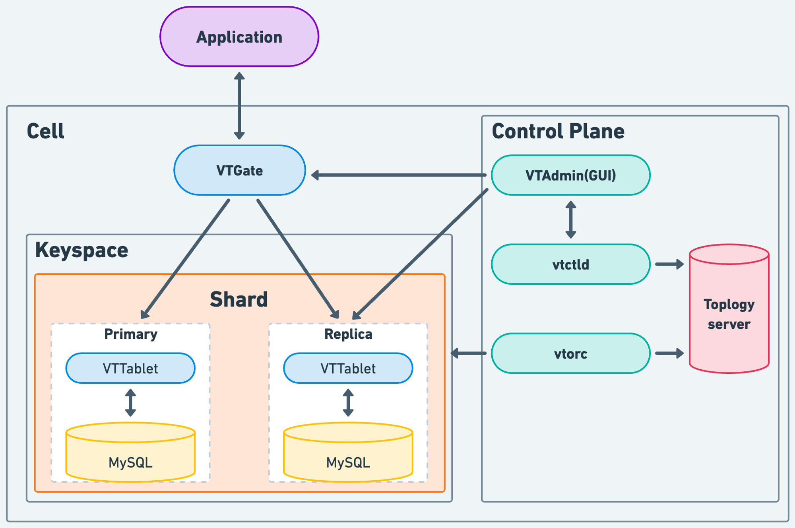

> 이 글은 쿠버네티스 기반 데이터베이스 운영에 대한 시리즈 글입니다.  
> 첫 데이터베이스로 실무에서 사용 중인 Vitess를 선택했습니다.  
> Vitess에 대한 소개를 시작으로 구성, 부하 테스트, 장애 시나리오 경험 등의 글을 이어갈 생각입니다.

## Vitess에 대한 간단한 소개

Vitess는 유튜브에서 개발된 오픈 소스 데이터베이스 클러스터링 시스템으로 MySQL 확장 문제를 해결하기 위해 개발됐습니다. 수평적 확장과 고가용성을 위해 설계되었으며, 웹 애플리케이션과 같은 대규모 시스템에서 데이터베이스 관리를 단순화하는 데 도움이 됩니다. 그러나 설정이 복잡하고, MySQL 외의 다른 데이터베이스와 호환성이 제한적이며, 모든 MySQL 기능을 완벽하게 지원하지 않을 수 있습니다.

확장성에 집중한 시스템인 만큼, 각 서버당 용량을 250GB정도로 유지할 것을 권장하고 있고 문제가 발생하는 경우 15분 이내에 백업본으로부터 복원되도록 하는 것이 Vitess의 확장 철학입니다.

이러한 확장성 때문에 Vitess에서는 클라우드와 쿠버네티스 환경에서 사용할 것을 추천합니다.

### Vitess 사용 사례

Vitess를 사용한 업체 사례를 보면 대부분 **확장성과 자동화** 문제를 해결하기 위해 선택했습니다.

| 업체명  | 도전 과제                                                                                                                                                                | 적용 후 효과                                                                                                                                    |
| ------- | ------------------------------------------------------------------------------------------------------------------------------------------------------------------------ | ----------------------------------------------------------------------------------------------------------------------------------------------- |
| Slack   | MySQL 확장이 필요할 때마다 수동으로 대응중이었음. 따라서, 확장 관리하는 새로운 접근 방식이 필요했음.                                                                     | 피크 시간대 **50만건 이상**의 쿼리 처리.  일일 총 쿼리 수 **20억건 이상**.   연결 지연 속도 평균 **1 밀리초(ms)** 정도.                 |
| HubSpot | 데이터베이스를 샤딩해야 했는데, MySQL을 수동으로 샤딩하는 것이 매우 어려웠음.                                                                                            | 전체 클러스터 업그레이드 시간이 **며칠에서 2시간으로 단축**.   같은 팀 규모로 프로덕션 환경 부하와 **데이터베이스 수를 거의 두 배**로 늘림. |
| JD.com  | 3억명 이상 활성 고객 데이터로 인해 MySQL 성능 저하 및 운영/유지 관리 비용이 증가 함. 따라서 MySQL을 쉽게 확장하고 하드웨어 및 인건비를 절감할 수 있는 솔루션이 필요했음. | 데이터베이스 클러스터의 확장성과 탄력성이 개선.   **수 만 개**의 MySQL 컨테이너 확장. **수 백만 개**의 테이블. **수조 개**의 레코드.        |

### Vitess와 순정 MySQL 비교

순정 MySQL 대비 Vitess 환경에서 얻을 수 있는 주요 장점은 다음과 같습니다.

단, Vitess의 쿼리 파서를 사용해야 하기 때문에 [지원되지 않는 MySQL 쿼리](https://github.com/vitessio/vitess/blob/main/go/vt/vtgate/planbuilder/testdata/unsupported_cases.json)가 있습니다.

| 항목                          | Vanilla MySQL                                                                                                                                            | Vitess                                                                                                                                                                      |
| ----------------------------- | -------------------------------------------------------------------------------------------------------------------------------------------------------- | --------------------------------------------------------------------------------------------------------------------------------------------------------------------------- |
| 커넥션 풀                     | 사용자가 많아질수록 더 많은 RAM을 추가해야 되고, 연결을 얻는 데 상당한 CPU 비용 필요                                                                     | 경량의 연결을 생성하고, Go의 동시성 지원을 사용하여 작은 MySQL 커넥션 풀에 매핑함(수천 개 연결 쉽게 처리 가능)                                                              |
| 쿼리 최적화                   | 제한(LIMIT)을 설정하지 않는 등의 잘못 작성된 쿼리는 모든 사용자에게 데이터베이스 성능에 부정적인 영향을 줄 수 있습니다.                                  | Vitess는 데이터베이스 성능을 저하시킬 수 있는 쿼리를 재작성하는 데 사용되는 SQL 파서를 사용                                                                                 |
| 샤딩 (데이터 파티셔닝)        | MySQL은 기본 샤딩 지원이 없어, 샤딩 코드를 작성하고 애플리케이션에 샤딩 로직을 포함시켜야 함                                                             | 테이블을 다른 데이터베이스로 마이그레이션하고 샤드 수를 늘리거나 줄일 수 있음(Resharding). 단 몇 초의 읽기 전용 다운타임으로 대부분의 데이터 전환을 완료할 수 있음          |
| 복제를 사용한 고가용성        | 문제가 발생해서 프라이머리 데이터베이스가 변경되는 경우를 위해 수명주기를 관리하고 애플리케이션에 현재 시스템 상태를 전달해야 함                         | 기본 장애 조치 및 데이터 백업을 포함한 다양한 시나리오를 지원하고 자동으로 처리해 줌(vtorc)                                                                                 |
| 부하에 대한 데이터베이스 구성 | 다양한 작업부하(쓰기, 읽기 복제본 구분 등)에 대한 사용자 정의 데이터베이스 구성을 가질 수 있으나, 애플리케이션에서 적절한 복제본 선택을 위한 로직이 필요 | Vitess는 etcd 또는 ZooKeeper와 같은 일관된 데이터 저장소를 기반으로 한 토폴로지를 사용함. 쿼리를 가장 적절한 MySQL 인스턴스로 효율적으로 라우팅하는 프록시(VTGate)를 제공함 |

## Vitess 핵심 개념 및 용어

Vitess는 어떻게 구성되어 있고, 각 용어들의 뜻에 대해서 간단히 알아보겠습니다.

사실상 사용자 입장(예: 웹 애플리케이션)에서는 프록시 서버인 VTGate와 목적 키스페이스(데이터베이스)만 알고 있으면 됩니다.

### Cell

셀은 **한 영역에 배치된 서버 및 네트워크 인프라 그룹**으로, 다른 셀의 장애로부터 격리되어 있습니다. 일반적으로 전체 데이터 센터 또는 데이터 센터의 하위 집합으로, 영역 또는 **가용성 영역(availability zone)**이라고도 합니다.

즉, 대규모 시스템이라면 퍼블릭 클라우드와 데이터 센터를 하나의 Vitess 클러스터로 관리할 수도 있습니다.

### Keyspace

키스페이스는 **논리적 데이터베이스**입니다. 샤딩을 사용하는 경우 키스페이스는 여러 MySQL 데이터베이스에 매핑되며, 샤딩을 사용하지 않는 경우 키스페이스는 MySQL 데이터베이스 이름에 직접 매핑됩니다. 두 경우 모두 애플리케이션의 관점에서 키스페이스는 단일 데이터베이스로 나타납니다.

### Shard

샤드는 **키스페이스의 하위 집합**입니다. 키 스페이스에는 항상 하나 이상의 샤드가 포함됩니다. 샤드에는 일반적으로 **하나의 MySQL 프라이머리 및 MySQL 복제본(Replicas)이 포함**됩니다.

### Tablet

태블릿은 일반적으로 동일한 컴퓨터(쿠버네티스에서는 파드)에서 실행되는 **mysqld 프로세스와 해당 vttablet 프로세스의 조합**입니다. 각 태블릿에는 현재 수행하는 역할을 지정하는 태블릿 유형이 할당됩니다.

쿼리는 VTGate 서버를 통해 태블릿으로 라우팅됩니다.

### VTGate

VTGate는 **트래픽을 올바른 VTTablet 서버로 라우팅하고 통합된 결과를 클라이언트에 다시 반환하는 경량 프록시 서버**입니다. MySQL 프로토콜과 Vitess gRPC 프로토콜을 모두 지원합니다. 따라서 애플리케이션은 마치 MySQL 서버인 것처럼 VTGate에 연결할 수 있습니다.

## 마치며

저의 Vitess 한줄평(?)을 하자면 처음에는 시스템이 복잡한 편이라 이해하는데 어려움이 있었습니다. 하지만 도입하고 나니 관리 측면에서 너무 편리해졌습니다. 오케스트레이터를 이용해서 스스로 복원하기도 하고, 확장도 쉽게 되는 점이 좋았습니다.

이번에는 첫 소개글이기 때문에 굳이 다루지 않은 개념들도 있는데, 실제 구성과 부하테스트 및 장애 시나리오를 진행하면서 필요할 때 다뤄볼 예정입니다. 구성은 쿠버네티스 환경에서 오퍼레이터를 사용할 예정이고, 글마다 조금씩 경험썰(?)을 추가로 풀어포도록 하겠습니다.

## 참고 자료

- [Vitess 공식 문서](https://vitess.io/docs/15.0/)
- [CNCF Vitess 사용 사례](https://www.cncf.io/case-studies/?_sft_lf-project=vitess)
- [CNCF Study in NaverLabs - Vitess](https://medium.com/@goinhacker/vitess-e423634ff978)
