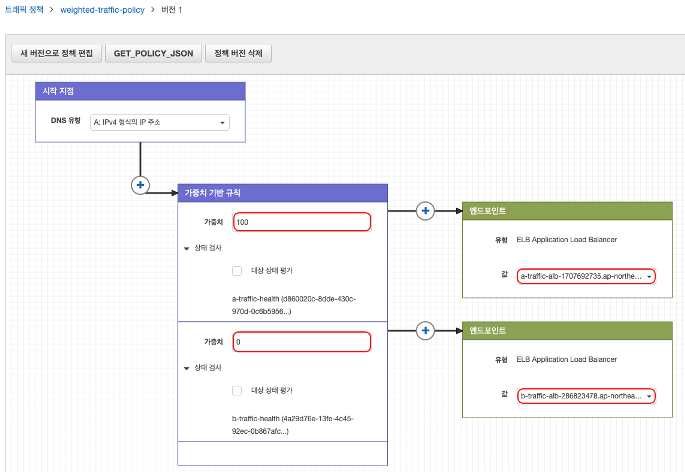
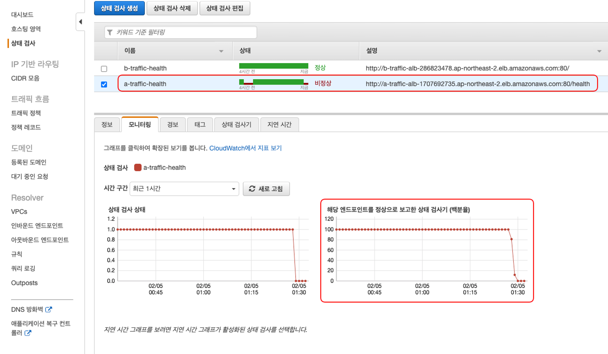
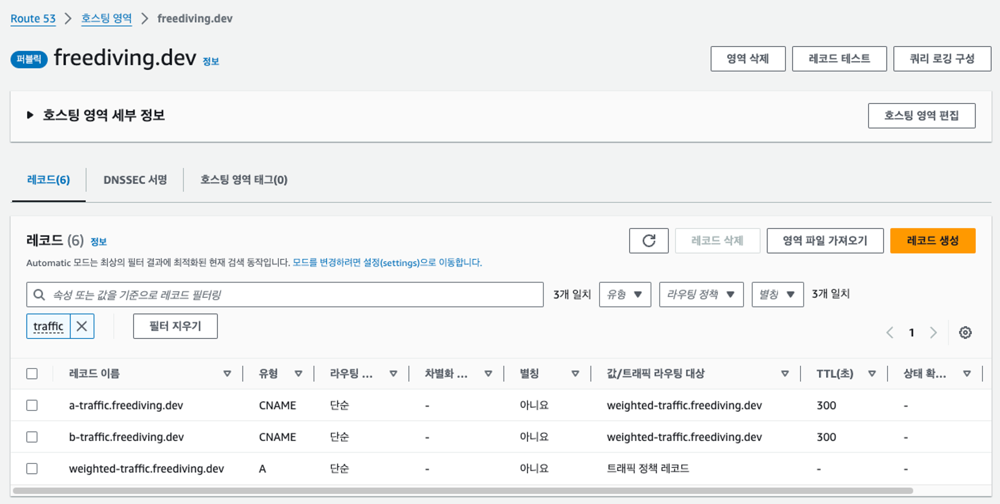

> 본 글에서는 DNS 레코드 유형과 동작 방식에 대해서는 다루지 않고, 트래픽 제어 테스트 관점에서만 작성되었습니다.
> 또한 AWS EC2, LoadBalancer, Route53 등에 대해서는 따로 설명을 하지 않기 때문에 관련 경험이 있으신 분이 보기에 적합합니다.

## 트래픽 제어 시나리오

ElasticBeanstalk(이하 A-traffic)로 사용 중인 API 서버를 컨테이너화하여 EKS 환경(이하 B-Traffic)으로 마이그레이션 합니다. 

마이그레이션 과정에서 다운타임을 최소화 해야 하고, 문제 발생 시 빠르게 롤백 하여 정상화 할 수 있는 방법을 선택해야 합니다. 이를 위해 [카나리 배포 전략](https://cloud.google.com/deploy/docs/deployment-strategies/canary?hl=ko)을 사용하여 트래픽을 제어하고 모니터링합니다.

단, 해당 글에서는 ElasticBeanstalk와 EKS를 구성하지는 않고 트래픽 제어에만 집중하기 위해 각 환경을 EC2 + Application Load Balancer로 간단하게 구성해서 진행했습니다.

> 카나리 배포
> - 이미 배포된 버전과 새 버전 간에 트래픽을 분할하여 완전히 배포되기 전에 일부 사용자에게 배포하는 애플리케이션의 점진적 출시입니다.

Route 53 정책 레코드를 카나리 배포하기 위한 과정을 요약하자면 다음과 같습니다.

1. 가중치 기반 트래픽 정책 생성
2. 트래픽 정책으로 정책 레코드 생성(DNS 레코드 유형 = A)
3. A-Traffic DNS 레코드의 값을 ALB 엔드포인트에서 정책 레코드로 수정
4. B-Traffic DNS 레코드의 값을 정책 레코드로 지정하여 생성(CNAME)
5. 트래픽 정책으로 가중치 변경 하면서 분할 확인

## 트래픽 정책 및 정책 레코드 생성

가중치에 따라 A-Traffic과 B-Traffic의 ALB 엔드포인트로 분할될 수 있도록 트래픽 정책을 생성합니다.

트래픽 정책에서 Route53의 상태 검사 기능을 활용하면, 한쪽이 비정상일 경우 가중치와 상관없이 정상으로 확인되는 곳으로 트래픽이 흘러갈 수 있도록 합니다. 즉, 새로 배포한 환경이 문제가 생겨 트래픽을 받을 수 없는 상황에 대해 어느정도 방어할 수 있습니다. 

위에서 생성한 트래픽 정책으로 정책 레코드를 생성합니다. 

정책 레코드는 가중치 기반 규칙 또는 엔드포인트를 수정할 때마다 버전이 새롭게 생성되는 데, 이를 활용하여 원하는 비율의 규칙들을 미리 생성해두고 모니터링 결과에 따라 빠르게 변경 적용할 수 있습니다.

## 레코드 유형 및 값 수정

기존 레코드는 ALB 엔드포인트로 지정되어 있던 A 유형을 CNAME으로 변경하고 정책 레코드를 바라보게 하여, 트래픽 정책을 통해 제어할 수 있도록 합니다.

## 참고 자료

- [카나리 배포 전략](https://cloud.google.com/deploy/docs/deployment-strategies/canary?hl=ko)