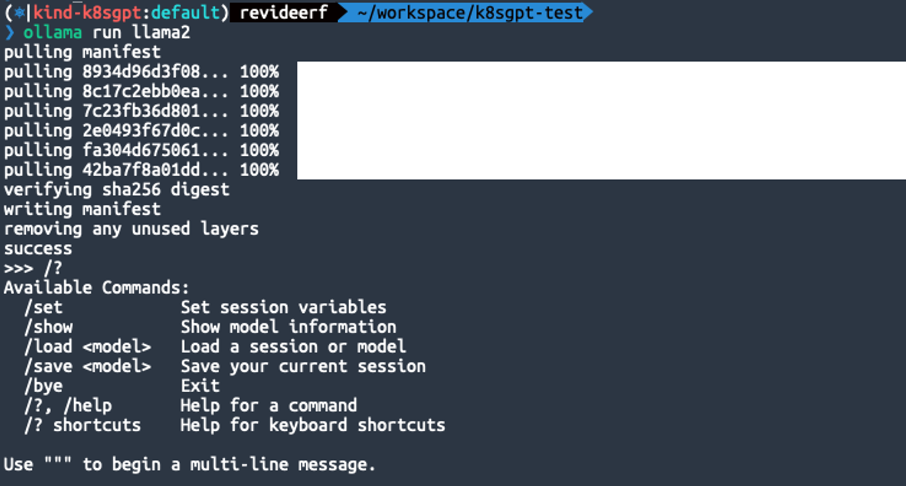
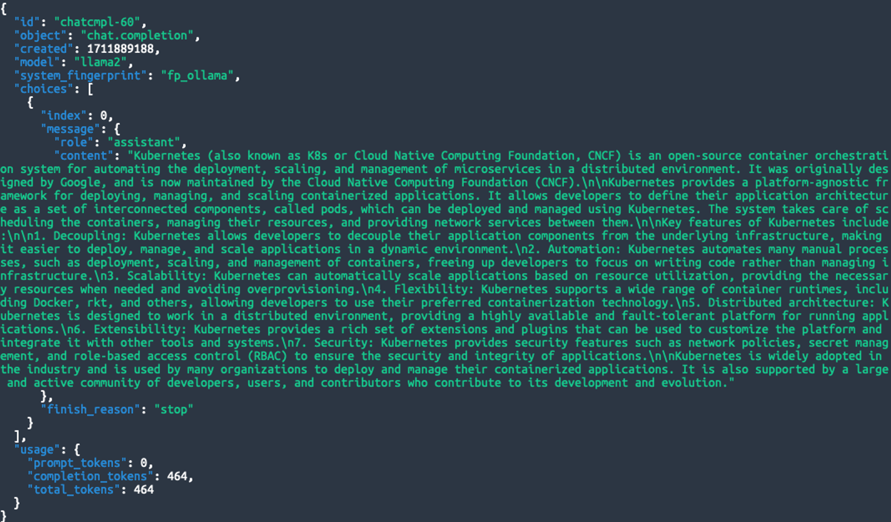
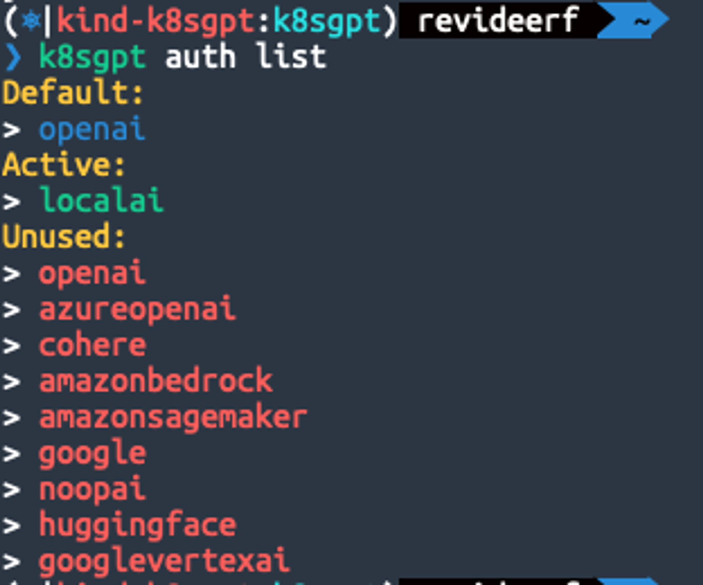
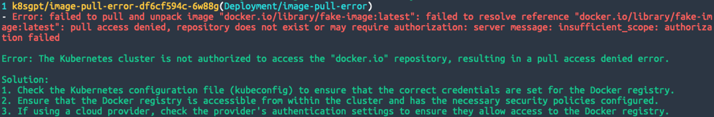
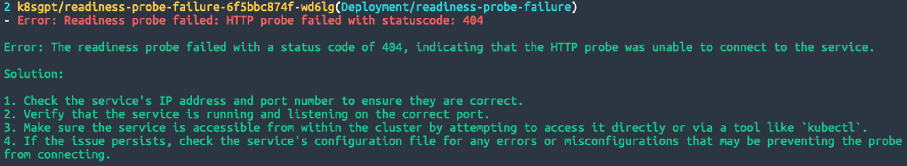
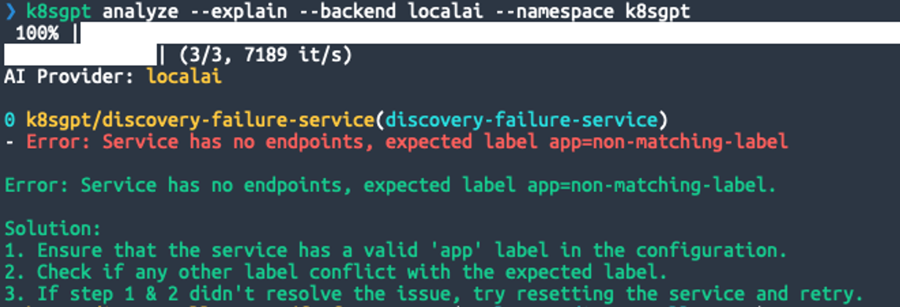

## k8sGPT

> “K8sGPT는 쿠버네티스 클러스터를 스캔하고 문제를 진단 및 분류하기 위한 도구입니다. 
> 분석기에 SRE 경험이 코드화되어 있으며 가장 관련성이 높은 정보를 추출하여 AI로 보강하는 데 도움을 줍니다.”

k8sGPT 프로젝트는 사이트에서 위와 같이 소개하고 있습니다. 이 프로젝트는 작년(2023년도)에 커뮤니티에서의 언급을 통해 우연히 알게 되었습니다. 
언젠가 체험해 봐야지라며 잊고 살다가 요즘 IT에 “**[로컬 LLM에서 K8sGPT로 쿠버네티스 AIOps 실행하기 (1)](https://www.wishket.com/magazine/detail/slack/2515/?h=T02JY6M4FE0)”** 글이 올라온 것을 보고 참고하여 실습해보고 개인 후기(?)를 적게 되었습니다.

## 테스트 환경 스펙

> 환경 구성이 번거로우신 분은 [killercoda k8sgpt 환경](https://killercoda.com/matthisholleville/scenario/k8sgpt-cli)에서 어떤 느낌인지 체험해 보실 수 있습니다.

- MacBook Pro 14 (M2, Memory 32GB, macOS Ventura)
- Kubernetes v1.29.2 ([kind](https://kind.sigs.k8s.io/docs/user/quick-start/)로 구성)
- kind(v0.22.0), k8sgpt(0.3.29)는 HomeBrew로 설치
- Local LLM([llama2](https://ollama.com/library/llama2))은 ollama를 사용해서 서빙

## k8sGPT 사용을 위한 환경 구성

### 쿠버네티스 구성

k8sGPT의 동작 자체의 경험에 집중하기 위해 kind를 사용해 단일 노드 클러스터 구성했습니다.,

```bash
kind create cluster --name k8sgpt
```

네임스페이스를 생성하여 이곳에 장애 상황을 재현하고, 해당 네임스페이스에 대해서만 k8sGPT의 분석결과를 확인해보고자 합니다.

```bash
kubectl create ns k8sgpt
```

### Ollama로 모델 설치 및 서빙

k8sGPT는 여러 AI 제공자(openai, google, huggingface 등)를 지원하지만 테스트 비용과 구성을 최소화 하기 위해 로컬 LLM을 사용하도록 합니다. k8sGPT와 연결하기 위해 모델과 엔드포인트 구성이 필요한데 Ollama를 사용하면 아주 쉽게 구성할 수 있습니다. Ollama를 [다운로드](https://ollama.com/download) 받아 설치하고, 아래 명령을 수행하면 끝입니다.

여러 모델을 지원하지만 저는 llama2를 사용했습니다. 모델 크기에 따라 [최소로 필요한 RAM 스펙](https://ollama.com/library/llama2)이 있으므로 확인하고 테스트 환경에 맞춰 사용하시기 바랍니다.

```bash
ollama run llama2
```




run 명령을 수행하면 모델 설치 후, 상호작용 세션이 열리는 데 이 세션은 종료해도 서빙은 백그라운드로 동작하니 닫으셔도 상관 없습니다. 11434 포트를 사용하여 서빙이 되며 openAI API 규격에 맞춰 요청할 수 있습니다. 아래와 같이 curl로 요청하면 JSON 형태로 응답을 받을 수 있습니다.

```bash
curl http://localhost:11434/v1/chat/completions \
-H "Content-Type: application/json" \
-d '{
    "model": "llama2",
    "messages": [
        {
            "role": "user",
            "content": "What is the kubernetes?"
        }
    ]
   }' | jq .
```



### k8sGPT 로컬 LLM 설정

AI 백엔드로 사용 가능한 목록은 `k8sgpt auth list` 명령으로 확인할 수 있습니다. 각 환경에 맞춰 인증 과정이 필요합니다. 로컬 LLM은 위의 설치 과정만 정상적으로 됐다면 baseurl 만 잘 지정해주면 됩니다.

```bash
k8sgpt auth add --backend localai --model llama2 --baseurl http://localhost:11434/v1
```



이제 사용할 수 있는 준비가 모두 끝났습니다. 장애 상황을 시나리오별로 구성하고, 각 상황에 맞춰 어떻게 가이드 해주는지 살펴보도록 하겠습니다.

## 장애 상황 시나리오

GPT 관련된 글인 만큼 Chat GPT도 적극 활용하여, 쿠버네티스 트러블슈팅 경험치를 쌓기 위한 장애 상황을 추천 받고 이를 재현할 수 있는 yaml 작성까지 요구했습니다.

본 글에서 아래 3가지 시나리오를 모두 재현해 놓은 상태로 k8sGPT의 도움을 받아보도록 하겠습니다. 아래 명령을 수행하면, 원인과 그에 대한 설명 및 솔루션을 제안해 줍니다.

```bash
k8sgpt analyze --explain --backend localai --namespace k8sgpt
```

> analyze만 수행하여 원인만 분석하는 것도 가능합니다. —explain 옵션을 사용해야 LLM을 연결하여 설명 및 솔루션 결과가 출력 됩니다.

### 시나리오1 : Image Pull 에러

- **문제 상황** : 존재하지 않는 이미지를 사용하거나, 프라이빗 이미지 레지스트리 인증 실패로 인해 파드가 컨테이너 이미지를 가져올 수 없는 경우입니다.
- **재현 방법** :
    1. Deployment를 생성할 때, 존재하지 않는 컨테이너 이미지를 사용하도록 설정합니다.
    2. 파드 상태를 확인하여 ImagePullBackOff 또는 ErrImagePull 상태가 되는지 관찰합니다.



- **k8sGPT 솔루션** :
    1. Kubernetes 구성 파일(kubeconfig)을 확인하여 Docker 레지스트리에 올바른 자격 증명이 설정되어 있는지 확인하세요.
    2. 클러스터 내에서 Docker 레지스트리에 액세스할 수 있고 필요한 보안 정책이 구성되어 있는지 확인하세요.
    3. 클라우드 제공업체를 사용하는 경우 제공업체의 인증 설정을 확인하여 Docker 레지스트리에 대한 액세스를 허용하는지 확인하세요.

### 시나리오2 : Readiness Probe 실패

- **문제 상황** : 애플리케이션이 준비되지 않았지만 쿠버네티스가 파드를 준비된 상태로 인식하는 문제입니다.
- **재현 방법** :
    1. Readiness Probe를 구성하고, 실패할 것으로 예상되는 엔드포인트를 지정한 Deployment를 생성합니다. 
    2. 파드가 준비 상태로 전환되지 않고 계속 재시작되는지 관찰합니다.



- **k8sGPT 솔루션** :
    1. 서비스의 IP 주소와 포트 번호가 올바른지 확인하세요.
    2. 서비스가 실행 중이고 올바른 포트에서 수신 대기 중인지 확인하세요.
    3. 클러스터 내에서 직접 또는 `kubectl`과 같은 도구를 통해 액세스를 시도하여 서비스에 액세스할 수 있는지 확인하
    4. 문제가 지속되면 서비스의 구성 파일에서 프로브 연결을 방해할 수 있는 오류나 잘못된 구성이 있는지 확인하세요.

### 시나리오3 : **서비스 디스커버리 실패**

- **문제 상황** : 서비스를 통해 파드를 찾지 못하는 문제입니다.
- **재현 방법** :
    1. Deployment와 Service를 생성합니다.
    2. Service의 selector가 Deployment의 파드 라벨과 일치하지 않도록 설정합니다.
    3. 서비스를 통해 파드에 접근하려고 할 때 실패하는 상황을 관찰합니다.



- **k8sGPT 솔루션** :
    1. 서비스 구성에 유효한 'app' 레이블이 있는지 확인하세요.
    2. 다른 레이블이 지정한 레이블과 충돌하는지 확인하세요.
    3. Step 1 & 2로 문제가 해결되지 않으면 서비스를 재구성하고 다시 시도하세요.

## 마치며

로컬 LLM으로만 테스트 해봤음에도 불구하고, 상당히 흥미롭고 만족스러운 경험이었습니다. 물론, 상용 환경이나 회사에 도입하여 사용하기에는 좀 더 연구가 필요하겠지만 쿠버네티스 학습이나 버전 테스트 등에 활용하면 꽤나 효율이 좋을 것 같다는 생각이 들었습니다. 이번 내용에는 포함하지 못했지만 Operator로 배포하여 k8sGPT 자체를 서빙하여 분석 결과들을 모니터링 시스템(Prometheus + Grafana)과 쉽게 결합할 수 있도록 지원하기 때문에 활용할 수 있는 방법은 더 다양할 것 같습니다. 이 프로젝트의 발전이 매우 기대 됩니다. 계속 지켜보며 업무에도 일부 환경에 도입할 수 있도록 추진해 보고 싶습니다.

## 참고 자료

[k8sGPT](https://k8sgpt.ai/)

[ChatGPT로 쿠버네티스 관리하는 방법](https://yozm.wishket.com/magazine/detail/1990/)

**[로컬 LLM에서 K8sGPT로 쿠버네티스 AIOps 실행하기 (1)](https://www.wishket.com/magazine/detail/slack/2515/?h=T02JY6M4FE0)**

**[로컬 LLM에서 K8sGPT로 쿠버네티스 AIOps 실행하기 (2)](https://www.wishket.com/magazine/detail/slack/2516/?h=T02JY6M4FE0)**

[OLLAMA(Local LLM)](https://ollama.com/)

[killercoda k8sgpt 실습환경](https://killercoda.com/matthisholleville/scenario/k8sgpt-cli)
