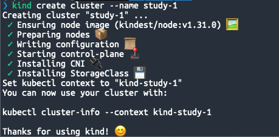
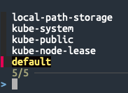
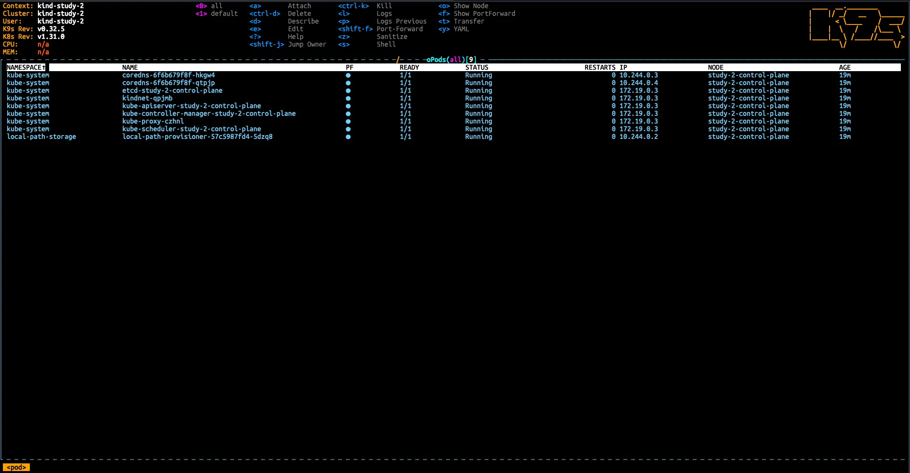
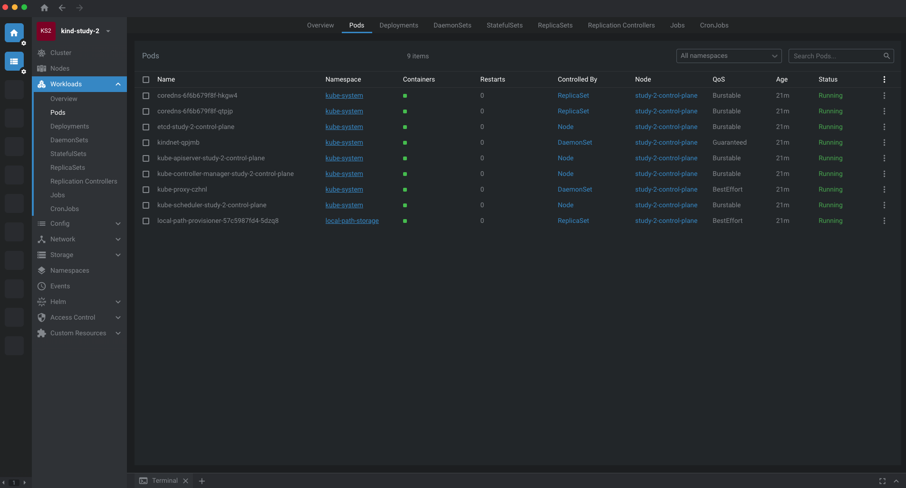

> 이번 최소한의 쿠버네티스 스터디 시리즈는 큰 그림을 파악하고 유용한 도구를 알아가는 것이 주요 목표입니다.  
> 쿠버네티스 이론 및 운영에 대한 깊이 있는 내용은 다음 시리즈로 구분하여 작성하고자 합니다.  

## 스터디 진행 계획

사내에서 쿠버네티스에 익숙하지 않은 분들 대상으로 짧은 강의형 스터디를 기획하여 진행하게 되었습니다. 
실무에서 유용하게 쓰고 있는 도구 소개 부터 쿠버네티스 환경 사용자 입장에서 알아두면 좋은 최소한의 내용들만 다루는 것을 목표로 하는 가벼운 스터디로 진행할 생각입니다.

### 스터디 목표

- 쿠버네티스에 대하여 무엇을 모르는 상태인지 알게 되는 것
- 쿠버네티스의 어떤 개념들이 실제 서버 운영에 직접적인 연관성이 있는지 아는 것

### 스터디 목표 아닌 것

- 쿠버네티스의 모든 개념을 이해하고, 상세히 알아가는 것
    - 이번 스터디에서는 큰 그림을 이해하고, 앞으로 학습해야 할 키워드 인지하는 것 까지만 목표로 합니다.

### 커리큘럼(4회차로 끝내는 가벼운 스터디)

- **1회차 : 오리엔테이션(스터디 참여 인원 이해도 조율). 작업 효율에 도움이 되는 도구 설치 및 설정.**
- 2회차 : kind 활용한 로컬 쿠버네티스 클러스터 구축 및 기본 동작 방식 이해
- 3회차 : 자바 컨테이너 이미지를 빌드하여 로컬 쿠버네티스에 배포하기(+ helm 활용)
- 4회차 : k8sgpt(로컬 LLM)을 활용하여 쿠버네티스 트러블슈팅 경험하기

## 스터디 실습 환경 구성

> 사내에서 모두 맥북을 쓰고 있기 때문에, 맥북을 기준으로 작성되었습니다.
각 도구는 직접 설치도 가능하지만, 편의를 위해 가능한 brew 를 사용해 설치했습니다.
> 

### kubectl

쿠버네티스 API를 사용하여 쿠버네티스 클러스터의 [컨트롤 플레인](https://kubernetes.io/ko/docs/reference/glossary/?all=true#term-control-plane)과 통신하기 위한 커맨드라인 도구입니다.

```bash
brew install kubectl
```

### kind(kubernetes in docker)

로컬에서 노드를 컨테이너로 사용하여 쿠버네티스 클러스터를 구성할 수 있는 도구입니다.

kind를 사용하기 위해 미리 설치해야 할 것들은 다음과 같습니다.

- [go](https://golang.org/) 1.16+ and [docker](https://www.docker.com/), [podman](https://podman.io/) or [nerdctl](https://github.com/containerd/nerdctl)

```bash
brew install kind
```

kind 명령으로 간단하게 클러스터를 생성할 수 있습니다. 환경변수($KUBECONFIG) 설정이나 플래그(--kubeconfig)를 지정하지 않으면 클러스터의 정보는 `${HOME}/.kube/config`에 저장됩니다.

노드의 구성 수는 설정을 통해 변경이 가능하며, 각 노드는 컨테이너로 생성됩니다.

```bash
kind create cluster --name study-1
```



위 명령으로 생성된 kind-study-1 클러스터의 정보가 담긴 Kubeconfig를 자세히 살펴보겠습니다.

```bash
apiVersion: v1
clusters:
- cluster:
    certificate-authority-data: LS0tLS1CRUdJTi~
    server: https://127.0.0.1:50408
  name: kind-study-1
contexts:
- context:
    cluster: kind-study-1
    user: kind-study-1
  name: kind-study-1
current-context: kind-study-1
kind: Config
preferences: {}
users:
- name: kind-study-1
  user:
    client-certificate-data: LS0tLS1CRUdJTi~
    client-key-data: LS0tLS1CRUdJTi~
```

- **clusters**: Kubernetes 클러스터에 대한 정보가 저장됩니다. `server` 필드에 클러스터 API 서버의 주소가 있으며, 보안 연결을 위해 `certificate-authority-data` 또는 `certificate-authority` 필드로 인증서 파일이 포함될 수 있습니다.
- **contexts**: `context`는 클러스터, 사용자, 네임스페이스를 한데 묶어 관리하는 환경을 나타냅니다. 이를 통해 사용자는 여러 클러스터와 네임스페이스를 쉽게 전환할 수 있습니다.
- **current-context**: 현재 사용 중인 `context`를 나타내며, 이를 통해 `kubectl`이 어떤 클러스터와 네임스페이스, 사용자를 기반으로 명령을 실행할지 결정합니다.
- **users**: 각 클러스터에 연결할 때 사용할 사용자 인증 정보가 포함됩니다. 기본적으로 `username`/`password` 또는 `token`, `client-certificate`/`client-key` 등이 사용됩니다.

### direnv

이 도구는 필수는 아니지만, 개인적으로 선호하는 도구라서 소개 해드립니다. 

direnv는 디렉터리마다 미리 지정해 둔 환경변수 정보(.envrc 파일에 정의)를 불러와서 쉘에 적용합니다. 

즉, ‘cd’ 명령으로 direnv 설정이 된 디렉터리로 경로를 변경하면 해당 쉘에 환경변수가 자동으로 설정됩니다

direnv는 쉘 확장이기 때문에, 설치 후에 hook 스크립트 등록이 필요합니다.

```bash
brew install direnv
echo 'eval "$(direnv hook zsh)"' >> ~/.zshrc
```

사용 예시를 통해 적용 방법에 대해 자세히 알아보도록 하겠습니다.

kind를 통해 쿠버네티스 클러스터를 1개 더 생성할 때, kubeconfig를 다른 경로에 설정한 경우입니다.

```bash
touch ~/.kube/study-2-config
export KUBECONFIG=~/.kube/study-2-config
kind create cluster --name study-2
```

작업 디렉터리 2개를 만들어서 각각 다른 kubeconfig를 참조하도록 설정해보겠습니다.

각 디렉터리에 .envrc를 생성한 후에는 direnv allow 명령으로 스크립트 실행을 허용해줘야 합니다.

```bash
mkdir -p ~/workspace/direnv-test1
mkdir -p ~/workspace/direnv-test2

echo "export KUBECONFIG=~/.kube/config" >> ~/workspace/direnv-test1/.envrc
echo "export KUBECONFIG=~/.kube/study-2-config" >> ~/workspace/direnv-test2/.envrc

direnv allow ~/workspace/direnv-test1
direnv allow ~/workspace/direnv-test2
```

위와 같이 설정한 뒤에 각 디렉터리에서 다른 쿠버네티스 클러스터를 관리할 수 있습니다.

```bash
cd ~/workspace/direnv-test1
direnv: loading ~/workspace/direnv-test1/.envrc
direnv: export +KUBECONFIG

kubectl get nodes
NAME                    STATUS   ROLES           AGE   VERSION
study-1-control-plane   Ready    control-plane   64m   v1.31.0
```

```bash
cd ~/workspace/direnv-test2
direnv: loading ~/workspace/direnv-test2/.envrc
direnv: export +KUBECONFIG

kubectl get nodes
NAME                    STATUS   ROLES           AGE   VERSION
study-2-control-plane   Ready    control-plane   71s   v1.31.0
```

물론 kubeconfig 하나에 여러 클러스터 정보를 저장하여 context를 변경해가면서 쓰는 방법을 많이 쓰기도 하지만, 개인적으로는 여러 클러스터를 관리할 때 디렉터리별로 구분하는 것이 실수를 줄일 수 있었습니다.

### kubectx, kubens

기본 컨텍스트(ctx)와 네임스페이스(ns)를 편리하게 변경할 수 있게 도와주는 도구입니다.

fzf(fuzzy finder)를 설치해서 사용하면 드랍다운 방식으로 선택할 수 있어서 더 편리합니다.

```bash
brew install kubectx

brew install fzf
# Set up fzf key bindings and fuzzy completion
source <(fzf --zsh)
```



### k9s(CUI), OpenLens(GUI)

kubectl 명령을 사용자 인터페이스로 제공하는 도구들입니다.

취향에 맞는 도구를 선택하여 활용하면 작업의 효율을 높일 수 있습니다.

```bash
brew install k9s
```



OpenLens는 Lens가 상용화 되기 전 버전(2023년도 버전)으로 받아서 설치 후, 사용할 수 있습니다.

https://github.com/MuhammedKalkan/OpenLens/releases



## 참고 자료

[macOS에 kubectl 설치 및 설정](https://kubernetes.io/ko/docs/tasks/tools/install-kubectl-macos/)

[kind(Installing With A Package Manager)](https://kind.sigs.k8s.io/docs/user/quick-start)

[direnv(Installation)](https://direnv.net/docs/installation.html)

[kubectx, kubens](https://github.com/ahmetb/kubectx)