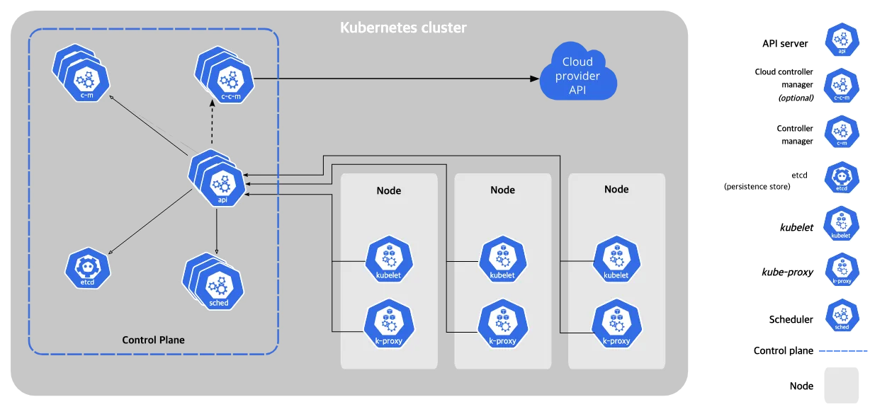

> 해당 글은 스터디 2회차에 해당하는 글로, 1회차의 환경 구성이 되어 있다는 가정하에 작성 되었습니다.  
> 실습 진행을 위해서 아래 커리큘럼의 1회차 글을 참고하시기 바랍니다. 

### 커리큘럼(4회차로 끝내는 가벼운 스터디)

- [1회차 : 오리엔테이션. 작업 효율에 도움이 되는 도구 설치 및 설정](https://sungchul-p.github.io/minimal-k8s-study-1)
- **2회차 : kind 활용한 로컬 쿠버네티스 클러스터 구축 및 기본 동작 방식 이해**
- 3회차 : 자바 컨테이너 이미지를 빌드하여 로컬 쿠버네티스에 배포하기(+ helm 활용)
- 4회차 : k8sgpt(로컬 LLM)을 활용하여 쿠버네티스 트러블슈팅 경험하기

## 쿠버네티스 주요 컴포넌트



- **kube-apiserver :** 쿠버네티스 API를 노출하여 클러스터의 모든 요청을 처리하는 게이트웨이 역할을 합니다.
- **etcd :** 클러스터의 상태 정보를 저장하는 분산 키-값 저장소로, 모든 클러스터 데이터, 구성 및 상태를 유지합니다.
- **kube-scheduler :** 새로 생성된 파드를 감지하고, 실행할 노드를 선택하는 스케줄링을 담당합니다.
- **kube-controller-manager :** 클러스터의 상태를 원하는 상태로 유지하기 위해 여러 컨트롤러를 실행합니다.
- **kubelet :** 각 노드에서 파드와 컨테이너의 생명 주기를 관리하고, 상태를 모니터링합니다.
- **kube-proxy :** 클러스터의 각 노드에서 네트워크 프록시 역할을 하여 서비스 간 통신을 지원합니다.

## kind 단일 클러스터 실습

`kind`(Kubernetes IN Docker)를 활용하여 로컬 환경에서 쿠버네티스 클러스터를 구축하면, 핵심 컴포넌트들의 동작 방식을 직접 실습하며 이해할 수 있습니다. 아래에 주요 시나리오를 상세히 설명하겠습니다.

 

### 1. 클러스터 생성 및 구성 확인

- **목표:** `kind`를 사용하여 로컬 쿠버네티스 클러스터를 생성하고, 클러스터의 구성 요소들을 확인합니다.

- `kind` 설치 후, 단일 노드 클러스터 생성

```bash
# kind가 지정한 kubeconfig를 사용하도록 설정
touch ~/.kube/single-config
export KUBECONFIG=~/.kube/single-config
kind create cluster --name single-cluster

# direnv 활용하기 위한 설정
mkdir -p ~/workspace/kind-single-test
echo "export KUBECONFIG=~/.kube/single-config" >> ~/workspace/kind-single-test/.envrc
direnv allow ~/workspace/kind-single-test

cd ~/workspace/kind-single-test
```

- `kubectl`을 통해 클러스터 정보 확인

```bash
kubectl cluster-info
kubectl get nodes
```

- 각 노드의 상태 및 역할 확인

```bash
kubectl describe node <노드명>
```

### 2. 파드(Pod) 생성 및 스케줄링 확인

- **목표:** 파드를 생성하고, 스케줄러(`kube-scheduler`)의 동작을 이해합니다.

- 간단한 Nginx 파드 생성

```bash
vi nginx-pod.yaml
```

```yaml
apiVersion: v1
kind: Pod
metadata:
  name: nginx-pod
spec:
  containers:
  - name: nginx
    image: nginx:alpine
```

```bash
kubectl apply -f nginx-pod.yaml
```

- 파드의 스케줄링 상태 확인

```bash
kubectl get pods -o wide
```

- 파드가 스케줄링된 노드 확인 및 해당 노드의 리소스 상태 점검

```bash
kubectl describe node <노드명>
```

### 3. 디플로이먼트(Deployment)와 컨트롤러 매니저(`kube-controller-manager`) 동작 확인

- **목표:** 디플로이먼트를 생성하여 컨트롤러 매니저의 역할을 이해합니다.

- Nginx 디플로이먼트 생성

```bash
vi nginx-deployment.yaml
```

```yaml
apiVersion: apps/v1
kind: Deployment
metadata:
  name: nginx-deployment
spec:
  replicas: 3
  selector:
    matchLabels:
      app: nginx
  template:
    metadata:
      labels:
        app: nginx
    spec:
      containers:
      - name: nginx
        image: nginx:alpine
```

```bash
kubectl apply -f nginx-deployment.yaml
```

- 파드 생성 상태 및 레플리카 수 확인

```bash
kubectl get deployments
kubectl get pods -l app=nginx
```

- 파드 중 하나를 삭제하여 컨트롤러 매니저의 복구 동작 확인
    - 삭제된 파드가 자동으로 재생성되는지 확인합니다

```bash
kubectl delete pod <파드명>
kubectl get pods -l app=nginx
```

### 4. 서비스(Service) 생성과 `kube-proxy` 동작 확인

- **목표:** 서비스를 생성하여 파드 간 통신을 설정하고, `kube-proxy`의 역할을 이해합니다.

- Nginx 서비스 생성

```bash
vi nginx-service.yaml
```

```yaml
apiVersion: v1
kind: Service
metadata:
  name: nginx-service
spec:
  selector:
    app: nginx
  ports:
  - protocol: TCP
    port: 80
    targetPort: 80
```

```bash
kubectl apply -f nginx-service.yaml
```

- 서비스 및 엔드포인트 확인

```bash
kubectl get services
kubectl get endpoints
```

- 클러스터 내부에서 서비스 접근 테스트

```bash
kubectl run test-pod --rm -it --image=busybox -- /bin/sh
wget -qO- nginx-service
```

### 5. `kubelet`의 역할 확인

- **목표:** `kubelet`의 역할을 이해하고, 노드에서 파드의 상태를 모니터링합니다.

- 노드 컨테이너에 접속하여 `kubelet` 로그 확인

```bash
# 도커 컨테이너 이름 확인
docker ps 
```

```bash
CONTAINER ID   IMAGE                  COMMAND                   CREATED          STATUS          PORTS                       NAMES
148fadbeed3b   kindest/node:v1.31.0   "/usr/local/bin/entr…"   22 minutes ago   Up 22 minutes   127.0.0.1:56463->6443/tcp   single-cluster-control-plane
```

```bash
docker exec -it single-cluster-control-plane /bin/bash
journalctl -u kubelet
```

- 파드의 상태 변화(예: 파드 생성, 삭제)에 따른 `kubelet`의 로그 변화를 관찰합니다.

### 6. `kube-apiserver`의 역할 확인

- **목표:** `kube-apiserver`의 역할을 이해하고, 클러스터의 API 요청 처리를 확인합니다.

- `kubectl`을 통해 리소스 생성, 조회, 삭제 등의 작업을 수행하고, 해당 요청이 `kube-apiserver`를 통해 처리되는 과정을 이해합니다.
- `kube-apiserver`의 로그를 확인하여 API 요청과 응답 과정을 살펴봅니다.

## 실습 환경 클린업

```bash
cd
kind delete clusters single-cluster
rm ~/.kube/single-config
rm -rf ~/workspace/kind-single-test
```

## 참고 자료

[쿠버네티스 컴포넌트](https://kubernetes.io/ko/docs/concepts/overview/components/)
